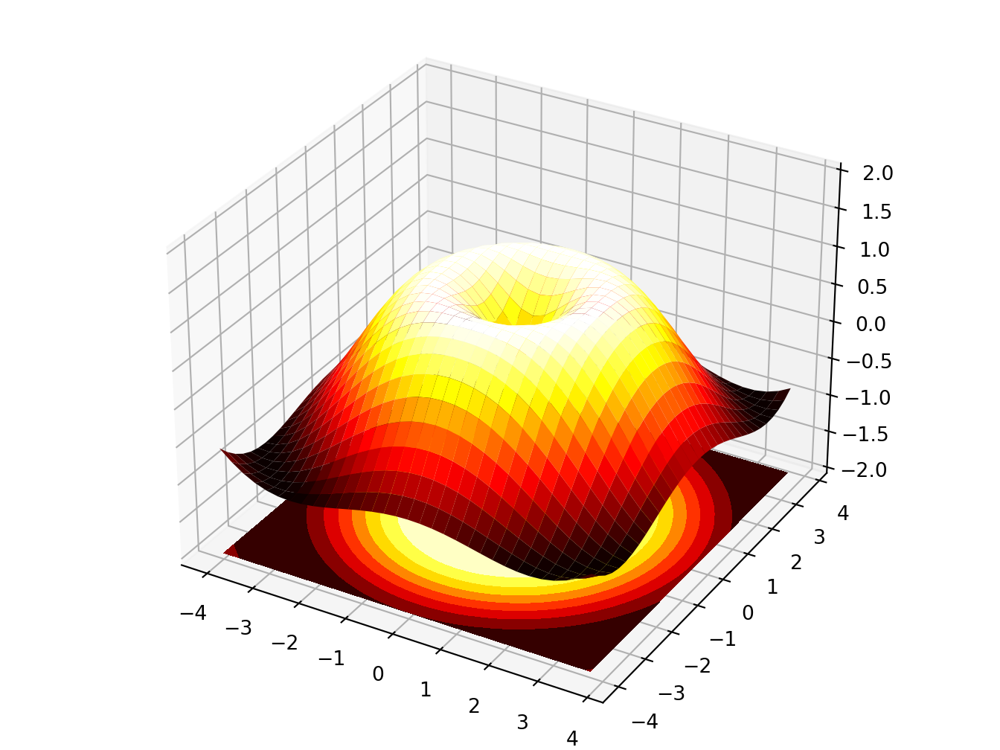
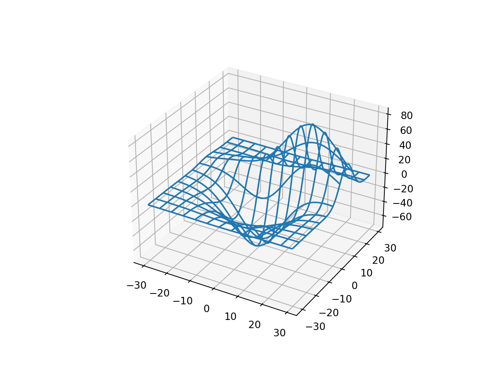

# Math

<div class=decocode><div style="background-color:#4C78DB"><span style="font-size:90%;color:#ffffff"><i class="fab fa-r-project"></i>  <b>R</b></span>

```r
library(reticulate)
reticulate::use_condaenv("r-python")
```

</div><br></div>


## Functions

<div class=decocode><div style="background-color:#417FB1"><span style="font-size:90%;color:#FFD94C"><i class="fab fa-python"></i>  <b>Python</b></span>

```python
# https://www.geeksforgeeks.org/plot-mathematical-expressions-in-python-using-matplotlib/
# Import libraries 
import matplotlib.pyplot as plt 
import numpy as np 
  
x = np.linspace(-6, 6, 50) 
fig = plt.figure(figsize = (14, 8)) 
  
# Plot y = cos(x) 
y = np.cos(x) 
plt.plot(x, y, 'b', label ='cos(x)') 
  
# Plot degree 2 Taylor polynomial 
y2 = 1 - x**2 / 2
plt.plot(x, y2, 'r-.', label ='Degree 2') 
  
# Plot degree 4 Taylor polynomial 
y4 = 1 - x**2 / 2 + x**4 / 24
plt.plot(x, y4, 'g:', label ='Degree 4') 
  
# Add features to our figure 
plt.legend() 
plt.grid(True, linestyle =':') 
plt.xlim([-6, 6]) 
plt.ylim([-4, 4]) 
  
plt.title('Taylor Polynomials of cos(x) at x = 0') 
plt.xlabel('x-axis') 
plt.ylabel('y-axis') 
  
# Show plot 
plt.show() 
```

</div><br></div>


## Functions with Latex labels

<div class=decocode><div style="background-color:#417FB1"><span style="font-size:90%;color:#FFD94C"><i class="fab fa-python"></i>  <b>Python</b></span>

```python
# https://www.kaggle.com/sskiing/matplotlib-showcase-examples

import numpy as np
import matplotlib.pyplot as plt
from matplotlib.patches import Polygon

def func(x):
    return (x - 3) * (x - 5) * (x - 7) + 85

a, b = 2, 9  # integral limits
x = np.linspace(0, 10)
y = func(x)

fig, ax = plt.subplots(dpi=200)
plt.plot(x, y, 'r', linewidth=2)
plt.ylim(ymin=0)

# Make the shaded region
ix = np.linspace(a, b)
iy = func(ix)
verts = [(a, 0)] + list(zip(ix, iy)) + [(b, 0)]
poly = Polygon(verts, facecolor='0.9', edgecolor='0.5')
ax.add_patch(poly)

plt.text(0.5 * (a + b), 30, r"$\int_a^b f(x)\mathrm{d}x$",
         horizontalalignment='center', fontsize=20)

plt.figtext(0.9, 0.05, '$x$')
plt.figtext(0.1, 0.9, '$y$')

ax.spines['right'].set_visible(False)
ax.spines['top'].set_visible(False)
ax.xaxis.set_ticks_position('bottom')

ax.set_xticks((a, b))
ax.set_xticklabels(('$a$', '$b$'))
ax.set_yticks([])
plt.show()
```

</div><br></div>


## Multiple functions in the same plot

<div class=decocode><div style="background-color:#417FB1"><span style="font-size:90%;color:#FFD94C"><i class="fab fa-python"></i>  <b>Python</b></span>

```python
import matplotlib.pyplot as plt
import numpy as np

t = np.arange(0.0, 2.0, 0.01)

s1 = np.sin(2 * np.pi * t)
s2 = np.exp(-t)
s3 = s1 * s2

fig, axs = plt.subplots(3, 1, sharex=True)
# Remove horizontal space between axes
fig.subplots_adjust(hspace=0)

# Plot each graph, and manually set the y tick values
axs[0].plot(t, s1)
axs[0].set_yticks(np.arange(-0.9, 1.0, 0.4))
axs[0].set_ylim(-1, 1)
axs[1].plot(t, s2)
axs[1].set_yticks(np.arange(0.1, 1.0, 0.2))
axs[1].set_ylim(0, 1)
axs[2].plot(t, s3)
axs[2].set_yticks(np.arange(-0.9, 1.0, 0.4))
axs[2].set_ylim(-1, 1)
plt.show()
```

</div><br></div>


## Overlapping functions
We use `subplot` to arrange the two functions. Observe that the y-axis is the same in both functions.

<div class=decocode><div style="background-color:#417FB1"><span style="font-size:90%;color:#FFD94C"><i class="fab fa-python"></i>  <b>Python</b></span>

```python
# https://www.python-course.eu/matplotlib_multiple_figures.php
import numpy as np
import matplotlib.pyplot as plt
def f(t):
    return np.exp(-t) * np.cos(2*np.pi*t)
def g(t):
    return np.sin(t) * np.cos(1/(t+0.1))
t1 = np.arange(0.0, 5.0, 0.1)
t2 = np.arange(0.0, 5.0, 0.02)
plt.subplot(212)
plt.plot(t1, g(t1), 'ro', t2, f(t2), 'k')
plt.grid(color='b', alpha=0.5, linestyle='dashed', linewidth=0.5)
plt.show()
```

</div><br></div>

## Surface functions


<div class=decocode><div style="background-color:#417FB1"><span style="font-size:90%;color:#FFD94C"><i class="fab fa-python"></i>  <b>Python</b></span>

```python
# http://www.scipy-lectures.org/intro/matplotlib/auto_examples/plot_plot3d_ex.html
import numpy as np
import matplotlib.pyplot as plt
from mpl_toolkits.mplot3d import Axes3D

fig = plt.figure()
ax = Axes3D(fig)
X = np.arange(-4, 4, 0.25)
Y = np.arange(-4, 4, 0.25)
X, Y = np.meshgrid(X, Y)
R = np.sqrt(X ** 2 + Y ** 2)
Z = np.sin(R)

ax.plot_surface(X, Y, Z, rstride=1, cstride=1, cmap=plt.cm.hot)
ax.contourf(X, Y, Z, zdir='z', offset=-2, cmap=plt.cm.hot)
ax.set_zlim(-2, 2)
plt.show()
```

</div><br></div>


<div class=decocode><div style="background-color:#417FB1"><span style="font-size:90%;color:#FFD94C"><i class="fab fa-python"></i>  <b>Python</b></span>

```python
# https://matplotlib.org/gallery/mplot3d/offset.html#sphx-glr-gallery-mplot3d-offset-py
# This import registers the 3D projection, but is otherwise unused.
from mpl_toolkits.mplot3d import Axes3D  # noqa: F401 unused import
import matplotlib.pyplot as plt
import numpy as np

fig = plt.figure()
ax = fig.gca(projection='3d')

X, Y = np.mgrid[0:6*np.pi:0.25, 0:4*np.pi:0.25]
Z = np.sqrt(np.abs(np.cos(X) + np.cos(Y)))

ax.plot_surface(X + 1e5, Y + 1e5, Z, cmap='autumn', cstride=2, rstride=2)

ax.set_xlabel("X label")
ax.set_ylabel("Y label")
ax.set_zlabel("Z label")
ax.set_zlim(0, 2)
plt.show()
```

</div><br></div>


<div class=decocode><div style="background-color:#417FB1"><span style="font-size:90%;color:#FFD94C"><i class="fab fa-python"></i>  <b>Python</b></span>

```python
# https://github.com/matplotlib/matplotlib/blob/master/examples/mplot3d/surface3d_radial.py
from mpl_toolkits.mplot3d import Axes3D  # noqa: F401 unused import
import matplotlib.pyplot as plt
import numpy as np

fig = plt.figure()
ax = fig.add_subplot(111, projection='3d')

# Create the mesh in polar coordinates and compute corresponding Z.
r = np.linspace(0, 1.25, 50)
p = np.linspace(0, 2*np.pi, 50)
R, P = np.meshgrid(r, p)
Z = ((R**2 - 1)**2)
# Express the mesh in the cartesian system.
X, Y = R*np.cos(P), R*np.sin(P)
# Plot the surface.
ax.plot_surface(X, Y, Z, cmap=plt.cm.YlGnBu_r)
# Tweak the limits and add latex math labels.
ax.set_zlim(0, 1)
ax.set_xlabel(r'$\phi_\mathrm{real}$')
ax.set_ylabel(r'$\phi_\mathrm{im}$')
ax.set_zlabel(r'$V(\phi)$')

plt.show()
```

</div><br></div>


## 3D wireframe

<div class=decocode><div style="background-color:#417FB1"><span style="font-size:90%;color:#FFD94C"><i class="fab fa-python"></i>  <b>Python</b></span>

```python
# https://github.com/matplotlib/matplotlib/blob/master/examples/mplot3d/wire3d.py
from mpl_toolkits.mplot3d import axes3d
import matplotlib.pyplot as plt

fig = plt.figure()
ax = fig.add_subplot(111, projection='3d')

# Grab some test data.
X, Y, Z = axes3d.get_test_data(0.05)

# Plot a basic wireframe.
ax.plot_wireframe(X, Y, Z, rstride=10, cstride=10)

plt.show()
```

</div><br></div>


## 3D contour plot

<div class=decocode><div style="background-color:#417FB1"><span style="font-size:90%;color:#FFD94C"><i class="fab fa-python"></i>  <b>Python</b></span>

```python
# https://matplotlib.org/2.0.2/examples/mplot3d/contour3d_demo.html
from mpl_toolkits.mplot3d import axes3d
import matplotlib.pyplot as plt
from matplotlib import cm

fig = plt.figure()
ax = fig.add_subplot(111, projection='3d')
X, Y, Z = axes3d.get_test_data(0.05)
cset = ax.contour(X, Y, Z, cmap=cm.coolwarm)
ax.clabel(cset, fontsize=9, inline=1)

plt.show()
```

</div><br></div>


## Machine Learning
This is just one sample of discovering patterns with machine learning.

<div class=decocode><div style="background-color:#417FB1"><span style="font-size:90%;color:#FFD94C"><i class="fab fa-python"></i>  <b>Python</b></span>

```python
import numpy as np
from matplotlib import pyplot as plt
from sklearn import neighbors, datasets
from matplotlib.colors import ListedColormap

# Create color maps for 3-class classification problem, as with iris
cmap_light = ListedColormap(['#FFAAAA','#AAFFAA','#AAAAFF'])
cmap_bold = ListedColormap(['#FF0000','#00FF00','#0000FF'])

iris = datasets.load_iris()
X = iris.data[:, :2]  # we only take the first two features. We could
                      # avoid this ugly slicing by using a two-dim dataset
y = iris.target
knn = neighbors.KNeighborsClassifier(n_neighbors=1)
knn.fit(X, y)
x_min, x_max = X[:, 0].min() - .1, X[:, 0].max() + .1
y_min, y_max = X[:, 1].min() - .1, X[:, 1].max() + .1
xx, yy = np.meshgrid(np.linspace(x_min, x_max, 100), np.linspace(y_min, y_max, 100))

Z = knn.predict(np.c_[xx.ravel(), yy.ravel()])

Z = Z.reshape(xx.shape)
plt.figure()
plt.pcolormesh(xx, yy, Z, cmap=cmap_light)

# Plot also the training points
plt.scatter(X[:, 0], X[:, 1], c=y, cmap=cmap_bold)
plt.xlabel('sepal length (cm)')
plt.ylabel('sepal width (cm)')
plt.axis('tight')
plt.show()
```

</div><br></div>


