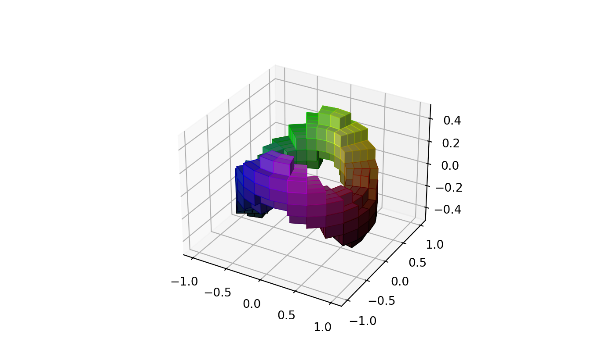
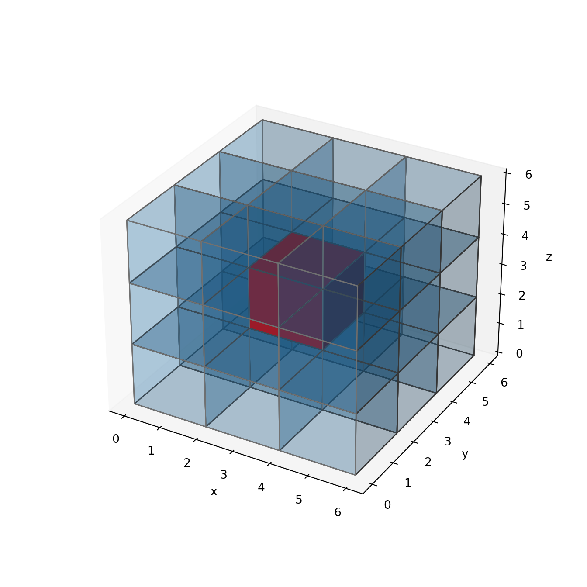
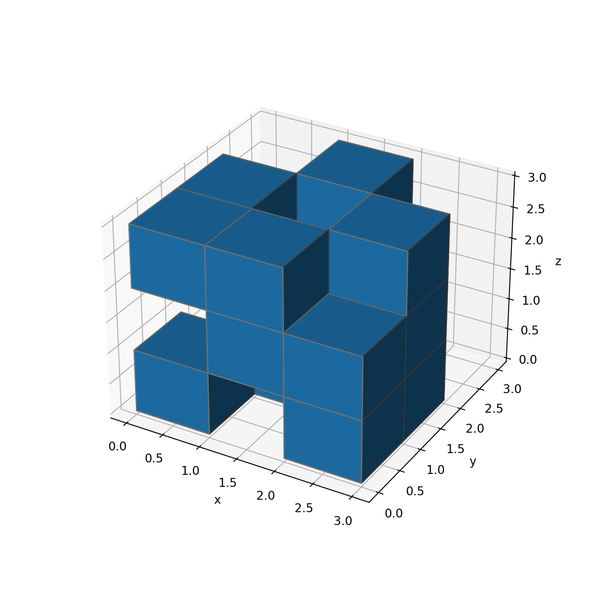
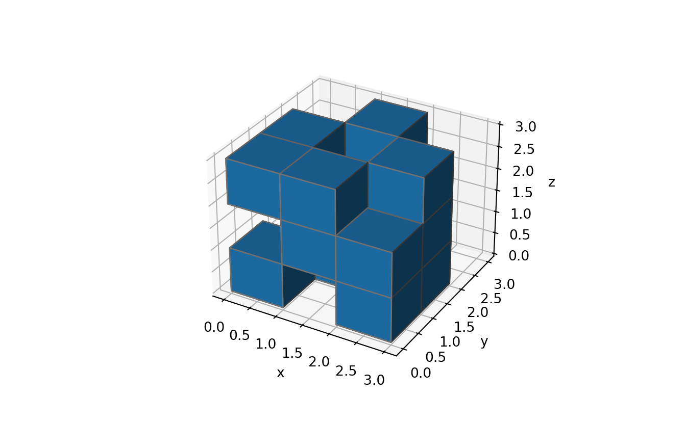
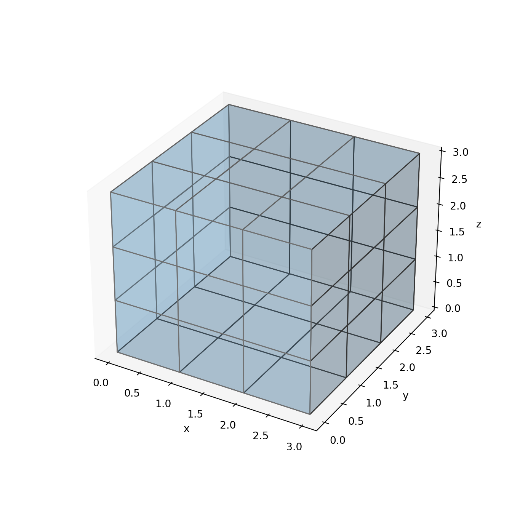
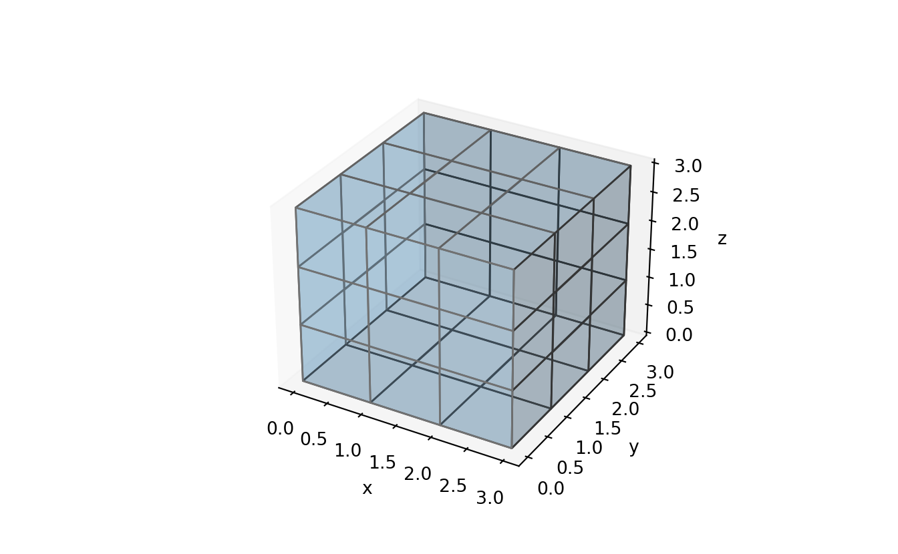
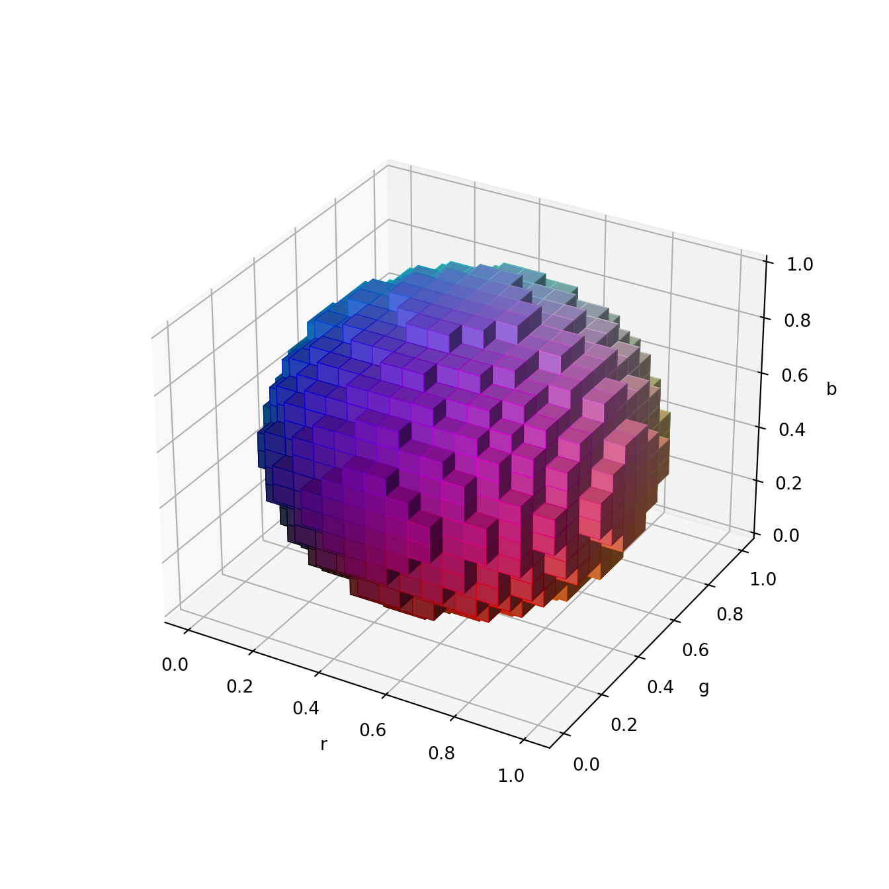
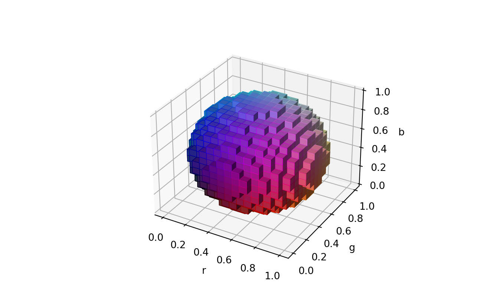
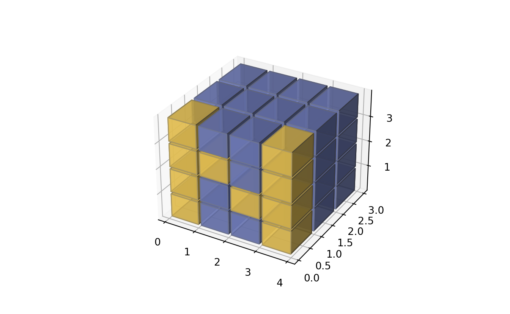

# Voxels


```r
library(reticulate)
reticulate::use_condaenv("r-torch")
reticulate::py_config()
```

```
## python:         /home/msfz751/anaconda3/envs/r-torch/bin/python
## libpython:      /home/msfz751/anaconda3/envs/r-torch/lib/libpython3.7m.so
## pythonhome:     /home/msfz751/anaconda3/envs/r-torch:/home/msfz751/anaconda3/envs/r-torch
## version:        3.7.9 (default, Aug 31 2020, 12:42:55)  [GCC 7.3.0]
## numpy:          /home/msfz751/anaconda3/envs/r-torch/lib/python3.7/site-packages/numpy
## numpy_version:  1.19.1
## 
## python versions found: 
##  /home/msfz751/anaconda3/envs/r-torch/bin/python
##  /home/msfz751/anaconda3/envs/r-torch/bin/python3
##  /usr/bin/python3
##  /usr/bin/python
##  /home/msfz751/anaconda3/bin/python
##  /home/msfz751/anaconda3/envs/man_ccia/bin/python
##  /home/msfz751/anaconda3/envs/porepy/bin/python
##  /home/msfz751/anaconda3/envs/python_book/bin/python
##  /home/msfz751/anaconda3/envs/r-python/bin/python
##  /home/msfz751/anaconda3/envs/r-tensorflow/bin/python
##  /home/msfz751/anaconda3/envs/r-toarchboard/bin/python
```


```r
# load the package that makes R and Python talk
library(reticulate)

# set the preferred Python to execute
user_profile <- Sys.getenv("USERPROFILE")                    # user folder
python_portable <- normalizePath(file.path(user_profile,     # Python location
                                "WPy-3710zero/python-3.7.1.amd64/python.exe"))

reticulate::use_python(python_portable, required = TRUE)
 
# find out if it took it
reticulate::py_config()
```


```python
# https://matplotlib.org/api/_as_gen/mpl_toolkits.mplot3d.axes3d.Axes3D.html


#=======================================================
#3D voxel / volumetric plot with cylindrical coordinates
#=======================================================

#Demonstrates using the ``x, y, z`` arguments of ``ax.voxels``.


import matplotlib.pyplot as plt
import matplotlib.colors
import numpy as np

# This import registers the 3D projection, but is otherwise unused.
from mpl_toolkits.mplot3d import Axes3D  # noqa: F401 unused import


def midpoints(x):
    sl = ()
    for i in range(x.ndim):
        x = (x[sl + np.index_exp[:-1]] + x[sl + np.index_exp[1:]]) / 2.0
        sl += np.index_exp[:]
    return x

# prepare some coordinates, and attach rgb values to each
r, theta, z = np.mgrid[0:1:11j, 0:np.pi*2:25j, -0.5:0.5:11j]
x = r*np.cos(theta)
y = r*np.sin(theta)

rc, thetac, zc = midpoints(r), midpoints(theta), midpoints(z)

# define a wobbly torus about [0.7, *, 0]
sphere = (rc - 0.7)**2 + (zc + 0.2*np.cos(thetac*2))**2 < 0.2**2

# combine the color components
hsv = np.zeros(sphere.shape + (3,))
hsv[..., 0] = thetac / (np.pi*2)
hsv[..., 1] = rc
hsv[..., 2] = zc + 0.5
colors = matplotlib.colors.hsv_to_rgb(hsv)

# and plot everything
fig = plt.figure()
ax = fig.gca(projection='3d')
ax.voxels(x, y, z, sphere,
          facecolors=colors,
          edgecolors=np.clip(2*colors - 0.5, 0, 1),  # brighter
          linewidth=0.5)
```

```
## {(5, 0, 2): <mpl_toolkits.mplot3d.art3d.Poly3DCollection object at 0x7f874cd99390>, (5, 0, 3): <mpl_toolkits.mplot3d.art3d.Poly3DCollection object at 0x7f8751e1b610>, (5, 1, 2): <mpl_toolkits.mplot3d.art3d.Poly3DCollection object at 0x7f874cdb2810>, (5, 1, 4): <mpl_toolkits.mplot3d.art3d.Poly3DCollection object at 0x7f874cdb2b50>, (5, 2, 3): <mpl_toolkits.mplot3d.art3d.Poly3DCollection object at 0x7f874cdb2e90>, (5, 2, 5): <mpl_toolkits.mplot3d.art3d.Poly3DCollection object at 0x7f874c572250>, (5, 3, 4): <mpl_toolkits.mplot3d.art3d.Poly3DCollection object at 0x7f874c572590>, (5, 3, 6): <mpl_toolkits.mplot3d.art3d.Poly3DCollection object at 0x7f874c5728d0>, (5, 4, 5): <mpl_toolkits.mplot3d.art3d.Poly3DCollection object at 0x7f874c572c10>, (5, 4, 7): <mpl_toolkits.mplot3d.art3d.Poly3DCollection object at 0x7f874c572f10>, (5, 5, 6): <mpl_toolkits.mplot3d.art3d.Poly3DCollection object at 0x7f874c501290>, (5, 5, 7): <mpl_toolkits.mplot3d.art3d.Poly3DCollection object at 0x7f874c5015d0>, (5, 6, 6): <mpl_toolkits.mplot3d.art3d.Poly3DCollection object at 0x7f874c501910>, (5, 6, 7): <mpl_toolkits.mplot3d.art3d.Poly3DCollection object at 0x7f874c501c50>, (5, 7, 5): <mpl_toolkits.mplot3d.art3d.Poly3DCollection object at 0x7f874c501f90>, (5, 7, 7): <mpl_toolkits.mplot3d.art3d.Poly3DCollection object at 0x7f874c510310>, (5, 8, 4): <mpl_toolkits.mplot3d.art3d.Poly3DCollection object at 0x7f874c510650>, (5, 8, 6): <mpl_toolkits.mplot3d.art3d.Poly3DCollection object at 0x7f874c510990>, (5, 9, 3): <mpl_toolkits.mplot3d.art3d.Poly3DCollection object at 0x7f874c510cd0>, (5, 9, 5): <mpl_toolkits.mplot3d.art3d.Poly3DCollection object at 0x7f874c510f10>, (5, 10, 2): <mpl_toolkits.mplot3d.art3d.Poly3DCollection object at 0x7f874c520390>, (5, 10, 4): <mpl_toolkits.mplot3d.art3d.Poly3DCollection object at 0x7f874c5206d0>, (5, 11, 2): <mpl_toolkits.mplot3d.art3d.Poly3DCollection object at 0x7f874c520a10>, (5, 11, 3): <mpl_toolkits.mplot3d.art3d.Poly3DCollection object at 0x7f874c520d50>, (5, 12, 2): <mpl_toolkits.mplot3d.art3d.Poly3DCollection object at 0x7f874c520f90>, (5, 12, 3): <mpl_toolkits.mplot3d.art3d.Poly3DCollection object at 0x7f874c532410>, (5, 13, 2): <mpl_toolkits.mplot3d.art3d.Poly3DCollection object at 0x7f874c532750>, (5, 13, 4): <mpl_toolkits.mplot3d.art3d.Poly3DCollection object at 0x7f874c532a90>, (5, 14, 3): <mpl_toolkits.mplot3d.art3d.Poly3DCollection object at 0x7f874c532dd0>, (5, 14, 5): <mpl_toolkits.mplot3d.art3d.Poly3DCollection object at 0x7f874c4c2150>, (5, 15, 4): <mpl_toolkits.mplot3d.art3d.Poly3DCollection object at 0x7f874c4c2490>, (5, 15, 6): <mpl_toolkits.mplot3d.art3d.Poly3DCollection object at 0x7f874c4c27d0>, (5, 16, 5): <mpl_toolkits.mplot3d.art3d.Poly3DCollection object at 0x7f874c4c2b10>, (5, 16, 7): <mpl_toolkits.mplot3d.art3d.Poly3DCollection object at 0x7f874c4c2e50>, (5, 17, 6): <mpl_toolkits.mplot3d.art3d.Poly3DCollection object at 0x7f874c4d11d0>, (5, 17, 7): <mpl_toolkits.mplot3d.art3d.Poly3DCollection object at 0x7f874c4d1510>, (5, 18, 6): <mpl_toolkits.mplot3d.art3d.Poly3DCollection object at 0x7f874c4d1850>, (5, 18, 7): <mpl_toolkits.mplot3d.art3d.Poly3DCollection object at 0x7f874c4d1b90>, (5, 19, 5): <mpl_toolkits.mplot3d.art3d.Poly3DCollection object at 0x7f874c4d1ed0>, (5, 19, 7): <mpl_toolkits.mplot3d.art3d.Poly3DCollection object at 0x7f874c4e0250>, (5, 20, 4): <mpl_toolkits.mplot3d.art3d.Poly3DCollection object at 0x7f874c4e0590>, (5, 20, 6): <mpl_toolkits.mplot3d.art3d.Poly3DCollection object at 0x7f874c4e08d0>, (5, 21, 3): <mpl_toolkits.mplot3d.art3d.Poly3DCollection object at 0x7f874c4e0c10>, (5, 21, 5): <mpl_toolkits.mplot3d.art3d.Poly3DCollection object at 0x7f874d307ed0>, (5, 22, 2): <mpl_toolkits.mplot3d.art3d.Poly3DCollection object at 0x7f875176b8d0>, (5, 22, 4): <mpl_toolkits.mplot3d.art3d.Poly3DCollection object at 0x7f874c4f2290>, (5, 23, 2): <mpl_toolkits.mplot3d.art3d.Poly3DCollection object at 0x7f874c4f25d0>, (5, 23, 3): <mpl_toolkits.mplot3d.art3d.Poly3DCollection object at 0x7f874c4f2910>, (6, 0, 1): <mpl_toolkits.mplot3d.art3d.Poly3DCollection object at 0x7f874c4f2c50>, (6, 0, 4): <mpl_toolkits.mplot3d.art3d.Poly3DCollection object at 0x7f874c4f2fd0>, (6, 1, 2): <mpl_toolkits.mplot3d.art3d.Poly3DCollection object at 0x7f874c483350>, (6, 1, 5): <mpl_toolkits.mplot3d.art3d.Poly3DCollection object at 0x7f874c483690>, (6, 2, 3): <mpl_toolkits.mplot3d.art3d.Poly3DCollection object at 0x7f874c4839d0>, (6, 2, 5): <mpl_toolkits.mplot3d.art3d.Poly3DCollection object at 0x7f874c483d10>, (6, 3, 4): <mpl_toolkits.mplot3d.art3d.Poly3DCollection object at 0x7f874c483f50>, (6, 3, 6): <mpl_toolkits.mplot3d.art3d.Poly3DCollection object at 0x7f874c4933d0>, (6, 4, 4): <mpl_toolkits.mplot3d.art3d.Poly3DCollection object at 0x7f874c493710>, (6, 4, 7): <mpl_toolkits.mplot3d.art3d.Poly3DCollection object at 0x7f874c493a50>, (6, 5, 5): <mpl_toolkits.mplot3d.art3d.Poly3DCollection object at 0x7f874c493d90>, (6, 5, 8): <mpl_toolkits.mplot3d.art3d.Poly3DCollection object at 0x7f874c493fd0>, (6, 6, 5): <mpl_toolkits.mplot3d.art3d.Poly3DCollection object at 0x7f874c4a2450>, (6, 6, 8): <mpl_toolkits.mplot3d.art3d.Poly3DCollection object at 0x7f874c4a2790>, (6, 7, 4): <mpl_toolkits.mplot3d.art3d.Poly3DCollection object at 0x7f874c4a2ad0>, (6, 7, 7): <mpl_toolkits.mplot3d.art3d.Poly3DCollection object at 0x7f874c4a2e10>, (6, 8, 4): <mpl_toolkits.mplot3d.art3d.Poly3DCollection object at 0x7f874c4b3190>, (6, 8, 6): <mpl_toolkits.mplot3d.art3d.Poly3DCollection object at 0x7f874c4b34d0>, (6, 9, 3): <mpl_toolkits.mplot3d.art3d.Poly3DCollection object at 0x7f874c4b3810>, (6, 9, 5): <mpl_toolkits.mplot3d.art3d.Poly3DCollection object at 0x7f874c4b3b50>, (6, 10, 2): <mpl_toolkits.mplot3d.art3d.Poly3DCollection object at 0x7f874c4b3e90>, (6, 10, 5): <mpl_toolkits.mplot3d.art3d.Poly3DCollection object at 0x7f874c442210>, (6, 11, 1): <mpl_toolkits.mplot3d.art3d.Poly3DCollection object at 0x7f874c442550>, (6, 11, 4): <mpl_toolkits.mplot3d.art3d.Poly3DCollection object at 0x7f874c442890>, (6, 12, 1): <mpl_toolkits.mplot3d.art3d.Poly3DCollection object at 0x7f874c442bd0>, (6, 12, 4): <mpl_toolkits.mplot3d.art3d.Poly3DCollection object at 0x7f874c442f10>, (6, 13, 2): <mpl_toolkits.mplot3d.art3d.Poly3DCollection object at 0x7f874c452290>, (6, 13, 5): <mpl_toolkits.mplot3d.art3d.Poly3DCollection object at 0x7f874c4525d0>, (6, 14, 3): <mpl_toolkits.mplot3d.art3d.Poly3DCollection object at 0x7f874c452910>, (6, 14, 5): <mpl_toolkits.mplot3d.art3d.Poly3DCollection object at 0x7f874c452c50>, (6, 15, 4): <mpl_toolkits.mplot3d.art3d.Poly3DCollection object at 0x7f874c452f90>, (6, 15, 6): <mpl_toolkits.mplot3d.art3d.Poly3DCollection object at 0x7f874c463310>, (6, 16, 4): <mpl_toolkits.mplot3d.art3d.Poly3DCollection object at 0x7f874c463650>, (6, 16, 7): <mpl_toolkits.mplot3d.art3d.Poly3DCollection object at 0x7f874c463990>, (6, 17, 5): <mpl_toolkits.mplot3d.art3d.Poly3DCollection object at 0x7f874c463cd0>, (6, 17, 8): <mpl_toolkits.mplot3d.art3d.Poly3DCollection object at 0x7f874c463f10>, (6, 18, 5): <mpl_toolkits.mplot3d.art3d.Poly3DCollection object at 0x7f874c471390>, (6, 18, 8): <mpl_toolkits.mplot3d.art3d.Poly3DCollection object at 0x7f874c4716d0>, (6, 19, 4): <mpl_toolkits.mplot3d.art3d.Poly3DCollection object at 0x7f874c471a10>, (6, 19, 7): <mpl_toolkits.mplot3d.art3d.Poly3DCollection object at 0x7f874c471d50>, (6, 20, 4): <mpl_toolkits.mplot3d.art3d.Poly3DCollection object at 0x7f874c471f90>, (6, 20, 6): <mpl_toolkits.mplot3d.art3d.Poly3DCollection object at 0x7f874c402410>, (6, 21, 3): <mpl_toolkits.mplot3d.art3d.Poly3DCollection object at 0x7f874c402750>, (6, 21, 5): <mpl_toolkits.mplot3d.art3d.Poly3DCollection object at 0x7f874c402a90>, (6, 22, 2): <mpl_toolkits.mplot3d.art3d.Poly3DCollection object at 0x7f874c402dd0>, (6, 22, 5): <mpl_toolkits.mplot3d.art3d.Poly3DCollection object at 0x7f874c414150>, (6, 23, 1): <mpl_toolkits.mplot3d.art3d.Poly3DCollection object at 0x7f874c414490>, (6, 23, 4): <mpl_toolkits.mplot3d.art3d.Poly3DCollection object at 0x7f874c414810>, (7, 0, 1): <mpl_toolkits.mplot3d.art3d.Poly3DCollection object at 0x7f874c414b50>, (7, 0, 4): <mpl_toolkits.mplot3d.art3d.Poly3DCollection object at 0x7f874c414ed0>, (7, 1, 2): <mpl_toolkits.mplot3d.art3d.Poly3DCollection object at 0x7f874c422250>, (7, 1, 5): <mpl_toolkits.mplot3d.art3d.Poly3DCollection object at 0x7f874c422590>, (7, 2, 3): <mpl_toolkits.mplot3d.art3d.Poly3DCollection object at 0x7f874c4228d0>, (7, 2, 5): <mpl_toolkits.mplot3d.art3d.Poly3DCollection object at 0x7f874c422c10>, (7, 3, 4): <mpl_toolkits.mplot3d.art3d.Poly3DCollection object at 0x7f874c422f50>, (7, 3, 6): <mpl_toolkits.mplot3d.art3d.Poly3DCollection object at 0x7f874c4332d0>, (7, 4, 4): <mpl_toolkits.mplot3d.art3d.Poly3DCollection object at 0x7f874c433610>, (7, 4, 7): <mpl_toolkits.mplot3d.art3d.Poly3DCollection object at 0x7f874c433950>, (7, 5, 5): <mpl_toolkits.mplot3d.art3d.Poly3DCollection object at 0x7f874c433c90>, (7, 5, 8): <mpl_toolkits.mplot3d.art3d.Poly3DCollection object at 0x7f874c433fd0>, (7, 6, 5): <mpl_toolkits.mplot3d.art3d.Poly3DCollection object at 0x7f874c3c0350>, (7, 6, 8): <mpl_toolkits.mplot3d.art3d.Poly3DCollection object at 0x7f874c3c0690>, (7, 7, 4): <mpl_toolkits.mplot3d.art3d.Poly3DCollection object at 0x7f874c3c09d0>, (7, 7, 7): <mpl_toolkits.mplot3d.art3d.Poly3DCollection object at 0x7f874c3c0d10>, (7, 8, 4): <mpl_toolkits.mplot3d.art3d.Poly3DCollection object at 0x7f874c3c0f50>, (7, 8, 6): <mpl_toolkits.mplot3d.art3d.Poly3DCollection object at 0x7f874c3d13d0>, (7, 9, 3): <mpl_toolkits.mplot3d.art3d.Poly3DCollection object at 0x7f874c3d1710>, (7, 9, 5): <mpl_toolkits.mplot3d.art3d.Poly3DCollection object at 0x7f874c3d1a50>, (7, 10, 2): <mpl_toolkits.mplot3d.art3d.Poly3DCollection object at 0x7f874c3d1d90>, (7, 10, 5): <mpl_toolkits.mplot3d.art3d.Poly3DCollection object at 0x7f874c3d1fd0>, (7, 11, 1): <mpl_toolkits.mplot3d.art3d.Poly3DCollection object at 0x7f874c3e3450>, (7, 11, 4): <mpl_toolkits.mplot3d.art3d.Poly3DCollection object at 0x7f874c3e3790>, (7, 12, 1): <mpl_toolkits.mplot3d.art3d.Poly3DCollection object at 0x7f874c3e3ad0>, (7, 12, 4): <mpl_toolkits.mplot3d.art3d.Poly3DCollection object at 0x7f874c3e3e10>, (7, 13, 2): <mpl_toolkits.mplot3d.art3d.Poly3DCollection object at 0x7f874c3ef190>, (7, 13, 5): <mpl_toolkits.mplot3d.art3d.Poly3DCollection object at 0x7f874c3ef4d0>, (7, 14, 3): <mpl_toolkits.mplot3d.art3d.Poly3DCollection object at 0x7f874c3ef810>, (7, 14, 5): <mpl_toolkits.mplot3d.art3d.Poly3DCollection object at 0x7f874c3efb50>, (7, 15, 4): <mpl_toolkits.mplot3d.art3d.Poly3DCollection object at 0x7f874c3efe90>, (7, 15, 6): <mpl_toolkits.mplot3d.art3d.Poly3DCollection object at 0x7f874c382210>, (7, 16, 4): <mpl_toolkits.mplot3d.art3d.Poly3DCollection object at 0x7f874c382550>, (7, 16, 7): <mpl_toolkits.mplot3d.art3d.Poly3DCollection object at 0x7f874c382890>, (7, 17, 5): <mpl_toolkits.mplot3d.art3d.Poly3DCollection object at 0x7f874c382bd0>, (7, 17, 8): <mpl_toolkits.mplot3d.art3d.Poly3DCollection object at 0x7f874c382f10>, (7, 18, 5): <mpl_toolkits.mplot3d.art3d.Poly3DCollection object at 0x7f874c392290>, (7, 18, 8): <mpl_toolkits.mplot3d.art3d.Poly3DCollection object at 0x7f874c3925d0>, (7, 19, 4): <mpl_toolkits.mplot3d.art3d.Poly3DCollection object at 0x7f874c392910>, (7, 19, 7): <mpl_toolkits.mplot3d.art3d.Poly3DCollection object at 0x7f874c392c50>, (7, 20, 4): <mpl_toolkits.mplot3d.art3d.Poly3DCollection object at 0x7f874c392f90>, (7, 20, 6): <mpl_toolkits.mplot3d.art3d.Poly3DCollection object at 0x7f874c39f310>, (7, 21, 3): <mpl_toolkits.mplot3d.art3d.Poly3DCollection object at 0x7f874c39f650>, (7, 21, 5): <mpl_toolkits.mplot3d.art3d.Poly3DCollection object at 0x7f874c39f990>, (7, 22, 2): <mpl_toolkits.mplot3d.art3d.Poly3DCollection object at 0x7f874c39fcd0>, (7, 22, 5): <mpl_toolkits.mplot3d.art3d.Poly3DCollection object at 0x7f874c39ff10>, (7, 23, 1): <mpl_toolkits.mplot3d.art3d.Poly3DCollection object at 0x7f874c3b0390>, (7, 23, 4): <mpl_toolkits.mplot3d.art3d.Poly3DCollection object at 0x7f874c3b0710>, (8, 0, 2): <mpl_toolkits.mplot3d.art3d.Poly3DCollection object at 0x7f874c3b0a50>, (8, 0, 3): <mpl_toolkits.mplot3d.art3d.Poly3DCollection object at 0x7f874c3b0d90>, (8, 1, 2): <mpl_toolkits.mplot3d.art3d.Poly3DCollection object at 0x7f874c3b0fd0>, (8, 1, 4): <mpl_toolkits.mplot3d.art3d.Poly3DCollection object at 0x7f874c341450>, (8, 2, 3): <mpl_toolkits.mplot3d.art3d.Poly3DCollection object at 0x7f874c341790>, (8, 2, 5): <mpl_toolkits.mplot3d.art3d.Poly3DCollection object at 0x7f874c341ad0>, (8, 3, 4): <mpl_toolkits.mplot3d.art3d.Poly3DCollection object at 0x7f874c341e10>, (8, 3, 6): <mpl_toolkits.mplot3d.art3d.Poly3DCollection object at 0x7f87518e8710>, (8, 4, 5): <mpl_toolkits.mplot3d.art3d.Poly3DCollection object at 0x7f87524bda10>, (8, 4, 7): <mpl_toolkits.mplot3d.art3d.Poly3DCollection object at 0x7f874d307e10>, (8, 5, 6): <mpl_toolkits.mplot3d.art3d.Poly3DCollection object at 0x7f874cd8d8d0>, (8, 5, 7): <mpl_toolkits.mplot3d.art3d.Poly3DCollection object at 0x7f875ed2e710>, (8, 6, 6): <mpl_toolkits.mplot3d.art3d.Poly3DCollection object at 0x7f874c501f10>, (8, 6, 7): <mpl_toolkits.mplot3d.art3d.Poly3DCollection object at 0x7f874c510ed0>, (8, 7, 5): <mpl_toolkits.mplot3d.art3d.Poly3DCollection object at 0x7f874c520c10>, (8, 7, 7): <mpl_toolkits.mplot3d.art3d.Poly3DCollection object at 0x7f874c4c2690>, (8, 8, 4): <mpl_toolkits.mplot3d.art3d.Poly3DCollection object at 0x7f874c4d1e50>, (8, 8, 6): <mpl_toolkits.mplot3d.art3d.Poly3DCollection object at 0x7f874d325050>, (8, 9, 3): <mpl_toolkits.mplot3d.art3d.Poly3DCollection object at 0x7f874d325ed0>, (8, 9, 5): <mpl_toolkits.mplot3d.art3d.Poly3DCollection object at 0x7f874c4e0790>, (8, 10, 2): <mpl_toolkits.mplot3d.art3d.Poly3DCollection object at 0x7f874c4f27d0>, (8, 10, 4): <mpl_toolkits.mplot3d.art3d.Poly3DCollection object at 0x7f874c493d10>, (8, 11, 2): <mpl_toolkits.mplot3d.art3d.Poly3DCollection object at 0x7f874c4a2cd0>, (8, 11, 3): <mpl_toolkits.mplot3d.art3d.Poly3DCollection object at 0x7f874c4b3a10>, (8, 12, 2): <mpl_toolkits.mplot3d.art3d.Poly3DCollection object at 0x7f874c452bd0>, (8, 12, 3): <mpl_toolkits.mplot3d.art3d.Poly3DCollection object at 0x7f874c463b90>, (8, 13, 2): <mpl_toolkits.mplot3d.art3d.Poly3DCollection object at 0x7f874c471fd0>, (8, 13, 4): <mpl_toolkits.mplot3d.art3d.Poly3DCollection object at 0x7f874c414e50>, (8, 14, 3): <mpl_toolkits.mplot3d.art3d.Poly3DCollection object at 0x7f874c422e10>, (8, 14, 5): <mpl_toolkits.mplot3d.art3d.Poly3DCollection object at 0x7f874c433b50>, (8, 15, 4): <mpl_toolkits.mplot3d.art3d.Poly3DCollection object at 0x7f874c3d15d0>, (8, 15, 6): <mpl_toolkits.mplot3d.art3d.Poly3DCollection object at 0x7f874c3e3d90>, (8, 16, 5): <mpl_toolkits.mplot3d.art3d.Poly3DCollection object at 0x7f874c3efd50>, (8, 16, 7): <mpl_toolkits.mplot3d.art3d.Poly3DCollection object at 0x7f874c3927d0>, (8, 17, 6): <mpl_toolkits.mplot3d.art3d.Poly3DCollection object at 0x7f874c39fed0>, (8, 17, 7): <mpl_toolkits.mplot3d.art3d.Poly3DCollection object at 0x7f874c3b0f90>, (8, 18, 6): <mpl_toolkits.mplot3d.art3d.Poly3DCollection object at 0x7f874cdb2d50>, (8, 18, 7): <mpl_toolkits.mplot3d.art3d.Poly3DCollection object at 0x7f8763690510>, (8, 19, 5): <mpl_toolkits.mplot3d.art3d.Poly3DCollection object at 0x7f874c328450>, (8, 19, 7): <mpl_toolkits.mplot3d.art3d.Poly3DCollection object at 0x7f874c328790>, (8, 20, 4): <mpl_toolkits.mplot3d.art3d.Poly3DCollection object at 0x7f874c328ad0>, (8, 20, 6): <mpl_toolkits.mplot3d.art3d.Poly3DCollection object at 0x7f874c328e10>, (8, 21, 3): <mpl_toolkits.mplot3d.art3d.Poly3DCollection object at 0x7f874c337190>, (8, 21, 5): <mpl_toolkits.mplot3d.art3d.Poly3DCollection object at 0x7f874c3374d0>, (8, 22, 2): <mpl_toolkits.mplot3d.art3d.Poly3DCollection object at 0x7f874c337810>, (8, 22, 4): <mpl_toolkits.mplot3d.art3d.Poly3DCollection object at 0x7f874c337b50>, (8, 23, 2): <mpl_toolkits.mplot3d.art3d.Poly3DCollection object at 0x7f874c337e90>, (8, 23, 3): <mpl_toolkits.mplot3d.art3d.Poly3DCollection object at 0x7f874c2c7210>, (5, 1, 3): <mpl_toolkits.mplot3d.art3d.Poly3DCollection object at 0x7f874c2c7550>, (8, 1, 3): <mpl_toolkits.mplot3d.art3d.Poly3DCollection object at 0x7f874c2c7890>, (5, 2, 4): <mpl_toolkits.mplot3d.art3d.Poly3DCollection object at 0x7f874c2c7bd0>, (8, 2, 4): <mpl_toolkits.mplot3d.art3d.Poly3DCollection object at 0x7f874c2c7f10>, (5, 3, 5): <mpl_toolkits.mplot3d.art3d.Poly3DCollection object at 0x7f874c2d7290>, (8, 3, 5): <mpl_toolkits.mplot3d.art3d.Poly3DCollection object at 0x7f874c2d75d0>, (5, 4, 6): <mpl_toolkits.mplot3d.art3d.Poly3DCollection object at 0x7f874c2d7910>, (8, 4, 6): <mpl_toolkits.mplot3d.art3d.Poly3DCollection object at 0x7f874c2d7c50>, (5, 7, 6): <mpl_toolkits.mplot3d.art3d.Poly3DCollection object at 0x7f874c2d7f90>, (8, 7, 6): <mpl_toolkits.mplot3d.art3d.Poly3DCollection object at 0x7f874c2e4310>, (5, 8, 5): <mpl_toolkits.mplot3d.art3d.Poly3DCollection object at 0x7f874c2e4650>, (8, 8, 5): <mpl_toolkits.mplot3d.art3d.Poly3DCollection object at 0x7f874c2e4990>, (5, 9, 4): <mpl_toolkits.mplot3d.art3d.Poly3DCollection object at 0x7f874c2e4cd0>, (8, 9, 4): <mpl_toolkits.mplot3d.art3d.Poly3DCollection object at 0x7f874c2e4f10>, (5, 10, 3): <mpl_toolkits.mplot3d.art3d.Poly3DCollection object at 0x7f874c2f6390>, (8, 10, 3): <mpl_toolkits.mplot3d.art3d.Poly3DCollection object at 0x7f874c2f66d0>, (5, 13, 3): <mpl_toolkits.mplot3d.art3d.Poly3DCollection object at 0x7f874c2f6a10>, (8, 13, 3): <mpl_toolkits.mplot3d.art3d.Poly3DCollection object at 0x7f874c2f6d50>, (5, 14, 4): <mpl_toolkits.mplot3d.art3d.Poly3DCollection object at 0x7f874c2f6f90>, (8, 14, 4): <mpl_toolkits.mplot3d.art3d.Poly3DCollection object at 0x7f874c286410>, (5, 15, 5): <mpl_toolkits.mplot3d.art3d.Poly3DCollection object at 0x7f874c286750>, (8, 15, 5): <mpl_toolkits.mplot3d.art3d.Poly3DCollection object at 0x7f874c286a90>, (5, 16, 6): <mpl_toolkits.mplot3d.art3d.Poly3DCollection object at 0x7f874c286dd0>, (8, 16, 6): <mpl_toolkits.mplot3d.art3d.Poly3DCollection object at 0x7f874c296150>, (5, 19, 6): <mpl_toolkits.mplot3d.art3d.Poly3DCollection object at 0x7f874c296490>, (8, 19, 6): <mpl_toolkits.mplot3d.art3d.Poly3DCollection object at 0x7f874c2967d0>, (5, 20, 5): <mpl_toolkits.mplot3d.art3d.Poly3DCollection object at 0x7f874c296b10>, (8, 20, 5): <mpl_toolkits.mplot3d.art3d.Poly3DCollection object at 0x7f874c296e50>, (5, 21, 4): <mpl_toolkits.mplot3d.art3d.Poly3DCollection object at 0x7f874c2a51d0>, (8, 21, 4): <mpl_toolkits.mplot3d.art3d.Poly3DCollection object at 0x7f874c2a5510>, (5, 22, 3): <mpl_toolkits.mplot3d.art3d.Poly3DCollection object at 0x7f874c2a5850>, (8, 22, 3): <mpl_toolkits.mplot3d.art3d.Poly3DCollection object at 0x7f874c2a5b90>, (6, 0, 2): <mpl_toolkits.mplot3d.art3d.Poly3DCollection object at 0x7f874c2a5ed0>, (6, 23, 2): <mpl_toolkits.mplot3d.art3d.Poly3DCollection object at 0x7f874c2b6250>, (7, 0, 2): <mpl_toolkits.mplot3d.art3d.Poly3DCollection object at 0x7f874c2b6590>, (7, 23, 2): <mpl_toolkits.mplot3d.art3d.Poly3DCollection object at 0x7f874c2b68d0>, (6, 0, 3): <mpl_toolkits.mplot3d.art3d.Poly3DCollection object at 0x7f874c2b6c10>, (6, 23, 3): <mpl_toolkits.mplot3d.art3d.Poly3DCollection object at 0x7f874c2b6f50>, (7, 0, 3): <mpl_toolkits.mplot3d.art3d.Poly3DCollection object at 0x7f874c2472d0>, (7, 23, 3): <mpl_toolkits.mplot3d.art3d.Poly3DCollection object at 0x7f874c247610>}
```

```python
plt.show()
```




```python
# https://github.com/matplotlib/matplotlib/blob/master/examples/mplot3d/voxels.py

import matplotlib.pyplot as plt
import numpy as np

# This import registers the 3D projection, but is otherwise unused.
from mpl_toolkits.mplot3d import Axes3D  # noqa: F401 unused import


# prepare some coordinates
x, y, z = np.indices((8, 8, 8))

# draw cuboids in the top left and bottom right corners, and a link between them
cube1 = (x < 3) & (y < 3) & (z < 3)
cube2 = (x >= 5) & (y >= 5) & (z >= 5)
link = abs(x - y) + abs(y - z) + abs(z - x) <= 2

# combine the objects into a single boolean array
voxels = cube1 | cube2 | link

# set the colors of each object
colors = np.empty(voxels.shape, dtype=object)
colors[link] = 'red'
colors[cube1] = 'blue'
colors[cube2] = 'green'

# and plot everything
fig = plt.figure()
ax = fig.gca(projection='3d')
ax.voxels(voxels, facecolors=colors, edgecolor='k')
```

```
## {(0, 0, 0): <mpl_toolkits.mplot3d.art3d.Poly3DCollection object at 0x7f874c11f510>, (0, 0, 2): <mpl_toolkits.mplot3d.art3d.Poly3DCollection object at 0x7f874c168ad0>, (0, 1, 0): <mpl_toolkits.mplot3d.art3d.Poly3DCollection object at 0x7f874c0c8290>, (0, 1, 2): <mpl_toolkits.mplot3d.art3d.Poly3DCollection object at 0x7f874c0c85d0>, (0, 2, 0): <mpl_toolkits.mplot3d.art3d.Poly3DCollection object at 0x7f874c0c8910>, (0, 2, 2): <mpl_toolkits.mplot3d.art3d.Poly3DCollection object at 0x7f874c0c8c90>, (1, 0, 0): <mpl_toolkits.mplot3d.art3d.Poly3DCollection object at 0x7f874c0c8fd0>, (1, 0, 2): <mpl_toolkits.mplot3d.art3d.Poly3DCollection object at 0x7f874c0d5350>, (1, 1, 0): <mpl_toolkits.mplot3d.art3d.Poly3DCollection object at 0x7f874c0d5690>, (1, 1, 2): <mpl_toolkits.mplot3d.art3d.Poly3DCollection object at 0x7f874c0d5990>, (1, 2, 0): <mpl_toolkits.mplot3d.art3d.Poly3DCollection object at 0x7f874c0d5cd0>, (1, 2, 2): <mpl_toolkits.mplot3d.art3d.Poly3DCollection object at 0x7f874c0d5fd0>, (2, 0, 0): <mpl_toolkits.mplot3d.art3d.Poly3DCollection object at 0x7f874c0e5390>, (2, 0, 2): <mpl_toolkits.mplot3d.art3d.Poly3DCollection object at 0x7f874c0e56d0>, (2, 1, 0): <mpl_toolkits.mplot3d.art3d.Poly3DCollection object at 0x7f874c0e5a10>, (2, 1, 2): <mpl_toolkits.mplot3d.art3d.Poly3DCollection object at 0x7f874c0e5d50>, (2, 2, 0): <mpl_toolkits.mplot3d.art3d.Poly3DCollection object at 0x7f874c0f40d0>, (2, 2, 3): <mpl_toolkits.mplot3d.art3d.Poly3DCollection object at 0x7f874c1f7710>, (2, 3, 2): <mpl_toolkits.mplot3d.art3d.Poly3DCollection object at 0x7f874c1eee50>, (2, 3, 3): <mpl_toolkits.mplot3d.art3d.Poly3DCollection object at 0x7f874c1eea10>, (3, 2, 2): <mpl_toolkits.mplot3d.art3d.Poly3DCollection object at 0x7f874c1db590>, (3, 2, 3): <mpl_toolkits.mplot3d.art3d.Poly3DCollection object at 0x7f874c1d3c10>, (3, 3, 2): <mpl_toolkits.mplot3d.art3d.Poly3DCollection object at 0x7f874c1d3710>, (3, 3, 4): <mpl_toolkits.mplot3d.art3d.Poly3DCollection object at 0x7f874c1cfd50>, (3, 4, 3): <mpl_toolkits.mplot3d.art3d.Poly3DCollection object at 0x7f874c1cfc50>, (3, 4, 4): <mpl_toolkits.mplot3d.art3d.Poly3DCollection object at 0x7f874c235110>, (4, 3, 3): <mpl_toolkits.mplot3d.art3d.Poly3DCollection object at 0x7f874c22dfd0>, (4, 3, 4): <mpl_toolkits.mplot3d.art3d.Poly3DCollection object at 0x7f874c247f10>, (4, 4, 3): <mpl_toolkits.mplot3d.art3d.Poly3DCollection object at 0x7f874cd991d0>, (4, 4, 5): <mpl_toolkits.mplot3d.art3d.Poly3DCollection object at 0x7f874c15fc90>, (4, 5, 4): <mpl_toolkits.mplot3d.art3d.Poly3DCollection object at 0x7f874c0f4610>, (4, 5, 5): <mpl_toolkits.mplot3d.art3d.Poly3DCollection object at 0x7f874c0f4910>, (5, 4, 4): <mpl_toolkits.mplot3d.art3d.Poly3DCollection object at 0x7f874c0f4c50>, (5, 4, 5): <mpl_toolkits.mplot3d.art3d.Poly3DCollection object at 0x7f874c0f4f90>, (5, 5, 4): <mpl_toolkits.mplot3d.art3d.Poly3DCollection object at 0x7f874c096310>, (5, 5, 7): <mpl_toolkits.mplot3d.art3d.Poly3DCollection object at 0x7f874c096650>, (5, 6, 5): <mpl_toolkits.mplot3d.art3d.Poly3DCollection object at 0x7f874c096990>, (5, 6, 7): <mpl_toolkits.mplot3d.art3d.Poly3DCollection object at 0x7f874c096cd0>, (5, 7, 5): <mpl_toolkits.mplot3d.art3d.Poly3DCollection object at 0x7f874c096fd0>, (5, 7, 7): <mpl_toolkits.mplot3d.art3d.Poly3DCollection object at 0x7f874c0a5390>, (6, 5, 5): <mpl_toolkits.mplot3d.art3d.Poly3DCollection object at 0x7f874c0a56d0>, (6, 5, 7): <mpl_toolkits.mplot3d.art3d.Poly3DCollection object at 0x7f874c0a5a10>, (6, 6, 5): <mpl_toolkits.mplot3d.art3d.Poly3DCollection object at 0x7f874c0a5d50>, (6, 6, 7): <mpl_toolkits.mplot3d.art3d.Poly3DCollection object at 0x7f874c0b30d0>, (6, 7, 5): <mpl_toolkits.mplot3d.art3d.Poly3DCollection object at 0x7f874c0b3410>, (6, 7, 7): <mpl_toolkits.mplot3d.art3d.Poly3DCollection object at 0x7f874c0b3750>, (7, 5, 5): <mpl_toolkits.mplot3d.art3d.Poly3DCollection object at 0x7f874c0b3a90>, (7, 5, 7): <mpl_toolkits.mplot3d.art3d.Poly3DCollection object at 0x7f874c0b3dd0>, (7, 6, 5): <mpl_toolkits.mplot3d.art3d.Poly3DCollection object at 0x7f874c040150>, (7, 6, 7): <mpl_toolkits.mplot3d.art3d.Poly3DCollection object at 0x7f874c040490>, (7, 7, 5): <mpl_toolkits.mplot3d.art3d.Poly3DCollection object at 0x7f874c0407d0>, (7, 7, 7): <mpl_toolkits.mplot3d.art3d.Poly3DCollection object at 0x7f874c040b10>, (0, 0, 1): <mpl_toolkits.mplot3d.art3d.Poly3DCollection object at 0x7f874c040e50>, (2, 0, 1): <mpl_toolkits.mplot3d.art3d.Poly3DCollection object at 0x7f874c0531d0>, (0, 1, 1): <mpl_toolkits.mplot3d.art3d.Poly3DCollection object at 0x7f874c053510>, (2, 1, 1): <mpl_toolkits.mplot3d.art3d.Poly3DCollection object at 0x7f874c053850>, (0, 2, 1): <mpl_toolkits.mplot3d.art3d.Poly3DCollection object at 0x7f874c053b90>, (2, 2, 1): <mpl_toolkits.mplot3d.art3d.Poly3DCollection object at 0x7f874c053ed0>, (5, 5, 6): <mpl_toolkits.mplot3d.art3d.Poly3DCollection object at 0x7f874c061250>, (7, 5, 6): <mpl_toolkits.mplot3d.art3d.Poly3DCollection object at 0x7f874c061590>, (5, 6, 6): <mpl_toolkits.mplot3d.art3d.Poly3DCollection object at 0x7f874c0618d0>, (7, 6, 6): <mpl_toolkits.mplot3d.art3d.Poly3DCollection object at 0x7f874c061c10>, (5, 7, 6): <mpl_toolkits.mplot3d.art3d.Poly3DCollection object at 0x7f874c061f50>, (7, 7, 6): <mpl_toolkits.mplot3d.art3d.Poly3DCollection object at 0x7f874c06e2d0>, (1, 0, 1): <mpl_toolkits.mplot3d.art3d.Poly3DCollection object at 0x7f874c06e610>, (1, 2, 1): <mpl_toolkits.mplot3d.art3d.Poly3DCollection object at 0x7f874c06e950>, (6, 5, 6): <mpl_toolkits.mplot3d.art3d.Poly3DCollection object at 0x7f874c06ec90>, (6, 7, 6): <mpl_toolkits.mplot3d.art3d.Poly3DCollection object at 0x7f874c06efd0>}
```

```python
plt.show()
```




```python
import numpy as np
import matplotlib.pyplot as plt
from mpl_toolkits.mplot3d import Axes3D

def make_ax(grid=False):
    fig = plt.figure()
    ax = fig.gca(projection='3d')
    ax.set_xlabel("x")
    ax.set_ylabel("y")
    ax.set_zlabel("z")
    ax.grid(grid)
    return ax

filled = np.array([
    [[1, 0, 1], [0, 0, 1], [0, 1, 0]],
    [[0, 1, 1], [1, 0, 0], [1, 0, 1]],
    [[1, 1, 0], [1, 1, 1], [0, 0, 0]]
])

def explode(data):
    shape_arr = np.array(data.shape)
    size = shape_arr[:3]*2 - 1
    exploded = np.zeros(np.concatenate([size, shape_arr[3:]]), dtype=data.dtype)
    exploded[::2, ::2, ::2] = data
    return exploded
    
def expand_coordinates(indices):
    x, y, z = indices
    x[1::2, :, :] += 1
    y[:, 1::2, :] += 1
    z[:, :, 1::2] += 1
    return x, y, z

ax = make_ax()
colors = np.array([[['#1f77b430']*3]*3]*3)
colors[1,1,1] = '#ff0000ff'
colors = explode(colors)
filled = explode(np.ones((3, 3, 3)))
x, y, z = expand_coordinates(np.indices(np.array(filled.shape) + 1))
ax.voxels(x, y, z, filled, facecolors=colors, edgecolors='gray')
```

```
## {(0, 0, 0): <mpl_toolkits.mplot3d.art3d.Poly3DCollection object at 0x7f8743fe0bd0>, (0, 0, 2): <mpl_toolkits.mplot3d.art3d.Poly3DCollection object at 0x7f8743f49c10>, (0, 0, 4): <mpl_toolkits.mplot3d.art3d.Poly3DCollection object at 0x7f8751622510>, (0, 2, 0): <mpl_toolkits.mplot3d.art3d.Poly3DCollection object at 0x7f8743f4fc50>, (0, 2, 2): <mpl_toolkits.mplot3d.art3d.Poly3DCollection object at 0x7f8743f4ff90>, (0, 2, 4): <mpl_toolkits.mplot3d.art3d.Poly3DCollection object at 0x7f8743f5e790>, (0, 4, 0): <mpl_toolkits.mplot3d.art3d.Poly3DCollection object at 0x7f8743f5ead0>, (0, 4, 2): <mpl_toolkits.mplot3d.art3d.Poly3DCollection object at 0x7f8743f5ee10>, (0, 4, 4): <mpl_toolkits.mplot3d.art3d.Poly3DCollection object at 0x7f8743f5ed10>, (2, 0, 0): <mpl_toolkits.mplot3d.art3d.Poly3DCollection object at 0x7f8743f6d490>, (2, 0, 2): <mpl_toolkits.mplot3d.art3d.Poly3DCollection object at 0x7f8743f6d7d0>, (2, 0, 4): <mpl_toolkits.mplot3d.art3d.Poly3DCollection object at 0x7f8743f6db10>, (2, 2, 0): <mpl_toolkits.mplot3d.art3d.Poly3DCollection object at 0x7f8743f6de50>, (2, 2, 2): <mpl_toolkits.mplot3d.art3d.Poly3DCollection object at 0x7f8743f6dd50>, (2, 2, 4): <mpl_toolkits.mplot3d.art3d.Poly3DCollection object at 0x7f8743efd510>, (2, 4, 0): <mpl_toolkits.mplot3d.art3d.Poly3DCollection object at 0x7f8743efd850>, (2, 4, 2): <mpl_toolkits.mplot3d.art3d.Poly3DCollection object at 0x7f8743efdb90>, (2, 4, 4): <mpl_toolkits.mplot3d.art3d.Poly3DCollection object at 0x7f8743efded0>, (4, 0, 0): <mpl_toolkits.mplot3d.art3d.Poly3DCollection object at 0x7f8743efddd0>, (4, 0, 2): <mpl_toolkits.mplot3d.art3d.Poly3DCollection object at 0x7f8743f0d590>, (4, 0, 4): <mpl_toolkits.mplot3d.art3d.Poly3DCollection object at 0x7f8743f0d8d0>, (4, 2, 0): <mpl_toolkits.mplot3d.art3d.Poly3DCollection object at 0x7f8743f0dc10>, (4, 2, 2): <mpl_toolkits.mplot3d.art3d.Poly3DCollection object at 0x7f8743f0df50>, (4, 2, 4): <mpl_toolkits.mplot3d.art3d.Poly3DCollection object at 0x7f8743f0de50>, (4, 4, 0): <mpl_toolkits.mplot3d.art3d.Poly3DCollection object at 0x7f8743f1b610>, (4, 4, 2): <mpl_toolkits.mplot3d.art3d.Poly3DCollection object at 0x7f8743f1b950>, (4, 4, 4): <mpl_toolkits.mplot3d.art3d.Poly3DCollection object at 0x7f8743f1bc90>}
```

```python
plt.show()
```




```python
import numpy as np
import matplotlib.pyplot as plt
from mpl_toolkits.mplot3d import Axes3D

def make_ax(grid=False):
    fig = plt.figure()
    ax = fig.gca(projection='3d')
    ax.set_xlabel("x")
    ax.set_ylabel("y")
    ax.set_zlabel("z")
    ax.grid(grid)
    return ax

filled = np.array([
    [[1, 0, 1], [0, 0, 1], [0, 1, 0]],
    [[0, 1, 1], [1, 0, 0], [1, 0, 1]],
    [[1, 1, 0], [1, 1, 1], [0, 0, 0]]
])

ax = make_ax(True)
ax.voxels(filled, edgecolors='gray')
```

```
## {(0, 0, 0): <mpl_toolkits.mplot3d.art3d.Poly3DCollection object at 0x7f8743fe0d90>, (0, 0, 2): <mpl_toolkits.mplot3d.art3d.Poly3DCollection object at 0x7f874db04c90>, (0, 1, 2): <mpl_toolkits.mplot3d.art3d.Poly3DCollection object at 0x7f8743ee5e90>, (0, 2, 1): <mpl_toolkits.mplot3d.art3d.Poly3DCollection object at 0x7f8743ff2310>, (1, 0, 1): <mpl_toolkits.mplot3d.art3d.Poly3DCollection object at 0x7f8743faa390>, (1, 0, 2): <mpl_toolkits.mplot3d.art3d.Poly3DCollection object at 0x7f8743ea4410>, (1, 1, 0): <mpl_toolkits.mplot3d.art3d.Poly3DCollection object at 0x7f8743ea4790>, (1, 2, 0): <mpl_toolkits.mplot3d.art3d.Poly3DCollection object at 0x7f8743ea4b10>, (1, 2, 2): <mpl_toolkits.mplot3d.art3d.Poly3DCollection object at 0x7f8743ea4e90>, (2, 0, 0): <mpl_toolkits.mplot3d.art3d.Poly3DCollection object at 0x7f8743e471d0>, (2, 0, 1): <mpl_toolkits.mplot3d.art3d.Poly3DCollection object at 0x7f8743e47550>, (2, 1, 0): <mpl_toolkits.mplot3d.art3d.Poly3DCollection object at 0x7f8743e47890>, (2, 1, 2): <mpl_toolkits.mplot3d.art3d.Poly3DCollection object at 0x7f8743e47bd0>, (2, 1, 1): <mpl_toolkits.mplot3d.art3d.Poly3DCollection object at 0x7f8743e47f50>}
```

```python
plt.show()
```




```python
import numpy as np
import matplotlib.pyplot as plt
from mpl_toolkits.mplot3d import Axes3D

def make_ax(grid=False):
    fig = plt.figure()
    ax = fig.gca(projection='3d')
    ax.set_xlabel("x")
    ax.set_ylabel("y")
    ax.set_zlabel("z")
    ax.grid(grid)
    return ax

filled = np.array([
    [[1, 0, 1], [0, 0, 1], [0, 1, 0]],
    [[0, 1, 1], [1, 0, 0], [1, 0, 1]],
    [[1, 1, 0], [1, 1, 1], [0, 0, 0]]
])

ax = make_ax()
ax.voxels(filled, facecolors='#1f77b430', edgecolors='gray')
```

```
## {(0, 0, 0): <mpl_toolkits.mplot3d.art3d.Poly3DCollection object at 0x7f8743e2e1d0>, (0, 0, 2): <mpl_toolkits.mplot3d.art3d.Poly3DCollection object at 0x7f874cda6b50>, (0, 1, 2): <mpl_toolkits.mplot3d.art3d.Poly3DCollection object at 0x7f8743dd0f10>, (0, 2, 1): <mpl_toolkits.mplot3d.art3d.Poly3DCollection object at 0x7f8743dde3d0>, (1, 0, 1): <mpl_toolkits.mplot3d.art3d.Poly3DCollection object at 0x7f8743dde710>, (1, 0, 2): <mpl_toolkits.mplot3d.art3d.Poly3DCollection object at 0x7f8743ddead0>, (1, 1, 0): <mpl_toolkits.mplot3d.art3d.Poly3DCollection object at 0x7f8743ddee50>, (1, 2, 0): <mpl_toolkits.mplot3d.art3d.Poly3DCollection object at 0x7f8743ded210>, (1, 2, 2): <mpl_toolkits.mplot3d.art3d.Poly3DCollection object at 0x7f8743ded590>, (2, 0, 0): <mpl_toolkits.mplot3d.art3d.Poly3DCollection object at 0x7f8743ded890>, (2, 0, 1): <mpl_toolkits.mplot3d.art3d.Poly3DCollection object at 0x7f8743dedc10>, (2, 1, 0): <mpl_toolkits.mplot3d.art3d.Poly3DCollection object at 0x7f8743dedf50>, (2, 1, 2): <mpl_toolkits.mplot3d.art3d.Poly3DCollection object at 0x7f8743d7c2d0>, (2, 1, 1): <mpl_toolkits.mplot3d.art3d.Poly3DCollection object at 0x7f8743d7c650>}
```

```python
plt.show()
```




```python
import numpy as np
import matplotlib.pyplot as plt
from mpl_toolkits.mplot3d import Axes3D

def make_ax(grid=False):
    fig = plt.figure()
    ax = fig.gca(projection='3d')
    ax.set_xlabel("x")
    ax.set_ylabel("y")
    ax.set_zlabel("z")
    ax.grid(grid)
    return ax

filled = np.array([
    [[1, 0, 1], [0, 0, 1], [0, 1, 0]],
    [[0, 1, 1], [1, 0, 0], [1, 0, 1]],
    [[1, 1, 0], [1, 1, 1], [0, 0, 0]]
])

ax = make_ax()
ax.voxels(np.ones((3, 3, 3)), facecolors='#1f77b430', edgecolors='gray')
```

```
## {(0, 0, 0): <mpl_toolkits.mplot3d.art3d.Poly3DCollection object at 0x7f8743eccb10>, (0, 0, 2): <mpl_toolkits.mplot3d.art3d.Poly3DCollection object at 0x7f8743f89250>, (0, 1, 0): <mpl_toolkits.mplot3d.art3d.Poly3DCollection object at 0x7f8743dd07d0>, (0, 1, 2): <mpl_toolkits.mplot3d.art3d.Poly3DCollection object at 0x7f8743e19a10>, (0, 2, 0): <mpl_toolkits.mplot3d.art3d.Poly3DCollection object at 0x7f8743d43fd0>, (0, 2, 2): <mpl_toolkits.mplot3d.art3d.Poly3DCollection object at 0x7f8743d43d10>, (1, 0, 0): <mpl_toolkits.mplot3d.art3d.Poly3DCollection object at 0x7f8743e1f990>, (1, 0, 2): <mpl_toolkits.mplot3d.art3d.Poly3DCollection object at 0x7f8743d49310>, (1, 1, 0): <mpl_toolkits.mplot3d.art3d.Poly3DCollection object at 0x7f8743d49e90>, (1, 1, 2): <mpl_toolkits.mplot3d.art3d.Poly3DCollection object at 0x7f8743cff150>, (1, 2, 0): <mpl_toolkits.mplot3d.art3d.Poly3DCollection object at 0x7f8743cff410>, (1, 2, 2): <mpl_toolkits.mplot3d.art3d.Poly3DCollection object at 0x7f8743cff6d0>, (2, 0, 0): <mpl_toolkits.mplot3d.art3d.Poly3DCollection object at 0x7f8743cff990>, (2, 0, 2): <mpl_toolkits.mplot3d.art3d.Poly3DCollection object at 0x7f8743cffc50>, (2, 1, 0): <mpl_toolkits.mplot3d.art3d.Poly3DCollection object at 0x7f8743cfff10>, (2, 1, 2): <mpl_toolkits.mplot3d.art3d.Poly3DCollection object at 0x7f8743d10210>, (2, 2, 0): <mpl_toolkits.mplot3d.art3d.Poly3DCollection object at 0x7f8743d104d0>, (2, 2, 2): <mpl_toolkits.mplot3d.art3d.Poly3DCollection object at 0x7f8743d10790>, (0, 0, 1): <mpl_toolkits.mplot3d.art3d.Poly3DCollection object at 0x7f8743d10a50>, (2, 0, 1): <mpl_toolkits.mplot3d.art3d.Poly3DCollection object at 0x7f8743d10d10>, (0, 1, 1): <mpl_toolkits.mplot3d.art3d.Poly3DCollection object at 0x7f8743d10fd0>, (2, 1, 1): <mpl_toolkits.mplot3d.art3d.Poly3DCollection object at 0x7f8743d202d0>, (0, 2, 1): <mpl_toolkits.mplot3d.art3d.Poly3DCollection object at 0x7f8743d20590>, (2, 2, 1): <mpl_toolkits.mplot3d.art3d.Poly3DCollection object at 0x7f8743d20850>, (1, 0, 1): <mpl_toolkits.mplot3d.art3d.Poly3DCollection object at 0x7f8743d20b10>, (1, 2, 1): <mpl_toolkits.mplot3d.art3d.Poly3DCollection object at 0x7f8743d20dd0>}
```

```python
plt.show()
```




```python
import numpy as np
import matplotlib.pyplot as plt
from mpl_toolkits.mplot3d import Axes3D

def make_ax(grid=False):
    fig = plt.figure()
    ax = fig.gca(projection='3d')
    ax.set_xlabel("x")
    ax.set_ylabel("y")
    ax.set_zlabel("z")
    ax.grid(grid)
    return ax

filled = np.array([
    [[1, 0, 1], [0, 0, 1], [0, 1, 0]],
    [[0, 1, 1], [1, 0, 0], [1, 0, 1]],
    [[1, 1, 0], [1, 1, 1], [0, 0, 0]]
])

ax = make_ax()
colors = np.array([[['#1f77b430']*3]*3]*3)
colors[1,1,1] = '#ff0000ff'
ax.voxels(np.ones((3, 3, 3)), facecolors=colors, edgecolor='gray')
```

```
## {(0, 0, 0): <mpl_toolkits.mplot3d.art3d.Poly3DCollection object at 0x7f8743e69950>, (0, 0, 2): <mpl_toolkits.mplot3d.art3d.Poly3DCollection object at 0x7f87524b1410>, (0, 1, 0): <mpl_toolkits.mplot3d.art3d.Poly3DCollection object at 0x7f8743d9c150>, (0, 1, 2): <mpl_toolkits.mplot3d.art3d.Poly3DCollection object at 0x7f8743c7e090>, (0, 2, 0): <mpl_toolkits.mplot3d.art3d.Poly3DCollection object at 0x7f8743c7e590>, (0, 2, 2): <mpl_toolkits.mplot3d.art3d.Poly3DCollection object at 0x7f8743c7ef10>, (1, 0, 0): <mpl_toolkits.mplot3d.art3d.Poly3DCollection object at 0x7f8743ca9210>, (1, 0, 2): <mpl_toolkits.mplot3d.art3d.Poly3DCollection object at 0x7f8743ca94d0>, (1, 1, 0): <mpl_toolkits.mplot3d.art3d.Poly3DCollection object at 0x7f8743ca9790>, (1, 1, 2): <mpl_toolkits.mplot3d.art3d.Poly3DCollection object at 0x7f8743ca9a10>, (1, 2, 0): <mpl_toolkits.mplot3d.art3d.Poly3DCollection object at 0x7f8743ca9cd0>, (1, 2, 2): <mpl_toolkits.mplot3d.art3d.Poly3DCollection object at 0x7f8743ca9f90>, (2, 0, 0): <mpl_toolkits.mplot3d.art3d.Poly3DCollection object at 0x7f8743cb9290>, (2, 0, 2): <mpl_toolkits.mplot3d.art3d.Poly3DCollection object at 0x7f8743cb9550>, (2, 1, 0): <mpl_toolkits.mplot3d.art3d.Poly3DCollection object at 0x7f8743cb9810>, (2, 1, 2): <mpl_toolkits.mplot3d.art3d.Poly3DCollection object at 0x7f8743cb9ad0>, (2, 2, 0): <mpl_toolkits.mplot3d.art3d.Poly3DCollection object at 0x7f8743cb9d90>, (2, 2, 2): <mpl_toolkits.mplot3d.art3d.Poly3DCollection object at 0x7f8743c49090>, (0, 0, 1): <mpl_toolkits.mplot3d.art3d.Poly3DCollection object at 0x7f8743c49350>, (2, 0, 1): <mpl_toolkits.mplot3d.art3d.Poly3DCollection object at 0x7f8743c49610>, (0, 1, 1): <mpl_toolkits.mplot3d.art3d.Poly3DCollection object at 0x7f8743c498d0>, (2, 1, 1): <mpl_toolkits.mplot3d.art3d.Poly3DCollection object at 0x7f8743c49b90>, (0, 2, 1): <mpl_toolkits.mplot3d.art3d.Poly3DCollection object at 0x7f8743c49e50>, (2, 2, 1): <mpl_toolkits.mplot3d.art3d.Poly3DCollection object at 0x7f8743c5b150>, (1, 0, 1): <mpl_toolkits.mplot3d.art3d.Poly3DCollection object at 0x7f8743c5b410>, (1, 2, 1): <mpl_toolkits.mplot3d.art3d.Poly3DCollection object at 0x7f8743c5b6d0>}
```

```python
plt.show()
```




```python
import matplotlib.pyplot as plt
import numpy as np

# This import registers the 3D projection, but is otherwise unused.
from mpl_toolkits.mplot3d import Axes3D  # noqa: F401 unused import


def midpoints(x):
    sl = ()
    for i in range(x.ndim):
        x = (x[sl + np.index_exp[:-1]] + x[sl + np.index_exp[1:]]) / 2.0
        sl += np.index_exp[:]
    return x

# prepare some coordinates, and attach rgb values to each
r, g, b = np.indices((17, 17, 17)) / 16.0
rc = midpoints(r)
gc = midpoints(g)
bc = midpoints(b)

# define a sphere about [0.5, 0.5, 0.5]
sphere = (rc - 0.5)**2 + (gc - 0.5)**2 + (bc - 0.5)**2 < 0.5**2

# combine the color components
colors = np.zeros(sphere.shape + (3,))
colors[..., 0] = rc
colors[..., 1] = gc
colors[..., 2] = bc

# and plot everything
fig = plt.figure()
ax = fig.gca(projection='3d')
ax.voxels(r, g, b, sphere,
          facecolors=colors,
          edgecolors=np.clip(2*colors - 0.5, 0, 1),  # brighter
          linewidth=0.5)
```

```
## {(0, 5, 7): <mpl_toolkits.mplot3d.art3d.Poly3DCollection object at 0x7f8743e3bf10>, (0, 5, 8): <mpl_toolkits.mplot3d.art3d.Poly3DCollection object at 0x7f8743e2e610>, (0, 6, 6): <mpl_toolkits.mplot3d.art3d.Poly3DCollection object at 0x7f8743c6b090>, (0, 6, 9): <mpl_toolkits.mplot3d.art3d.Poly3DCollection object at 0x7f8743e71050>, (0, 7, 5): <mpl_toolkits.mplot3d.art3d.Poly3DCollection object at 0x7f8743c02950>, (0, 7, 10): <mpl_toolkits.mplot3d.art3d.Poly3DCollection object at 0x7f8743c02050>, (0, 8, 5): <mpl_toolkits.mplot3d.art3d.Poly3DCollection object at 0x7f8743c7e350>, (0, 8, 10): <mpl_toolkits.mplot3d.art3d.Poly3DCollection object at 0x7f8743c5bf90>, (0, 9, 6): <mpl_toolkits.mplot3d.art3d.Poly3DCollection object at 0x7f8743c6a410>, (0, 9, 9): <mpl_toolkits.mplot3d.art3d.Poly3DCollection object at 0x7f8743e69f90>, (0, 10, 7): <mpl_toolkits.mplot3d.art3d.Poly3DCollection object at 0x7f8743dc40d0>, (0, 10, 8): <mpl_toolkits.mplot3d.art3d.Poly3DCollection object at 0x7f8743cd7150>, (1, 3, 7): <mpl_toolkits.mplot3d.art3d.Poly3DCollection object at 0x7f8743cda3d0>, (1, 3, 8): <mpl_toolkits.mplot3d.art3d.Poly3DCollection object at 0x7f8743bcca90>, (1, 4, 5): <mpl_toolkits.mplot3d.art3d.Poly3DCollection object at 0x7f8743bccd50>, (1, 4, 10): <mpl_toolkits.mplot3d.art3d.Poly3DCollection object at 0x7f8743bccf90>, (1, 5, 4): <mpl_toolkits.mplot3d.art3d.Poly3DCollection object at 0x7f8743bbb310>, (1, 5, 11): <mpl_toolkits.mplot3d.art3d.Poly3DCollection object at 0x7f8743bbb5d0>, (1, 6, 4): <mpl_toolkits.mplot3d.art3d.Poly3DCollection object at 0x7f8743bbb890>, (1, 6, 11): <mpl_toolkits.mplot3d.art3d.Poly3DCollection object at 0x7f8743bbbb50>, (1, 7, 3): <mpl_toolkits.mplot3d.art3d.Poly3DCollection object at 0x7f8743bbbe10>, (1, 7, 12): <mpl_toolkits.mplot3d.art3d.Poly3DCollection object at 0x7f8743bbbfd0>, (1, 8, 3): <mpl_toolkits.mplot3d.art3d.Poly3DCollection object at 0x7f8743b4d3d0>, (1, 8, 12): <mpl_toolkits.mplot3d.art3d.Poly3DCollection object at 0x7f8743b4d690>, (1, 9, 4): <mpl_toolkits.mplot3d.art3d.Poly3DCollection object at 0x7f8743b4d950>, (1, 9, 11): <mpl_toolkits.mplot3d.art3d.Poly3DCollection object at 0x7f8743b4dc10>, (1, 10, 4): <mpl_toolkits.mplot3d.art3d.Poly3DCollection object at 0x7f8743b4ded0>, (1, 10, 11): <mpl_toolkits.mplot3d.art3d.Poly3DCollection object at 0x7f8743b5f1d0>, (1, 11, 5): <mpl_toolkits.mplot3d.art3d.Poly3DCollection object at 0x7f8743b5f490>, (1, 11, 10): <mpl_toolkits.mplot3d.art3d.Poly3DCollection object at 0x7f8743b5f750>, (1, 12, 7): <mpl_toolkits.mplot3d.art3d.Poly3DCollection object at 0x7f8743b5fa10>, (1, 12, 8): <mpl_toolkits.mplot3d.art3d.Poly3DCollection object at 0x7f8743b5fcd0>, (2, 2, 6): <mpl_toolkits.mplot3d.art3d.Poly3DCollection object at 0x7f8743b5ff90>, (2, 2, 9): <mpl_toolkits.mplot3d.art3d.Poly3DCollection object at 0x7f8743b75290>, (2, 3, 4): <mpl_toolkits.mplot3d.art3d.Poly3DCollection object at 0x7f8743b75550>, (2, 3, 11): <mpl_toolkits.mplot3d.art3d.Poly3DCollection object at 0x7f8743b75810>, (2, 4, 3): <mpl_toolkits.mplot3d.art3d.Poly3DCollection object at 0x7f8743b75ad0>, (2, 4, 12): <mpl_toolkits.mplot3d.art3d.Poly3DCollection object at 0x7f8743b75d90>, (2, 5, 3): <mpl_toolkits.mplot3d.art3d.Poly3DCollection object at 0x7f8743b75fd0>, (2, 5, 12): <mpl_toolkits.mplot3d.art3d.Poly3DCollection object at 0x7f8743b06350>, (2, 6, 2): <mpl_toolkits.mplot3d.art3d.Poly3DCollection object at 0x7f8743b06610>, (2, 6, 13): <mpl_toolkits.mplot3d.art3d.Poly3DCollection object at 0x7f8743b068d0>, (2, 7, 2): <mpl_toolkits.mplot3d.art3d.Poly3DCollection object at 0x7f8743b06b90>, (2, 7, 13): <mpl_toolkits.mplot3d.art3d.Poly3DCollection object at 0x7f8743b06e50>, (2, 8, 2): <mpl_toolkits.mplot3d.art3d.Poly3DCollection object at 0x7f8743b1a150>, (2, 8, 13): <mpl_toolkits.mplot3d.art3d.Poly3DCollection object at 0x7f8743b1a410>, (2, 9, 2): <mpl_toolkits.mplot3d.art3d.Poly3DCollection object at 0x7f8743b1a6d0>, (2, 9, 13): <mpl_toolkits.mplot3d.art3d.Poly3DCollection object at 0x7f8743b1a990>, (2, 10, 3): <mpl_toolkits.mplot3d.art3d.Poly3DCollection object at 0x7f8743b1ac50>, (2, 10, 12): <mpl_toolkits.mplot3d.art3d.Poly3DCollection object at 0x7f8743b1af10>, (2, 11, 3): <mpl_toolkits.mplot3d.art3d.Poly3DCollection object at 0x7f8743b29210>, (2, 11, 12): <mpl_toolkits.mplot3d.art3d.Poly3DCollection object at 0x7f8743b294d0>, (2, 12, 4): <mpl_toolkits.mplot3d.art3d.Poly3DCollection object at 0x7f8743b29790>, (2, 12, 11): <mpl_toolkits.mplot3d.art3d.Poly3DCollection object at 0x7f8743b29a50>, (2, 13, 6): <mpl_toolkits.mplot3d.art3d.Poly3DCollection object at 0x7f8743b29d10>, (2, 13, 9): <mpl_toolkits.mplot3d.art3d.Poly3DCollection object at 0x7f8743b29fd0>, (3, 1, 7): <mpl_toolkits.mplot3d.art3d.Poly3DCollection object at 0x7f8743b3b2d0>, (3, 1, 8): <mpl_toolkits.mplot3d.art3d.Poly3DCollection object at 0x7f8743b3b590>, (3, 2, 4): <mpl_toolkits.mplot3d.art3d.Poly3DCollection object at 0x7f8743b3b850>, (3, 2, 11): <mpl_toolkits.mplot3d.art3d.Poly3DCollection object at 0x7f8743b3bb10>, (3, 3, 3): <mpl_toolkits.mplot3d.art3d.Poly3DCollection object at 0x7f8743b3bdd0>, (3, 3, 12): <mpl_toolkits.mplot3d.art3d.Poly3DCollection object at 0x7f8743b3bfd0>, (3, 4, 2): <mpl_toolkits.mplot3d.art3d.Poly3DCollection object at 0x7f8743acf390>, (3, 4, 13): <mpl_toolkits.mplot3d.art3d.Poly3DCollection object at 0x7f8743acf650>, (3, 5, 2): <mpl_toolkits.mplot3d.art3d.Poly3DCollection object at 0x7f8743acf910>, (3, 5, 13): <mpl_toolkits.mplot3d.art3d.Poly3DCollection object at 0x7f8743acfbd0>, (3, 6, 2): <mpl_toolkits.mplot3d.art3d.Poly3DCollection object at 0x7f8743acfe90>, (3, 6, 13): <mpl_toolkits.mplot3d.art3d.Poly3DCollection object at 0x7f8743ae2190>, (3, 7, 1): <mpl_toolkits.mplot3d.art3d.Poly3DCollection object at 0x7f8743ae2450>, (3, 7, 14): <mpl_toolkits.mplot3d.art3d.Poly3DCollection object at 0x7f8743ae2710>, (3, 8, 1): <mpl_toolkits.mplot3d.art3d.Poly3DCollection object at 0x7f8743ae29d0>, (3, 8, 14): <mpl_toolkits.mplot3d.art3d.Poly3DCollection object at 0x7f8743ae2c90>, (3, 9, 2): <mpl_toolkits.mplot3d.art3d.Poly3DCollection object at 0x7f8743ae2f50>, (3, 9, 13): <mpl_toolkits.mplot3d.art3d.Poly3DCollection object at 0x7f8743af4250>, (3, 10, 2): <mpl_toolkits.mplot3d.art3d.Poly3DCollection object at 0x7f8743af4510>, (3, 10, 13): <mpl_toolkits.mplot3d.art3d.Poly3DCollection object at 0x7f8743af47d0>, (3, 11, 2): <mpl_toolkits.mplot3d.art3d.Poly3DCollection object at 0x7f8743af4a90>, (3, 11, 13): <mpl_toolkits.mplot3d.art3d.Poly3DCollection object at 0x7f8743af4d50>, (3, 12, 3): <mpl_toolkits.mplot3d.art3d.Poly3DCollection object at 0x7f8743af4f90>, (3, 12, 12): <mpl_toolkits.mplot3d.art3d.Poly3DCollection object at 0x7f8743a86310>, (3, 13, 4): <mpl_toolkits.mplot3d.art3d.Poly3DCollection object at 0x7f8743a865d0>, (3, 13, 11): <mpl_toolkits.mplot3d.art3d.Poly3DCollection object at 0x7f8743a86890>, (3, 14, 7): <mpl_toolkits.mplot3d.art3d.Poly3DCollection object at 0x7f8743a86b50>, (3, 14, 8): <mpl_toolkits.mplot3d.art3d.Poly3DCollection object at 0x7f8743a86e10>, (4, 1, 5): <mpl_toolkits.mplot3d.art3d.Poly3DCollection object at 0x7f8743a86fd0>, (4, 1, 10): <mpl_toolkits.mplot3d.art3d.Poly3DCollection object at 0x7f8743a9a3d0>, (4, 2, 3): <mpl_toolkits.mplot3d.art3d.Poly3DCollection object at 0x7f8743a9a690>, (4, 2, 12): <mpl_toolkits.mplot3d.art3d.Poly3DCollection object at 0x7f8743a9a950>, (4, 3, 2): <mpl_toolkits.mplot3d.art3d.Poly3DCollection object at 0x7f8743a9ac10>, (4, 3, 13): <mpl_toolkits.mplot3d.art3d.Poly3DCollection object at 0x7f8743a9aed0>, (4, 4, 2): <mpl_toolkits.mplot3d.art3d.Poly3DCollection object at 0x7f8743aad1d0>, (4, 4, 13): <mpl_toolkits.mplot3d.art3d.Poly3DCollection object at 0x7f8743aad490>, (4, 5, 1): <mpl_toolkits.mplot3d.art3d.Poly3DCollection object at 0x7f8743aad750>, (4, 5, 14): <mpl_toolkits.mplot3d.art3d.Poly3DCollection object at 0x7f8743aada10>, (4, 6, 1): <mpl_toolkits.mplot3d.art3d.Poly3DCollection object at 0x7f8743aadcd0>, (4, 6, 14): <mpl_toolkits.mplot3d.art3d.Poly3DCollection object at 0x7f8743aadf90>, (4, 7, 1): <mpl_toolkits.mplot3d.art3d.Poly3DCollection object at 0x7f8743a3f290>, (4, 7, 14): <mpl_toolkits.mplot3d.art3d.Poly3DCollection object at 0x7f8743a3f550>, (4, 8, 1): <mpl_toolkits.mplot3d.art3d.Poly3DCollection object at 0x7f8743a3f810>, (4, 8, 14): <mpl_toolkits.mplot3d.art3d.Poly3DCollection object at 0x7f8743a3fad0>, (4, 9, 1): <mpl_toolkits.mplot3d.art3d.Poly3DCollection object at 0x7f8743a3fd90>, (4, 9, 14): <mpl_toolkits.mplot3d.art3d.Poly3DCollection object at 0x7f8743a3ffd0>, (4, 10, 1): <mpl_toolkits.mplot3d.art3d.Poly3DCollection object at 0x7f8743a52350>, (4, 10, 14): <mpl_toolkits.mplot3d.art3d.Poly3DCollection object at 0x7f8743a52610>, (4, 11, 2): <mpl_toolkits.mplot3d.art3d.Poly3DCollection object at 0x7f8743a528d0>, (4, 11, 13): <mpl_toolkits.mplot3d.art3d.Poly3DCollection object at 0x7f8743a52b90>, (4, 12, 2): <mpl_toolkits.mplot3d.art3d.Poly3DCollection object at 0x7f8743a52e50>, (4, 12, 13): <mpl_toolkits.mplot3d.art3d.Poly3DCollection object at 0x7f8743a65150>, (4, 13, 3): <mpl_toolkits.mplot3d.art3d.Poly3DCollection object at 0x7f8743a65410>, (4, 13, 12): <mpl_toolkits.mplot3d.art3d.Poly3DCollection object at 0x7f8743a656d0>, (4, 14, 5): <mpl_toolkits.mplot3d.art3d.Poly3DCollection object at 0x7f8743a65990>, (4, 14, 10): <mpl_toolkits.mplot3d.art3d.Poly3DCollection object at 0x7f8743a65c50>, (5, 0, 7): <mpl_toolkits.mplot3d.art3d.Poly3DCollection object at 0x7f8743a65f10>, (5, 0, 8): <mpl_toolkits.mplot3d.art3d.Poly3DCollection object at 0x7f8743a79210>, (5, 1, 4): <mpl_toolkits.mplot3d.art3d.Poly3DCollection object at 0x7f8743a794d0>, (5, 1, 11): <mpl_toolkits.mplot3d.art3d.Poly3DCollection object at 0x7f8743a79790>, (5, 2, 3): <mpl_toolkits.mplot3d.art3d.Poly3DCollection object at 0x7f8743a79a50>, (5, 2, 12): <mpl_toolkits.mplot3d.art3d.Poly3DCollection object at 0x7f8743a79d10>, (5, 3, 2): <mpl_toolkits.mplot3d.art3d.Poly3DCollection object at 0x7f8743a79fd0>, (5, 3, 13): <mpl_toolkits.mplot3d.art3d.Poly3DCollection object at 0x7f8743a0a2d0>, (5, 4, 1): <mpl_toolkits.mplot3d.art3d.Poly3DCollection object at 0x7f8743a0a590>, (5, 4, 14): <mpl_toolkits.mplot3d.art3d.Poly3DCollection object at 0x7f8743a0a850>, (5, 5, 1): <mpl_toolkits.mplot3d.art3d.Poly3DCollection object at 0x7f8743a0ab10>, (5, 5, 14): <mpl_toolkits.mplot3d.art3d.Poly3DCollection object at 0x7f8743a0add0>, (5, 6, 1): <mpl_toolkits.mplot3d.art3d.Poly3DCollection object at 0x7f8743a0afd0>, (5, 6, 14): <mpl_toolkits.mplot3d.art3d.Poly3DCollection object at 0x7f8743a1d390>, (5, 7, 0): <mpl_toolkits.mplot3d.art3d.Poly3DCollection object at 0x7f8743a1d650>, (5, 7, 15): <mpl_toolkits.mplot3d.art3d.Poly3DCollection object at 0x7f8743a1d910>, (5, 8, 0): <mpl_toolkits.mplot3d.art3d.Poly3DCollection object at 0x7f8743a1dbd0>, (5, 8, 15): <mpl_toolkits.mplot3d.art3d.Poly3DCollection object at 0x7f8743a1de90>, (5, 9, 1): <mpl_toolkits.mplot3d.art3d.Poly3DCollection object at 0x7f8743a2f190>, (5, 9, 14): <mpl_toolkits.mplot3d.art3d.Poly3DCollection object at 0x7f8743a2f450>, (5, 10, 1): <mpl_toolkits.mplot3d.art3d.Poly3DCollection object at 0x7f8743a2f710>, (5, 10, 14): <mpl_toolkits.mplot3d.art3d.Poly3DCollection object at 0x7f8743a2f9d0>, (5, 11, 1): <mpl_toolkits.mplot3d.art3d.Poly3DCollection object at 0x7f8743a2fc90>, (5, 11, 14): <mpl_toolkits.mplot3d.art3d.Poly3DCollection object at 0x7f8743a2ff50>, (5, 12, 2): <mpl_toolkits.mplot3d.art3d.Poly3DCollection object at 0x7f87439c0250>, (5, 12, 13): <mpl_toolkits.mplot3d.art3d.Poly3DCollection object at 0x7f87439c0510>, (5, 13, 3): <mpl_toolkits.mplot3d.art3d.Poly3DCollection object at 0x7f87439c07d0>, (5, 13, 12): <mpl_toolkits.mplot3d.art3d.Poly3DCollection object at 0x7f87439c0a90>, (5, 14, 4): <mpl_toolkits.mplot3d.art3d.Poly3DCollection object at 0x7f87439c0d50>, (5, 14, 11): <mpl_toolkits.mplot3d.art3d.Poly3DCollection object at 0x7f87439c0f90>, (5, 15, 7): <mpl_toolkits.mplot3d.art3d.Poly3DCollection object at 0x7f87439d4310>, (5, 15, 8): <mpl_toolkits.mplot3d.art3d.Poly3DCollection object at 0x7f87439d45d0>, (6, 0, 6): <mpl_toolkits.mplot3d.art3d.Poly3DCollection object at 0x7f87439d4890>, (6, 0, 9): <mpl_toolkits.mplot3d.art3d.Poly3DCollection object at 0x7f87439d4b50>, (6, 1, 4): <mpl_toolkits.mplot3d.art3d.Poly3DCollection object at 0x7f87439d4e10>, (6, 1, 11): <mpl_toolkits.mplot3d.art3d.Poly3DCollection object at 0x7f87439d4fd0>, (6, 2, 2): <mpl_toolkits.mplot3d.art3d.Poly3DCollection object at 0x7f87439e63d0>, (6, 2, 13): <mpl_toolkits.mplot3d.art3d.Poly3DCollection object at 0x7f87439e6690>, (6, 3, 2): <mpl_toolkits.mplot3d.art3d.Poly3DCollection object at 0x7f87439e6950>, (6, 3, 13): <mpl_toolkits.mplot3d.art3d.Poly3DCollection object at 0x7f87439e6c10>, (6, 4, 1): <mpl_toolkits.mplot3d.art3d.Poly3DCollection object at 0x7f87439e6ed0>, (6, 4, 14): <mpl_toolkits.mplot3d.art3d.Poly3DCollection object at 0x7f87439fa1d0>, (6, 5, 1): <mpl_toolkits.mplot3d.art3d.Poly3DCollection object at 0x7f87439fa490>, (6, 5, 14): <mpl_toolkits.mplot3d.art3d.Poly3DCollection object at 0x7f87439fa750>, (6, 6, 0): <mpl_toolkits.mplot3d.art3d.Poly3DCollection object at 0x7f87439faa10>, (6, 6, 15): <mpl_toolkits.mplot3d.art3d.Poly3DCollection object at 0x7f87439facd0>, (6, 7, 0): <mpl_toolkits.mplot3d.art3d.Poly3DCollection object at 0x7f87439faf90>, (6, 7, 15): <mpl_toolkits.mplot3d.art3d.Poly3DCollection object at 0x7f874398e290>, (6, 8, 0): <mpl_toolkits.mplot3d.art3d.Poly3DCollection object at 0x7f874398e550>, (6, 8, 15): <mpl_toolkits.mplot3d.art3d.Poly3DCollection object at 0x7f874398e810>, (6, 9, 0): <mpl_toolkits.mplot3d.art3d.Poly3DCollection object at 0x7f874398ead0>, (6, 9, 15): <mpl_toolkits.mplot3d.art3d.Poly3DCollection object at 0x7f874398ed90>, (6, 10, 1): <mpl_toolkits.mplot3d.art3d.Poly3DCollection object at 0x7f874398efd0>, (6, 10, 14): <mpl_toolkits.mplot3d.art3d.Poly3DCollection object at 0x7f874399f350>, (6, 11, 1): <mpl_toolkits.mplot3d.art3d.Poly3DCollection object at 0x7f874399f610>, (6, 11, 14): <mpl_toolkits.mplot3d.art3d.Poly3DCollection object at 0x7f874399f8d0>, (6, 12, 2): <mpl_toolkits.mplot3d.art3d.Poly3DCollection object at 0x7f874399fb90>, (6, 12, 13): <mpl_toolkits.mplot3d.art3d.Poly3DCollection object at 0x7f874399fe50>, (6, 13, 2): <mpl_toolkits.mplot3d.art3d.Poly3DCollection object at 0x7f87439b1150>, (6, 13, 13): <mpl_toolkits.mplot3d.art3d.Poly3DCollection object at 0x7f87439b1410>, (6, 14, 4): <mpl_toolkits.mplot3d.art3d.Poly3DCollection object at 0x7f87439b16d0>, (6, 14, 11): <mpl_toolkits.mplot3d.art3d.Poly3DCollection object at 0x7f87439b1990>, (6, 15, 6): <mpl_toolkits.mplot3d.art3d.Poly3DCollection object at 0x7f87439b1c50>, (6, 15, 9): <mpl_toolkits.mplot3d.art3d.Poly3DCollection object at 0x7f87439b1f10>, (7, 0, 5): <mpl_toolkits.mplot3d.art3d.Poly3DCollection object at 0x7f8743943210>, (7, 0, 10): <mpl_toolkits.mplot3d.art3d.Poly3DCollection object at 0x7f87439434d0>, (7, 1, 3): <mpl_toolkits.mplot3d.art3d.Poly3DCollection object at 0x7f8743943790>, (7, 1, 12): <mpl_toolkits.mplot3d.art3d.Poly3DCollection object at 0x7f8743943a50>, (7, 2, 2): <mpl_toolkits.mplot3d.art3d.Poly3DCollection object at 0x7f8743943d10>, (7, 2, 13): <mpl_toolkits.mplot3d.art3d.Poly3DCollection object at 0x7f8743943fd0>, (7, 3, 1): <mpl_toolkits.mplot3d.art3d.Poly3DCollection object at 0x7f87439562d0>, (7, 3, 14): <mpl_toolkits.mplot3d.art3d.Poly3DCollection object at 0x7f8743956590>, (7, 4, 1): <mpl_toolkits.mplot3d.art3d.Poly3DCollection object at 0x7f8743956850>, (7, 4, 14): <mpl_toolkits.mplot3d.art3d.Poly3DCollection object at 0x7f8743956b10>, (7, 5, 0): <mpl_toolkits.mplot3d.art3d.Poly3DCollection object at 0x7f8743956dd0>, (7, 5, 15): <mpl_toolkits.mplot3d.art3d.Poly3DCollection object at 0x7f8743956fd0>, (7, 6, 0): <mpl_toolkits.mplot3d.art3d.Poly3DCollection object at 0x7f8743969390>, (7, 6, 15): <mpl_toolkits.mplot3d.art3d.Poly3DCollection object at 0x7f8743969650>, (7, 7, 0): <mpl_toolkits.mplot3d.art3d.Poly3DCollection object at 0x7f8743969910>, (7, 7, 15): <mpl_toolkits.mplot3d.art3d.Poly3DCollection object at 0x7f8743969bd0>, (7, 8, 0): <mpl_toolkits.mplot3d.art3d.Poly3DCollection object at 0x7f8743969e90>, (7, 8, 15): <mpl_toolkits.mplot3d.art3d.Poly3DCollection object at 0x7f874397b190>, (7, 9, 0): <mpl_toolkits.mplot3d.art3d.Poly3DCollection object at 0x7f874397b450>, (7, 9, 15): <mpl_toolkits.mplot3d.art3d.Poly3DCollection object at 0x7f874397b710>, (7, 10, 0): <mpl_toolkits.mplot3d.art3d.Poly3DCollection object at 0x7f874397b9d0>, (7, 10, 15): <mpl_toolkits.mplot3d.art3d.Poly3DCollection object at 0x7f874397bc90>, (7, 11, 1): <mpl_toolkits.mplot3d.art3d.Poly3DCollection object at 0x7f874397bf50>, (7, 11, 14): <mpl_toolkits.mplot3d.art3d.Poly3DCollection object at 0x7f874390e250>, (7, 12, 1): <mpl_toolkits.mplot3d.art3d.Poly3DCollection object at 0x7f874390e510>, (7, 12, 14): <mpl_toolkits.mplot3d.art3d.Poly3DCollection object at 0x7f874390e7d0>, (7, 13, 2): <mpl_toolkits.mplot3d.art3d.Poly3DCollection object at 0x7f874390ea90>, (7, 13, 13): <mpl_toolkits.mplot3d.art3d.Poly3DCollection object at 0x7f874390ed50>, (7, 14, 3): <mpl_toolkits.mplot3d.art3d.Poly3DCollection object at 0x7f874390ef90>, (7, 14, 12): <mpl_toolkits.mplot3d.art3d.Poly3DCollection object at 0x7f8743920310>, (7, 15, 5): <mpl_toolkits.mplot3d.art3d.Poly3DCollection object at 0x7f87439205d0>, (7, 15, 10): <mpl_toolkits.mplot3d.art3d.Poly3DCollection object at 0x7f8743920890>, (8, 0, 5): <mpl_toolkits.mplot3d.art3d.Poly3DCollection object at 0x7f8743920b50>, (8, 0, 10): <mpl_toolkits.mplot3d.art3d.Poly3DCollection object at 0x7f8743920e10>, (8, 1, 3): <mpl_toolkits.mplot3d.art3d.Poly3DCollection object at 0x7f8743920fd0>, (8, 1, 12): <mpl_toolkits.mplot3d.art3d.Poly3DCollection object at 0x7f87439333d0>, (8, 2, 2): <mpl_toolkits.mplot3d.art3d.Poly3DCollection object at 0x7f8743933690>, (8, 2, 13): <mpl_toolkits.mplot3d.art3d.Poly3DCollection object at 0x7f8743933950>, (8, 3, 1): <mpl_toolkits.mplot3d.art3d.Poly3DCollection object at 0x7f8743933c10>, (8, 3, 14): <mpl_toolkits.mplot3d.art3d.Poly3DCollection object at 0x7f8743933ed0>, (8, 4, 1): <mpl_toolkits.mplot3d.art3d.Poly3DCollection object at 0x7f87438c41d0>, (8, 4, 14): <mpl_toolkits.mplot3d.art3d.Poly3DCollection object at 0x7f87438c4490>, (8, 5, 0): <mpl_toolkits.mplot3d.art3d.Poly3DCollection object at 0x7f87438c4750>, (8, 5, 15): <mpl_toolkits.mplot3d.art3d.Poly3DCollection object at 0x7f87438c4a10>, (8, 6, 0): <mpl_toolkits.mplot3d.art3d.Poly3DCollection object at 0x7f87438c4cd0>, (8, 6, 15): <mpl_toolkits.mplot3d.art3d.Poly3DCollection object at 0x7f87438c4f90>, (8, 7, 0): <mpl_toolkits.mplot3d.art3d.Poly3DCollection object at 0x7f87438d8290>, (8, 7, 15): <mpl_toolkits.mplot3d.art3d.Poly3DCollection object at 0x7f87438d8550>, (8, 8, 0): <mpl_toolkits.mplot3d.art3d.Poly3DCollection object at 0x7f87438d8810>, (8, 8, 15): <mpl_toolkits.mplot3d.art3d.Poly3DCollection object at 0x7f87438d8ad0>, (8, 9, 0): <mpl_toolkits.mplot3d.art3d.Poly3DCollection object at 0x7f87438d8d90>, (8, 9, 15): <mpl_toolkits.mplot3d.art3d.Poly3DCollection object at 0x7f87438d8fd0>, (8, 10, 0): <mpl_toolkits.mplot3d.art3d.Poly3DCollection object at 0x7f87438ec350>, (8, 10, 15): <mpl_toolkits.mplot3d.art3d.Poly3DCollection object at 0x7f87438ec610>, (8, 11, 1): <mpl_toolkits.mplot3d.art3d.Poly3DCollection object at 0x7f87438ec8d0>, (8, 11, 14): <mpl_toolkits.mplot3d.art3d.Poly3DCollection object at 0x7f87438ecb90>, (8, 12, 1): <mpl_toolkits.mplot3d.art3d.Poly3DCollection object at 0x7f87438ece50>, (8, 12, 14): <mpl_toolkits.mplot3d.art3d.Poly3DCollection object at 0x7f8743880150>, (8, 13, 2): <mpl_toolkits.mplot3d.art3d.Poly3DCollection object at 0x7f8743880410>, (8, 13, 13): <mpl_toolkits.mplot3d.art3d.Poly3DCollection object at 0x7f87438806d0>, (8, 14, 3): <mpl_toolkits.mplot3d.art3d.Poly3DCollection object at 0x7f8743880990>, (8, 14, 12): <mpl_toolkits.mplot3d.art3d.Poly3DCollection object at 0x7f8743880c50>, (8, 15, 5): <mpl_toolkits.mplot3d.art3d.Poly3DCollection object at 0x7f8743880f10>, (8, 15, 10): <mpl_toolkits.mplot3d.art3d.Poly3DCollection object at 0x7f8743891210>, (9, 0, 6): <mpl_toolkits.mplot3d.art3d.Poly3DCollection object at 0x7f87438914d0>, (9, 0, 9): <mpl_toolkits.mplot3d.art3d.Poly3DCollection object at 0x7f8743891790>, (9, 1, 4): <mpl_toolkits.mplot3d.art3d.Poly3DCollection object at 0x7f8743891a50>, (9, 1, 11): <mpl_toolkits.mplot3d.art3d.Poly3DCollection object at 0x7f8743891d10>, (9, 2, 2): <mpl_toolkits.mplot3d.art3d.Poly3DCollection object at 0x7f8743891fd0>, (9, 2, 13): <mpl_toolkits.mplot3d.art3d.Poly3DCollection object at 0x7f87438a52d0>, (9, 3, 2): <mpl_toolkits.mplot3d.art3d.Poly3DCollection object at 0x7f87438a5590>, (9, 3, 13): <mpl_toolkits.mplot3d.art3d.Poly3DCollection object at 0x7f87438a5850>, (9, 4, 1): <mpl_toolkits.mplot3d.art3d.Poly3DCollection object at 0x7f87438a5b10>, (9, 4, 14): <mpl_toolkits.mplot3d.art3d.Poly3DCollection object at 0x7f87438a5dd0>, (9, 5, 1): <mpl_toolkits.mplot3d.art3d.Poly3DCollection object at 0x7f87438a5fd0>, (9, 5, 14): <mpl_toolkits.mplot3d.art3d.Poly3DCollection object at 0x7f87438b7390>, (9, 6, 0): <mpl_toolkits.mplot3d.art3d.Poly3DCollection object at 0x7f87438b7650>, (9, 6, 15): <mpl_toolkits.mplot3d.art3d.Poly3DCollection object at 0x7f87438b7910>, (9, 7, 0): <mpl_toolkits.mplot3d.art3d.Poly3DCollection object at 0x7f87438b7bd0>, (9, 7, 15): <mpl_toolkits.mplot3d.art3d.Poly3DCollection object at 0x7f87438b7e90>, (9, 8, 0): <mpl_toolkits.mplot3d.art3d.Poly3DCollection object at 0x7f874384a190>, (9, 8, 15): <mpl_toolkits.mplot3d.art3d.Poly3DCollection object at 0x7f874384a450>, (9, 9, 0): <mpl_toolkits.mplot3d.art3d.Poly3DCollection object at 0x7f874384a710>, (9, 9, 15): <mpl_toolkits.mplot3d.art3d.Poly3DCollection object at 0x7f874384a9d0>, (9, 10, 1): <mpl_toolkits.mplot3d.art3d.Poly3DCollection object at 0x7f874384ac90>, (9, 10, 14): <mpl_toolkits.mplot3d.art3d.Poly3DCollection object at 0x7f874384af50>, (9, 11, 1): <mpl_toolkits.mplot3d.art3d.Poly3DCollection object at 0x7f874385d250>, (9, 11, 14): <mpl_toolkits.mplot3d.art3d.Poly3DCollection object at 0x7f874385d510>, (9, 12, 2): <mpl_toolkits.mplot3d.art3d.Poly3DCollection object at 0x7f874385d7d0>, (9, 12, 13): <mpl_toolkits.mplot3d.art3d.Poly3DCollection object at 0x7f874385da90>, (9, 13, 2): <mpl_toolkits.mplot3d.art3d.Poly3DCollection object at 0x7f874385dd50>, (9, 13, 13): <mpl_toolkits.mplot3d.art3d.Poly3DCollection object at 0x7f874385df90>, (9, 14, 4): <mpl_toolkits.mplot3d.art3d.Poly3DCollection object at 0x7f874386d310>, (9, 14, 11): <mpl_toolkits.mplot3d.art3d.Poly3DCollection object at 0x7f874386d5d0>, (9, 15, 6): <mpl_toolkits.mplot3d.art3d.Poly3DCollection object at 0x7f874386d890>, (9, 15, 9): <mpl_toolkits.mplot3d.art3d.Poly3DCollection object at 0x7f874386db50>, (10, 0, 7): <mpl_toolkits.mplot3d.art3d.Poly3DCollection object at 0x7f874386de10>, (10, 0, 8): <mpl_toolkits.mplot3d.art3d.Poly3DCollection object at 0x7f874386dfd0>, (10, 1, 4): <mpl_toolkits.mplot3d.art3d.Poly3DCollection object at 0x7f87438013d0>, (10, 1, 11): <mpl_toolkits.mplot3d.art3d.Poly3DCollection object at 0x7f8743801690>, (10, 2, 3): <mpl_toolkits.mplot3d.art3d.Poly3DCollection object at 0x7f8743801950>, (10, 2, 12): <mpl_toolkits.mplot3d.art3d.Poly3DCollection object at 0x7f8743801c10>, (10, 3, 2): <mpl_toolkits.mplot3d.art3d.Poly3DCollection object at 0x7f8743801ed0>, (10, 3, 13): <mpl_toolkits.mplot3d.art3d.Poly3DCollection object at 0x7f87438131d0>, (10, 4, 1): <mpl_toolkits.mplot3d.art3d.Poly3DCollection object at 0x7f8743813490>, (10, 4, 14): <mpl_toolkits.mplot3d.art3d.Poly3DCollection object at 0x7f8743813750>, (10, 5, 1): <mpl_toolkits.mplot3d.art3d.Poly3DCollection object at 0x7f8743813a10>, (10, 5, 14): <mpl_toolkits.mplot3d.art3d.Poly3DCollection object at 0x7f8743813cd0>, (10, 6, 1): <mpl_toolkits.mplot3d.art3d.Poly3DCollection object at 0x7f8743813f90>, (10, 6, 14): <mpl_toolkits.mplot3d.art3d.Poly3DCollection object at 0x7f8743825290>, (10, 7, 0): <mpl_toolkits.mplot3d.art3d.Poly3DCollection object at 0x7f8743825550>, (10, 7, 15): <mpl_toolkits.mplot3d.art3d.Poly3DCollection object at 0x7f8743825810>, (10, 8, 0): <mpl_toolkits.mplot3d.art3d.Poly3DCollection object at 0x7f8743825ad0>, (10, 8, 15): <mpl_toolkits.mplot3d.art3d.Poly3DCollection object at 0x7f8743825d90>, (10, 9, 1): <mpl_toolkits.mplot3d.art3d.Poly3DCollection object at 0x7f8743825fd0>, (10, 9, 14): <mpl_toolkits.mplot3d.art3d.Poly3DCollection object at 0x7f874383a350>, (10, 10, 1): <mpl_toolkits.mplot3d.art3d.Poly3DCollection object at 0x7f874383a610>, (10, 10, 14): <mpl_toolkits.mplot3d.art3d.Poly3DCollection object at 0x7f874383a8d0>, (10, 11, 1): <mpl_toolkits.mplot3d.art3d.Poly3DCollection object at 0x7f874383ab90>, (10, 11, 14): <mpl_toolkits.mplot3d.art3d.Poly3DCollection object at 0x7f874383ae50>, (10, 12, 2): <mpl_toolkits.mplot3d.art3d.Poly3DCollection object at 0x7f87437cd150>, (10, 12, 13): <mpl_toolkits.mplot3d.art3d.Poly3DCollection object at 0x7f87437cd410>, (10, 13, 3): <mpl_toolkits.mplot3d.art3d.Poly3DCollection object at 0x7f87437cd6d0>, (10, 13, 12): <mpl_toolkits.mplot3d.art3d.Poly3DCollection object at 0x7f87437cd990>, (10, 14, 4): <mpl_toolkits.mplot3d.art3d.Poly3DCollection object at 0x7f87437cdc50>, (10, 14, 11): <mpl_toolkits.mplot3d.art3d.Poly3DCollection object at 0x7f87437cdf10>, (10, 15, 7): <mpl_toolkits.mplot3d.art3d.Poly3DCollection object at 0x7f87437df210>, (10, 15, 8): <mpl_toolkits.mplot3d.art3d.Poly3DCollection object at 0x7f87437df4d0>, (11, 1, 5): <mpl_toolkits.mplot3d.art3d.Poly3DCollection object at 0x7f87437df790>, (11, 1, 10): <mpl_toolkits.mplot3d.art3d.Poly3DCollection object at 0x7f87437dfa50>, (11, 2, 3): <mpl_toolkits.mplot3d.art3d.Poly3DCollection object at 0x7f87437dfd10>, (11, 2, 12): <mpl_toolkits.mplot3d.art3d.Poly3DCollection object at 0x7f87437dffd0>, (11, 3, 2): <mpl_toolkits.mplot3d.art3d.Poly3DCollection object at 0x7f87437ef2d0>, (11, 3, 13): <mpl_toolkits.mplot3d.art3d.Poly3DCollection object at 0x7f87437ef590>, (11, 4, 2): <mpl_toolkits.mplot3d.art3d.Poly3DCollection object at 0x7f87437ef850>, (11, 4, 13): <mpl_toolkits.mplot3d.art3d.Poly3DCollection object at 0x7f87437efb10>, (11, 5, 1): <mpl_toolkits.mplot3d.art3d.Poly3DCollection object at 0x7f87437efdd0>, (11, 5, 14): <mpl_toolkits.mplot3d.art3d.Poly3DCollection object at 0x7f87437effd0>, (11, 6, 1): <mpl_toolkits.mplot3d.art3d.Poly3DCollection object at 0x7f8743783390>, (11, 6, 14): <mpl_toolkits.mplot3d.art3d.Poly3DCollection object at 0x7f8743783650>, (11, 7, 1): <mpl_toolkits.mplot3d.art3d.Poly3DCollection object at 0x7f8743783910>, (11, 7, 14): <mpl_toolkits.mplot3d.art3d.Poly3DCollection object at 0x7f8743783bd0>, (11, 8, 1): <mpl_toolkits.mplot3d.art3d.Poly3DCollection object at 0x7f8743783e90>, (11, 8, 14): <mpl_toolkits.mplot3d.art3d.Poly3DCollection object at 0x7f8743793190>, (11, 9, 1): <mpl_toolkits.mplot3d.art3d.Poly3DCollection object at 0x7f8743793450>, (11, 9, 14): <mpl_toolkits.mplot3d.art3d.Poly3DCollection object at 0x7f8743793710>, (11, 10, 1): <mpl_toolkits.mplot3d.art3d.Poly3DCollection object at 0x7f87437939d0>, (11, 10, 14): <mpl_toolkits.mplot3d.art3d.Poly3DCollection object at 0x7f8743793c90>, (11, 11, 2): <mpl_toolkits.mplot3d.art3d.Poly3DCollection object at 0x7f8743793f50>, (11, 11, 13): <mpl_toolkits.mplot3d.art3d.Poly3DCollection object at 0x7f87437a9250>, (11, 12, 2): <mpl_toolkits.mplot3d.art3d.Poly3DCollection object at 0x7f87437a9510>, (11, 12, 13): <mpl_toolkits.mplot3d.art3d.Poly3DCollection object at 0x7f87437a97d0>, (11, 13, 3): <mpl_toolkits.mplot3d.art3d.Poly3DCollection object at 0x7f87437a9a90>, (11, 13, 12): <mpl_toolkits.mplot3d.art3d.Poly3DCollection object at 0x7f87437a9d50>, (11, 14, 5): <mpl_toolkits.mplot3d.art3d.Poly3DCollection object at 0x7f87437a9f90>, (11, 14, 10): <mpl_toolkits.mplot3d.art3d.Poly3DCollection object at 0x7f87437b9310>, (12, 1, 7): <mpl_toolkits.mplot3d.art3d.Poly3DCollection object at 0x7f87437b95d0>, (12, 1, 8): <mpl_toolkits.mplot3d.art3d.Poly3DCollection object at 0x7f87437b9890>, (12, 2, 4): <mpl_toolkits.mplot3d.art3d.Poly3DCollection object at 0x7f87437b9b50>, (12, 2, 11): <mpl_toolkits.mplot3d.art3d.Poly3DCollection object at 0x7f87437b9e10>, (12, 3, 3): <mpl_toolkits.mplot3d.art3d.Poly3DCollection object at 0x7f87437b9fd0>, (12, 3, 12): <mpl_toolkits.mplot3d.art3d.Poly3DCollection object at 0x7f874374e3d0>, (12, 4, 2): <mpl_toolkits.mplot3d.art3d.Poly3DCollection object at 0x7f874374e690>, (12, 4, 13): <mpl_toolkits.mplot3d.art3d.Poly3DCollection object at 0x7f874374e950>, (12, 5, 2): <mpl_toolkits.mplot3d.art3d.Poly3DCollection object at 0x7f874374ec10>, (12, 5, 13): <mpl_toolkits.mplot3d.art3d.Poly3DCollection object at 0x7f874374eed0>, (12, 6, 2): <mpl_toolkits.mplot3d.art3d.Poly3DCollection object at 0x7f87437601d0>, (12, 6, 13): <mpl_toolkits.mplot3d.art3d.Poly3DCollection object at 0x7f8743760490>, (12, 7, 1): <mpl_toolkits.mplot3d.art3d.Poly3DCollection object at 0x7f8743760750>, (12, 7, 14): <mpl_toolkits.mplot3d.art3d.Poly3DCollection object at 0x7f8743760a10>, (12, 8, 1): <mpl_toolkits.mplot3d.art3d.Poly3DCollection object at 0x7f8743760cd0>, (12, 8, 14): <mpl_toolkits.mplot3d.art3d.Poly3DCollection object at 0x7f8743760f90>, (12, 9, 2): <mpl_toolkits.mplot3d.art3d.Poly3DCollection object at 0x7f8743774290>, (12, 9, 13): <mpl_toolkits.mplot3d.art3d.Poly3DCollection object at 0x7f8743774550>, (12, 10, 2): <mpl_toolkits.mplot3d.art3d.Poly3DCollection object at 0x7f8743774810>, (12, 10, 13): <mpl_toolkits.mplot3d.art3d.Poly3DCollection object at 0x7f8743774ad0>, (12, 11, 2): <mpl_toolkits.mplot3d.art3d.Poly3DCollection object at 0x7f8743774d90>, (12, 11, 13): <mpl_toolkits.mplot3d.art3d.Poly3DCollection object at 0x7f8743774fd0>, (12, 12, 3): <mpl_toolkits.mplot3d.art3d.Poly3DCollection object at 0x7f8743706350>, (12, 12, 12): <mpl_toolkits.mplot3d.art3d.Poly3DCollection object at 0x7f8743706610>, (12, 13, 4): <mpl_toolkits.mplot3d.art3d.Poly3DCollection object at 0x7f87437068d0>, (12, 13, 11): <mpl_toolkits.mplot3d.art3d.Poly3DCollection object at 0x7f8743706b90>, (12, 14, 7): <mpl_toolkits.mplot3d.art3d.Poly3DCollection object at 0x7f8743706e50>, (12, 14, 8): <mpl_toolkits.mplot3d.art3d.Poly3DCollection object at 0x7f8743719150>, (13, 2, 6): <mpl_toolkits.mplot3d.art3d.Poly3DCollection object at 0x7f8743719410>, (13, 2, 9): <mpl_toolkits.mplot3d.art3d.Poly3DCollection object at 0x7f87437196d0>, (13, 3, 4): <mpl_toolkits.mplot3d.art3d.Poly3DCollection object at 0x7f8743719990>, (13, 3, 11): <mpl_toolkits.mplot3d.art3d.Poly3DCollection object at 0x7f8743719c50>, (13, 4, 3): <mpl_toolkits.mplot3d.art3d.Poly3DCollection object at 0x7f8743719f10>, (13, 4, 12): <mpl_toolkits.mplot3d.art3d.Poly3DCollection object at 0x7f874372d210>, (13, 5, 3): <mpl_toolkits.mplot3d.art3d.Poly3DCollection object at 0x7f874372d4d0>, (13, 5, 12): <mpl_toolkits.mplot3d.art3d.Poly3DCollection object at 0x7f874372d790>, (13, 6, 2): <mpl_toolkits.mplot3d.art3d.Poly3DCollection object at 0x7f874372da50>, (13, 6, 13): <mpl_toolkits.mplot3d.art3d.Poly3DCollection object at 0x7f874372dd10>, (13, 7, 2): <mpl_toolkits.mplot3d.art3d.Poly3DCollection object at 0x7f874372dfd0>, (13, 7, 13): <mpl_toolkits.mplot3d.art3d.Poly3DCollection object at 0x7f87436bd2d0>, (13, 8, 2): <mpl_toolkits.mplot3d.art3d.Poly3DCollection object at 0x7f87436bd590>, (13, 8, 13): <mpl_toolkits.mplot3d.art3d.Poly3DCollection object at 0x7f87436bd850>, (13, 9, 2): <mpl_toolkits.mplot3d.art3d.Poly3DCollection object at 0x7f87436bdb10>, (13, 9, 13): <mpl_toolkits.mplot3d.art3d.Poly3DCollection object at 0x7f87436bddd0>, (13, 10, 3): <mpl_toolkits.mplot3d.art3d.Poly3DCollection object at 0x7f87436bdfd0>, (13, 10, 12): <mpl_toolkits.mplot3d.art3d.Poly3DCollection object at 0x7f87436d0390>, (13, 11, 3): <mpl_toolkits.mplot3d.art3d.Poly3DCollection object at 0x7f87436d0650>, (13, 11, 12): <mpl_toolkits.mplot3d.art3d.Poly3DCollection object at 0x7f87436d0910>, (13, 12, 4): <mpl_toolkits.mplot3d.art3d.Poly3DCollection object at 0x7f87436d0bd0>, (13, 12, 11): <mpl_toolkits.mplot3d.art3d.Poly3DCollection object at 0x7f87436d0e90>, (13, 13, 6): <mpl_toolkits.mplot3d.art3d.Poly3DCollection object at 0x7f87436e4190>, (13, 13, 9): <mpl_toolkits.mplot3d.art3d.Poly3DCollection object at 0x7f87436e4450>, (14, 3, 7): <mpl_toolkits.mplot3d.art3d.Poly3DCollection object at 0x7f87436e4710>, (14, 3, 8): <mpl_toolkits.mplot3d.art3d.Poly3DCollection object at 0x7f87436e49d0>, (14, 4, 5): <mpl_toolkits.mplot3d.art3d.Poly3DCollection object at 0x7f87436e4c90>, (14, 4, 10): <mpl_toolkits.mplot3d.art3d.Poly3DCollection object at 0x7f87436e4f50>, (14, 5, 4): <mpl_toolkits.mplot3d.art3d.Poly3DCollection object at 0x7f87436f6250>, (14, 5, 11): <mpl_toolkits.mplot3d.art3d.Poly3DCollection object at 0x7f87436f6510>, (14, 6, 4): <mpl_toolkits.mplot3d.art3d.Poly3DCollection object at 0x7f87436f67d0>, (14, 6, 11): <mpl_toolkits.mplot3d.art3d.Poly3DCollection object at 0x7f87436f6a90>, (14, 7, 3): <mpl_toolkits.mplot3d.art3d.Poly3DCollection object at 0x7f87436f6d50>, (14, 7, 12): <mpl_toolkits.mplot3d.art3d.Poly3DCollection object at 0x7f87436f6f90>, (14, 8, 3): <mpl_toolkits.mplot3d.art3d.Poly3DCollection object at 0x7f8743688310>, (14, 8, 12): <mpl_toolkits.mplot3d.art3d.Poly3DCollection object at 0x7f87436885d0>, (14, 9, 4): <mpl_toolkits.mplot3d.art3d.Poly3DCollection object at 0x7f8743688890>, (14, 9, 11): <mpl_toolkits.mplot3d.art3d.Poly3DCollection object at 0x7f8743688b50>, (14, 10, 4): <mpl_toolkits.mplot3d.art3d.Poly3DCollection object at 0x7f8743688e10>, (14, 10, 11): <mpl_toolkits.mplot3d.art3d.Poly3DCollection object at 0x7f8743688fd0>, (14, 11, 5): <mpl_toolkits.mplot3d.art3d.Poly3DCollection object at 0x7f874369c3d0>, (14, 11, 10): <mpl_toolkits.mplot3d.art3d.Poly3DCollection object at 0x7f874369c690>, (14, 12, 7): <mpl_toolkits.mplot3d.art3d.Poly3DCollection object at 0x7f874369c950>, (14, 12, 8): <mpl_toolkits.mplot3d.art3d.Poly3DCollection object at 0x7f874369cc10>, (15, 5, 7): <mpl_toolkits.mplot3d.art3d.Poly3DCollection object at 0x7f874369ced0>, (15, 5, 8): <mpl_toolkits.mplot3d.art3d.Poly3DCollection object at 0x7f87436af1d0>, (15, 6, 6): <mpl_toolkits.mplot3d.art3d.Poly3DCollection object at 0x7f87436af490>, (15, 6, 9): <mpl_toolkits.mplot3d.art3d.Poly3DCollection object at 0x7f87436af750>, (15, 7, 5): <mpl_toolkits.mplot3d.art3d.Poly3DCollection object at 0x7f87436afa10>, (15, 7, 10): <mpl_toolkits.mplot3d.art3d.Poly3DCollection object at 0x7f87436afcd0>, (15, 8, 5): <mpl_toolkits.mplot3d.art3d.Poly3DCollection object at 0x7f87436aff90>, (15, 8, 10): <mpl_toolkits.mplot3d.art3d.Poly3DCollection object at 0x7f8743640290>, (15, 9, 6): <mpl_toolkits.mplot3d.art3d.Poly3DCollection object at 0x7f8743640550>, (15, 9, 9): <mpl_toolkits.mplot3d.art3d.Poly3DCollection object at 0x7f8743640810>, (15, 10, 7): <mpl_toolkits.mplot3d.art3d.Poly3DCollection object at 0x7f87635eb810>, (15, 10, 8): <mpl_toolkits.mplot3d.art3d.Poly3DCollection object at 0x7f875176b7d0>, (4, 1, 6): <mpl_toolkits.mplot3d.art3d.Poly3DCollection object at 0x7f874c4631d0>, (11, 1, 6): <mpl_toolkits.mplot3d.art3d.Poly3DCollection object at 0x7f874c11e5d0>, (4, 1, 9): <mpl_toolkits.mplot3d.art3d.Poly3DCollection object at 0x7f874c11e3d0>, (11, 1, 9): <mpl_toolkits.mplot3d.art3d.Poly3DCollection object at 0x7f874c11ec90>, (3, 2, 5): <mpl_toolkits.mplot3d.art3d.Poly3DCollection object at 0x7f874c11ef90>, (12, 2, 5): <mpl_toolkits.mplot3d.art3d.Poly3DCollection object at 0x7f874c11ee90>, (2, 2, 7): <mpl_toolkits.mplot3d.art3d.Poly3DCollection object at 0x7f874c194b10>, (13, 2, 7): <mpl_toolkits.mplot3d.art3d.Poly3DCollection object at 0x7f874c4939d0>, (2, 2, 8): <mpl_toolkits.mplot3d.art3d.Poly3DCollection object at 0x7f874c4a2a50>, (13, 2, 8): <mpl_toolkits.mplot3d.art3d.Poly3DCollection object at 0x7f874c0c8f50>, (3, 2, 10): <mpl_toolkits.mplot3d.art3d.Poly3DCollection object at 0x7f874c0e5990>, (12, 2, 10): <mpl_toolkits.mplot3d.art3d.Poly3DCollection object at 0x7f874c1ee990>, (2, 3, 5): <mpl_toolkits.mplot3d.art3d.Poly3DCollection object at 0x7f874c1d3950>, (13, 3, 5): <mpl_toolkits.mplot3d.art3d.Poly3DCollection object at 0x7f874c061310>, (2, 3, 6): <mpl_toolkits.mplot3d.art3d.Poly3DCollection object at 0x7f874c096290>, (13, 3, 6): <mpl_toolkits.mplot3d.art3d.Poly3DCollection object at 0x7f874c053910>, (2, 3, 9): <mpl_toolkits.mplot3d.art3d.Poly3DCollection object at 0x7f874c11f850>, (13, 3, 9): <mpl_toolkits.mplot3d.art3d.Poly3DCollection object at 0x7f874c11f090>, (2, 3, 10): <mpl_toolkits.mplot3d.art3d.Poly3DCollection object at 0x7f874c0b3390>, (13, 3, 10): <mpl_toolkits.mplot3d.art3d.Poly3DCollection object at 0x7f874c1e5f50>, (2, 4, 4): <mpl_toolkits.mplot3d.art3d.Poly3DCollection object at 0x7f874c1e5750>, (13, 4, 4): <mpl_toolkits.mplot3d.art3d.Poly3DCollection object at 0x7f874c118b10>, (1, 4, 6): <mpl_toolkits.mplot3d.art3d.Poly3DCollection object at 0x7f874c1186d0>, (14, 4, 6): <mpl_toolkits.mplot3d.art3d.Poly3DCollection object at 0x7f874c118090>, (1, 4, 7): <mpl_toolkits.mplot3d.art3d.Poly3DCollection object at 0x7f874c118590>, (14, 4, 7): <mpl_toolkits.mplot3d.art3d.Poly3DCollection object at 0x7f874c1cf3d0>, (1, 4, 8): <mpl_toolkits.mplot3d.art3d.Poly3DCollection object at 0x7f874c06ec10>, (14, 4, 8): <mpl_toolkits.mplot3d.art3d.Poly3DCollection object at 0x7f874c13b3d0>, (1, 4, 9): <mpl_toolkits.mplot3d.art3d.Poly3DCollection object at 0x7f874c226c10>, (14, 4, 9): <mpl_toolkits.mplot3d.art3d.Poly3DCollection object at 0x7f874c226850>, (2, 4, 11): <mpl_toolkits.mplot3d.art3d.Poly3DCollection object at 0x7f874c235410>, (13, 4, 11): <mpl_toolkits.mplot3d.art3d.Poly3DCollection object at 0x7f8743fc1490>, (1, 5, 5): <mpl_toolkits.mplot3d.art3d.Poly3DCollection object at 0x7f8743fc1450>, (14, 5, 5): <mpl_toolkits.mplot3d.art3d.Poly3DCollection object at 0x7f8743f6d690>, (1, 5, 6): <mpl_toolkits.mplot3d.art3d.Poly3DCollection object at 0x7f8743fb4310>, (14, 5, 6): <mpl_toolkits.mplot3d.art3d.Poly3DCollection object at 0x7f8743fb4d50>, (1, 5, 9): <mpl_toolkits.mplot3d.art3d.Poly3DCollection object at 0x7f8743fb4cd0>, (14, 5, 9): <mpl_toolkits.mplot3d.art3d.Poly3DCollection object at 0x7f8743fb4a90>, (1, 5, 10): <mpl_toolkits.mplot3d.art3d.Poly3DCollection object at 0x7f8743f92110>, (14, 5, 10): <mpl_toolkits.mplot3d.art3d.Poly3DCollection object at 0x7f8743ffadd0>, (2, 6, 3): <mpl_toolkits.mplot3d.art3d.Poly3DCollection object at 0x7f8743ffa890>, (13, 6, 3): <mpl_toolkits.mplot3d.art3d.Poly3DCollection object at 0x7f8743ffaa50>, (1, 6, 5): <mpl_toolkits.mplot3d.art3d.Poly3DCollection object at 0x7f8743efd3d0>, (14, 6, 5): <mpl_toolkits.mplot3d.art3d.Poly3DCollection object at 0x7f8743f9af10>, (0, 6, 7): <mpl_toolkits.mplot3d.art3d.Poly3DCollection object at 0x7f8743f9a890>, (15, 6, 7): <mpl_toolkits.mplot3d.art3d.Poly3DCollection object at 0x7f8743f9aa10>, (0, 6, 8): <mpl_toolkits.mplot3d.art3d.Poly3DCollection object at 0x7f8743f49a10>, (15, 6, 8): <mpl_toolkits.mplot3d.art3d.Poly3DCollection object at 0x7f8743f4fc10>, (1, 6, 10): <mpl_toolkits.mplot3d.art3d.Poly3DCollection object at 0x7f8743f4f250>, (14, 6, 10): <mpl_toolkits.mplot3d.art3d.Poly3DCollection object at 0x7f8743e85910>, (2, 6, 12): <mpl_toolkits.mplot3d.art3d.Poly3DCollection object at 0x7f8743e85c10>, (13, 6, 12): <mpl_toolkits.mplot3d.art3d.Poly3DCollection object at 0x7f8743e85050>, (1, 7, 4): <mpl_toolkits.mplot3d.art3d.Poly3DCollection object at 0x7f874c1dbf50>, (14, 7, 4): <mpl_toolkits.mplot3d.art3d.Poly3DCollection object at 0x7f8743ef3110>, (0, 7, 6): <mpl_toolkits.mplot3d.art3d.Poly3DCollection object at 0x7f8743ef3fd0>, (15, 7, 6): <mpl_toolkits.mplot3d.art3d.Poly3DCollection object at 0x7f8743ef35d0>, (0, 7, 7): <mpl_toolkits.mplot3d.art3d.Poly3DCollection object at 0x7f8743ed94d0>, (15, 7, 7): <mpl_toolkits.mplot3d.art3d.Poly3DCollection object at 0x7f8743fbb890>, (0, 7, 8): <mpl_toolkits.mplot3d.art3d.Poly3DCollection object at 0x7f8743fbb250>, (15, 7, 8): <mpl_toolkits.mplot3d.art3d.Poly3DCollection object at 0x7f8743fbb090>, (0, 7, 9): <mpl_toolkits.mplot3d.art3d.Poly3DCollection object at 0x7f8743fbb390>, (15, 7, 9): <mpl_toolkits.mplot3d.art3d.Poly3DCollection object at 0x7f8743e8aa10>, (1, 7, 11): <mpl_toolkits.mplot3d.art3d.Poly3DCollection object at 0x7f8743e8a210>, (14, 7, 11): <mpl_toolkits.mplot3d.art3d.Poly3DCollection object at 0x7f8743e8abd0>, (1, 8, 4): <mpl_toolkits.mplot3d.art3d.Poly3DCollection object at 0x7f8743f3f050>, (14, 8, 4): <mpl_toolkits.mplot3d.art3d.Poly3DCollection object at 0x7f8743f3f950>, (0, 8, 6): <mpl_toolkits.mplot3d.art3d.Poly3DCollection object at 0x7f8743f3f0d0>, (15, 8, 6): <mpl_toolkits.mplot3d.art3d.Poly3DCollection object at 0x7f8743f3f550>, (0, 8, 7): <mpl_toolkits.mplot3d.art3d.Poly3DCollection object at 0x7f8743e07610>, (15, 8, 7): <mpl_toolkits.mplot3d.art3d.Poly3DCollection object at 0x7f8743e07810>, (0, 8, 8): <mpl_toolkits.mplot3d.art3d.Poly3DCollection object at 0x7f8743e79950>, (15, 8, 8): <mpl_toolkits.mplot3d.art3d.Poly3DCollection object at 0x7f8743e79cd0>, (0, 8, 9): <mpl_toolkits.mplot3d.art3d.Poly3DCollection object at 0x7f8743ded510>, (15, 8, 9): <mpl_toolkits.mplot3d.art3d.Poly3DCollection object at 0x7f8743e19a50>, (1, 8, 11): <mpl_toolkits.mplot3d.art3d.Poly3DCollection object at 0x7f8743e01910>, (14, 8, 11): <mpl_toolkits.mplot3d.art3d.Poly3DCollection object at 0x7f8743cc5090>, (2, 9, 3): <mpl_toolkits.mplot3d.art3d.Poly3DCollection object at 0x7f8743d3df50>, (13, 9, 3): <mpl_toolkits.mplot3d.art3d.Poly3DCollection object at 0x7f8743e2ccd0>, (1, 9, 5): <mpl_toolkits.mplot3d.art3d.Poly3DCollection object at 0x7f8743e2c490>, (14, 9, 5): <mpl_toolkits.mplot3d.art3d.Poly3DCollection object at 0x7f8743c5b990>, (0, 9, 7): <mpl_toolkits.mplot3d.art3d.Poly3DCollection object at 0x7f8743cbcc90>, (15, 9, 7): <mpl_toolkits.mplot3d.art3d.Poly3DCollection object at 0x7f8743c1b7d0>, (0, 9, 8): <mpl_toolkits.mplot3d.art3d.Poly3DCollection object at 0x7f8743d43c10>, (15, 9, 8): <mpl_toolkits.mplot3d.art3d.Poly3DCollection object at 0x7f8743d43d50>, (1, 9, 10): <mpl_toolkits.mplot3d.art3d.Poly3DCollection object at 0x7f8743c13b90>, (14, 9, 10): <mpl_toolkits.mplot3d.art3d.Poly3DCollection object at 0x7f8743cf0410>, (2, 9, 12): <mpl_toolkits.mplot3d.art3d.Poly3DCollection object at 0x7f8743d96510>, (13, 9, 12): <mpl_toolkits.mplot3d.art3d.Poly3DCollection object at 0x7f8743d96690>, (1, 10, 5): <mpl_toolkits.mplot3d.art3d.Poly3DCollection object at 0x7f8743da3750>, (14, 10, 5): <mpl_toolkits.mplot3d.art3d.Poly3DCollection object at 0x7f8743da3090>, (1, 10, 6): <mpl_toolkits.mplot3d.art3d.Poly3DCollection object at 0x7f8743d9c750>, (14, 10, 6): <mpl_toolkits.mplot3d.art3d.Poly3DCollection object at 0x7f8743d7ce90>, (1, 10, 9): <mpl_toolkits.mplot3d.art3d.Poly3DCollection object at 0x7f8743e1fbd0>, (14, 10, 9): <mpl_toolkits.mplot3d.art3d.Poly3DCollection object at 0x7f8743e1f9d0>, (1, 10, 10): <mpl_toolkits.mplot3d.art3d.Poly3DCollection object at 0x7f8743ed3110>, (14, 10, 10): <mpl_toolkits.mplot3d.art3d.Poly3DCollection object at 0x7f8743d93c90>, (2, 11, 4): <mpl_toolkits.mplot3d.art3d.Poly3DCollection object at 0x7f8743dc41d0>, (13, 11, 4): <mpl_toolkits.mplot3d.art3d.Poly3DCollection object at 0x7f8743e3b410>, (1, 11, 6): <mpl_toolkits.mplot3d.art3d.Poly3DCollection object at 0x7f8743e108d0>, (14, 11, 6): <mpl_toolkits.mplot3d.art3d.Poly3DCollection object at 0x7f8743e10490>, (1, 11, 7): <mpl_toolkits.mplot3d.art3d.Poly3DCollection object at 0x7f8743e33110>, (14, 11, 7): <mpl_toolkits.mplot3d.art3d.Poly3DCollection object at 0x7f8743e33250>, (1, 11, 8): <mpl_toolkits.mplot3d.art3d.Poly3DCollection object at 0x7f8743e2f510>, (14, 11, 8): <mpl_toolkits.mplot3d.art3d.Poly3DCollection object at 0x7f8743e2fbd0>, (1, 11, 9): <mpl_toolkits.mplot3d.art3d.Poly3DCollection object at 0x7f8743e2e990>, (14, 11, 9): <mpl_toolkits.mplot3d.art3d.Poly3DCollection object at 0x7f8743e9b4d0>, (2, 11, 11): <mpl_toolkits.mplot3d.art3d.Poly3DCollection object at 0x7f8743e9b210>, (13, 11, 11): <mpl_toolkits.mplot3d.art3d.Poly3DCollection object at 0x7f8743f41510>, (2, 12, 5): <mpl_toolkits.mplot3d.art3d.Poly3DCollection object at 0x7f8743f418d0>, (13, 12, 5): <mpl_toolkits.mplot3d.art3d.Poly3DCollection object at 0x7f8743e8f6d0>, (2, 12, 6): <mpl_toolkits.mplot3d.art3d.Poly3DCollection object at 0x7f8743e8f550>, (13, 12, 6): <mpl_toolkits.mplot3d.art3d.Poly3DCollection object at 0x7f8743e92410>, (2, 12, 9): <mpl_toolkits.mplot3d.art3d.Poly3DCollection object at 0x7f8743e93690>, (13, 12, 9): <mpl_toolkits.mplot3d.art3d.Poly3DCollection object at 0x7f8743e931d0>, (2, 12, 10): <mpl_toolkits.mplot3d.art3d.Poly3DCollection object at 0x7f8743e9e5d0>, (13, 12, 10): <mpl_toolkits.mplot3d.art3d.Poly3DCollection object at 0x7f8743e9ec50>, (3, 13, 5): <mpl_toolkits.mplot3d.art3d.Poly3DCollection object at 0x7f8743fe0950>, (12, 13, 5): <mpl_toolkits.mplot3d.art3d.Poly3DCollection object at 0x7f8743e7cb50>, (2, 13, 7): <mpl_toolkits.mplot3d.art3d.Poly3DCollection object at 0x7f8743e7c690>, (13, 13, 7): <mpl_toolkits.mplot3d.art3d.Poly3DCollection object at 0x7f8743eccd10>, (2, 13, 8): <mpl_toolkits.mplot3d.art3d.Poly3DCollection object at 0x7f8743ecc390>, (13, 13, 8): <mpl_toolkits.mplot3d.art3d.Poly3DCollection object at 0x7f8743eec450>, (3, 13, 10): <mpl_toolkits.mplot3d.art3d.Poly3DCollection object at 0x7f8743eec650>, (12, 13, 10): <mpl_toolkits.mplot3d.art3d.Poly3DCollection object at 0x7f8743f42590>, (4, 14, 6): <mpl_toolkits.mplot3d.art3d.Poly3DCollection object at 0x7f8743f422d0>, (11, 14, 6): <mpl_toolkits.mplot3d.art3d.Poly3DCollection object at 0x7f8743ee5850>, (4, 14, 9): <mpl_toolkits.mplot3d.art3d.Poly3DCollection object at 0x7f8743ee5190>, (11, 14, 9): <mpl_toolkits.mplot3d.art3d.Poly3DCollection object at 0x7f8743ee5790>, (6, 2, 3): <mpl_toolkits.mplot3d.art3d.Poly3DCollection object at 0x7f8743f83f90>, (6, 13, 3): <mpl_toolkits.mplot3d.art3d.Poly3DCollection object at 0x7f8743f83d90>, (9, 2, 3): <mpl_toolkits.mplot3d.art3d.Poly3DCollection object at 0x7f8743ff2b50>, (9, 13, 3): <mpl_toolkits.mplot3d.art3d.Poly3DCollection object at 0x7f874c22d9d0>, (4, 2, 4): <mpl_toolkits.mplot3d.art3d.Poly3DCollection object at 0x7f8743faa590>, (4, 13, 4): <mpl_toolkits.mplot3d.art3d.Poly3DCollection object at 0x7f8743faa210>, (7, 1, 4): <mpl_toolkits.mplot3d.art3d.Poly3DCollection object at 0x7f8743e27850>, (7, 14, 4): <mpl_toolkits.mplot3d.art3d.Poly3DCollection object at 0x7f8743e27390>, (8, 1, 4): <mpl_toolkits.mplot3d.art3d.Poly3DCollection object at 0x7f8743e27710>, (8, 14, 4): <mpl_toolkits.mplot3d.art3d.Poly3DCollection object at 0x7f8743fa2150>, (11, 2, 4): <mpl_toolkits.mplot3d.art3d.Poly3DCollection object at 0x7f8743fa2710>, (11, 13, 4): <mpl_toolkits.mplot3d.art3d.Poly3DCollection object at 0x7f8743ea4650>, (5, 1, 5): <mpl_toolkits.mplot3d.art3d.Poly3DCollection object at 0x7f8743ea4490>, (5, 14, 5): <mpl_toolkits.mplot3d.art3d.Poly3DCollection object at 0x7f8743ea4350>, (6, 1, 5): <mpl_toolkits.mplot3d.art3d.Poly3DCollection object at 0x7f8743ea4a50>, (6, 14, 5): <mpl_toolkits.mplot3d.art3d.Poly3DCollection object at 0x7f8743ea4dd0>, (9, 1, 5): <mpl_toolkits.mplot3d.art3d.Poly3DCollection object at 0x7f8743e5f2d0>, (9, 14, 5): <mpl_toolkits.mplot3d.art3d.Poly3DCollection object at 0x7f8743e5f650>, (10, 1, 5): <mpl_toolkits.mplot3d.art3d.Poly3DCollection object at 0x7f8743e5f990>, (10, 14, 5): <mpl_toolkits.mplot3d.art3d.Poly3DCollection object at 0x7f8743e56390>, (3, 2, 6): <mpl_toolkits.mplot3d.art3d.Poly3DCollection object at 0x7f8743e56b50>, (3, 13, 6): <mpl_toolkits.mplot3d.art3d.Poly3DCollection object at 0x7f8743e56e90>, (5, 1, 6): <mpl_toolkits.mplot3d.art3d.Poly3DCollection object at 0x7f8743e56090>, (5, 14, 6): <mpl_toolkits.mplot3d.art3d.Poly3DCollection object at 0x7f8743e47350>, (7, 0, 6): <mpl_toolkits.mplot3d.art3d.Poly3DCollection object at 0x7f8743e47610>, (7, 15, 6): <mpl_toolkits.mplot3d.art3d.Poly3DCollection object at 0x7f8743e47490>, (8, 0, 6): <mpl_toolkits.mplot3d.art3d.Poly3DCollection object at 0x7f8743e47f50>, (8, 15, 6): <mpl_toolkits.mplot3d.art3d.Poly3DCollection object at 0x7f874c1351d0>, (10, 1, 6): <mpl_toolkits.mplot3d.art3d.Poly3DCollection object at 0x7f874c135c10>, (10, 14, 6): <mpl_toolkits.mplot3d.art3d.Poly3DCollection object at 0x7f8743f89510>, (12, 2, 6): <mpl_toolkits.mplot3d.art3d.Poly3DCollection object at 0x7f8743f89790>, (12, 13, 6): <mpl_toolkits.mplot3d.art3d.Poly3DCollection object at 0x7f874c12d290>, (4, 1, 7): <mpl_toolkits.mplot3d.art3d.Poly3DCollection object at 0x7f874c126950>, (4, 14, 7): <mpl_toolkits.mplot3d.art3d.Poly3DCollection object at 0x7f874c1264d0>, (6, 0, 7): <mpl_toolkits.mplot3d.art3d.Poly3DCollection object at 0x7f874c129250>, (6, 15, 7): <mpl_toolkits.mplot3d.art3d.Poly3DCollection object at 0x7f874c1237d0>, (7, 0, 7): <mpl_toolkits.mplot3d.art3d.Poly3DCollection object at 0x7f874c123e90>, (7, 15, 7): <mpl_toolkits.mplot3d.art3d.Poly3DCollection object at 0x7f874c218810>, (8, 0, 7): <mpl_toolkits.mplot3d.art3d.Poly3DCollection object at 0x7f874c168150>, (8, 15, 7): <mpl_toolkits.mplot3d.art3d.Poly3DCollection object at 0x7f874c168490>, (9, 0, 7): <mpl_toolkits.mplot3d.art3d.Poly3DCollection object at 0x7f874c168b90>, (9, 15, 7): <mpl_toolkits.mplot3d.art3d.Poly3DCollection object at 0x7f874c168550>, (11, 1, 7): <mpl_toolkits.mplot3d.art3d.Poly3DCollection object at 0x7f874cd99290>, (11, 14, 7): <mpl_toolkits.mplot3d.art3d.Poly3DCollection object at 0x7f874cd8dbd0>, (4, 1, 8): <mpl_toolkits.mplot3d.art3d.Poly3DCollection object at 0x7f874d338a10>, (4, 14, 8): <mpl_toolkits.mplot3d.art3d.Poly3DCollection object at 0x7f874d338510>, (6, 0, 8): <mpl_toolkits.mplot3d.art3d.Poly3DCollection object at 0x7f874d307190>, (6, 15, 8): <mpl_toolkits.mplot3d.art3d.Poly3DCollection object at 0x7f8743640b90>, (7, 0, 8): <mpl_toolkits.mplot3d.art3d.Poly3DCollection object at 0x7f8743640f50>, (7, 15, 8): <mpl_toolkits.mplot3d.art3d.Poly3DCollection object at 0x7f87434f52d0>, (8, 0, 8): <mpl_toolkits.mplot3d.art3d.Poly3DCollection object at 0x7f87434f5610>, (8, 15, 8): <mpl_toolkits.mplot3d.art3d.Poly3DCollection object at 0x7f87434f5950>, (9, 0, 8): <mpl_toolkits.mplot3d.art3d.Poly3DCollection object at 0x7f87434f5c90>, (9, 15, 8): <mpl_toolkits.mplot3d.art3d.Poly3DCollection object at 0x7f87434f5fd0>, (11, 1, 8): <mpl_toolkits.mplot3d.art3d.Poly3DCollection object at 0x7f8743484350>, (11, 14, 8): <mpl_toolkits.mplot3d.art3d.Poly3DCollection object at 0x7f8743484690>, (3, 2, 9): <mpl_toolkits.mplot3d.art3d.Poly3DCollection object at 0x7f87434849d0>, (3, 13, 9): <mpl_toolkits.mplot3d.art3d.Poly3DCollection object at 0x7f8743484d10>, (5, 1, 9): <mpl_toolkits.mplot3d.art3d.Poly3DCollection object at 0x7f8743484f50>, (5, 14, 9): <mpl_toolkits.mplot3d.art3d.Poly3DCollection object at 0x7f87434953d0>, (7, 0, 9): <mpl_toolkits.mplot3d.art3d.Poly3DCollection object at 0x7f8743495710>, (7, 15, 9): <mpl_toolkits.mplot3d.art3d.Poly3DCollection object at 0x7f8743495a50>, (8, 0, 9): <mpl_toolkits.mplot3d.art3d.Poly3DCollection object at 0x7f8743495d90>, (8, 15, 9): <mpl_toolkits.mplot3d.art3d.Poly3DCollection object at 0x7f8743495fd0>, (10, 1, 9): <mpl_toolkits.mplot3d.art3d.Poly3DCollection object at 0x7f87434a6450>, (10, 14, 9): <mpl_toolkits.mplot3d.art3d.Poly3DCollection object at 0x7f87434a6790>, (12, 2, 9): <mpl_toolkits.mplot3d.art3d.Poly3DCollection object at 0x7f87434a6ad0>, (12, 13, 9): <mpl_toolkits.mplot3d.art3d.Poly3DCollection object at 0x7f87434a6e10>, (5, 1, 10): <mpl_toolkits.mplot3d.art3d.Poly3DCollection object at 0x7f87434b5190>, (5, 14, 10): <mpl_toolkits.mplot3d.art3d.Poly3DCollection object at 0x7f87434b54d0>, (6, 1, 10): <mpl_toolkits.mplot3d.art3d.Poly3DCollection object at 0x7f87434b5810>, (6, 14, 10): <mpl_toolkits.mplot3d.art3d.Poly3DCollection object at 0x7f87434b5b50>, (9, 1, 10): <mpl_toolkits.mplot3d.art3d.Poly3DCollection object at 0x7f87434b5e90>, (9, 14, 10): <mpl_toolkits.mplot3d.art3d.Poly3DCollection object at 0x7f8743446210>, (10, 1, 10): <mpl_toolkits.mplot3d.art3d.Poly3DCollection object at 0x7f8743446550>, (10, 14, 10): <mpl_toolkits.mplot3d.art3d.Poly3DCollection object at 0x7f8743446890>, (4, 2, 11): <mpl_toolkits.mplot3d.art3d.Poly3DCollection object at 0x7f8743446bd0>, (4, 13, 11): <mpl_toolkits.mplot3d.art3d.Poly3DCollection object at 0x7f8743446f10>, (7, 1, 11): <mpl_toolkits.mplot3d.art3d.Poly3DCollection object at 0x7f8743455290>, (7, 14, 11): <mpl_toolkits.mplot3d.art3d.Poly3DCollection object at 0x7f87434555d0>, (8, 1, 11): <mpl_toolkits.mplot3d.art3d.Poly3DCollection object at 0x7f8743455910>, (8, 14, 11): <mpl_toolkits.mplot3d.art3d.Poly3DCollection object at 0x7f8743455c50>, (11, 2, 11): <mpl_toolkits.mplot3d.art3d.Poly3DCollection object at 0x7f8743455f90>, (11, 13, 11): <mpl_toolkits.mplot3d.art3d.Poly3DCollection object at 0x7f8743465310>, (6, 2, 12): <mpl_toolkits.mplot3d.art3d.Poly3DCollection object at 0x7f8743465650>, (6, 13, 12): <mpl_toolkits.mplot3d.art3d.Poly3DCollection object at 0x7f8743465990>, (9, 2, 12): <mpl_toolkits.mplot3d.art3d.Poly3DCollection object at 0x7f8743465cd0>, (9, 13, 12): <mpl_toolkits.mplot3d.art3d.Poly3DCollection object at 0x7f8743465f10>}
```

```python
ax.set(xlabel='r', ylabel='g', zlabel='b')
```

```
## [Text(0.5, 0, 'r'), Text(0.5, 0, 'g'), Text(0.5, 0, 'b')]
```

```python
plt.show()
```




```python
# https://matplotlib.org/gallery/mplot3d/voxels_numpy_logo.html

import matplotlib.pyplot as plt
import numpy as np

# This import registers the 3D projection, but is otherwise unused.
from mpl_toolkits.mplot3d import Axes3D  # noqa: F401 unused import


def explode(data):
    size = np.array(data.shape)*2
    data_e = np.zeros(size - 1, dtype=data.dtype)
    data_e[::2, ::2, ::2] = data
    return data_e

# build up the numpy logo
n_voxels = np.zeros((4, 3, 4), dtype=bool)
n_voxels[0, 0, :] = True
n_voxels[-1, 0, :] = True
n_voxels[1, 0, 2] = True
n_voxels[2, 0, 1] = True
facecolors = np.where(n_voxels, '#FFD65DC0', '#7A88CCC0')
edgecolors = np.where(n_voxels, '#BFAB6E', '#7D84A6')
filled = np.ones(n_voxels.shape)

# upscale the above voxel image, leaving gaps
filled_2 = explode(filled)
fcolors_2 = explode(facecolors)
ecolors_2 = explode(edgecolors)

# Shrink the gaps
x, y, z = np.indices(np.array(filled_2.shape) + 1).astype(float) // 2
x[0::2, :, :] += 0.05
y[:, 0::2, :] += 0.05
z[:, :, 0::2] += 0.05
x[1::2, :, :] += 0.95
y[:, 1::2, :] += 0.95
z[:, :, 1::2] += 0.95

fig = plt.figure()
ax = fig.gca(projection='3d')
ax.voxels(x, y, z, filled_2, facecolors=fcolors_2, edgecolors=ecolors_2)
```

```
## {(0, 0, 0): <mpl_toolkits.mplot3d.art3d.Poly3DCollection object at 0x7f8743292990>, (0, 0, 2): <mpl_toolkits.mplot3d.art3d.Poly3DCollection object at 0x7f87432e3710>, (0, 0, 4): <mpl_toolkits.mplot3d.art3d.Poly3DCollection object at 0x7f8743d20f90>, (0, 0, 6): <mpl_toolkits.mplot3d.art3d.Poly3DCollection object at 0x7f87432a0f90>, (0, 2, 0): <mpl_toolkits.mplot3d.art3d.Poly3DCollection object at 0x7f87432a0e90>, (0, 2, 2): <mpl_toolkits.mplot3d.art3d.Poly3DCollection object at 0x7f87432ad690>, (0, 2, 4): <mpl_toolkits.mplot3d.art3d.Poly3DCollection object at 0x7f87432ad9d0>, (0, 2, 6): <mpl_toolkits.mplot3d.art3d.Poly3DCollection object at 0x7f87432add10>, (0, 4, 0): <mpl_toolkits.mplot3d.art3d.Poly3DCollection object at 0x7f87432adc10>, (0, 4, 2): <mpl_toolkits.mplot3d.art3d.Poly3DCollection object at 0x7f87432adf50>, (0, 4, 4): <mpl_toolkits.mplot3d.art3d.Poly3DCollection object at 0x7f87432b96d0>, (0, 4, 6): <mpl_toolkits.mplot3d.art3d.Poly3DCollection object at 0x7f87432b9a10>, (2, 0, 0): <mpl_toolkits.mplot3d.art3d.Poly3DCollection object at 0x7f87432b9d50>, (2, 0, 2): <mpl_toolkits.mplot3d.art3d.Poly3DCollection object at 0x7f87432b9c50>, (2, 0, 4): <mpl_toolkits.mplot3d.art3d.Poly3DCollection object at 0x7f87432b9f90>, (2, 0, 6): <mpl_toolkits.mplot3d.art3d.Poly3DCollection object at 0x7f8743248750>, (2, 2, 0): <mpl_toolkits.mplot3d.art3d.Poly3DCollection object at 0x7f8743248a90>, (2, 2, 2): <mpl_toolkits.mplot3d.art3d.Poly3DCollection object at 0x7f8743248dd0>, (2, 2, 4): <mpl_toolkits.mplot3d.art3d.Poly3DCollection object at 0x7f8743248cd0>, (2, 2, 6): <mpl_toolkits.mplot3d.art3d.Poly3DCollection object at 0x7f8743256490>, (2, 4, 0): <mpl_toolkits.mplot3d.art3d.Poly3DCollection object at 0x7f87432567d0>, (2, 4, 2): <mpl_toolkits.mplot3d.art3d.Poly3DCollection object at 0x7f8743256b10>, (2, 4, 4): <mpl_toolkits.mplot3d.art3d.Poly3DCollection object at 0x7f8743256e50>, (2, 4, 6): <mpl_toolkits.mplot3d.art3d.Poly3DCollection object at 0x7f8743256d50>, (4, 0, 0): <mpl_toolkits.mplot3d.art3d.Poly3DCollection object at 0x7f8743266510>, (4, 0, 2): <mpl_toolkits.mplot3d.art3d.Poly3DCollection object at 0x7f8743266850>, (4, 0, 4): <mpl_toolkits.mplot3d.art3d.Poly3DCollection object at 0x7f8743266b90>, (4, 0, 6): <mpl_toolkits.mplot3d.art3d.Poly3DCollection object at 0x7f8743266ed0>, (4, 2, 0): <mpl_toolkits.mplot3d.art3d.Poly3DCollection object at 0x7f8743266dd0>, (4, 2, 2): <mpl_toolkits.mplot3d.art3d.Poly3DCollection object at 0x7f8743276590>, (4, 2, 4): <mpl_toolkits.mplot3d.art3d.Poly3DCollection object at 0x7f87432768d0>, (4, 2, 6): <mpl_toolkits.mplot3d.art3d.Poly3DCollection object at 0x7f8743276c10>, (4, 4, 0): <mpl_toolkits.mplot3d.art3d.Poly3DCollection object at 0x7f8743276f50>, (4, 4, 2): <mpl_toolkits.mplot3d.art3d.Poly3DCollection object at 0x7f8743276e50>, (4, 4, 4): <mpl_toolkits.mplot3d.art3d.Poly3DCollection object at 0x7f8743203610>, (4, 4, 6): <mpl_toolkits.mplot3d.art3d.Poly3DCollection object at 0x7f8743203950>, (6, 0, 0): <mpl_toolkits.mplot3d.art3d.Poly3DCollection object at 0x7f8743203c90>, (6, 0, 2): <mpl_toolkits.mplot3d.art3d.Poly3DCollection object at 0x7f8743203fd0>, (6, 0, 4): <mpl_toolkits.mplot3d.art3d.Poly3DCollection object at 0x7f8743203ed0>, (6, 0, 6): <mpl_toolkits.mplot3d.art3d.Poly3DCollection object at 0x7f8743216690>, (6, 2, 0): <mpl_toolkits.mplot3d.art3d.Poly3DCollection object at 0x7f87432169d0>, (6, 2, 2): <mpl_toolkits.mplot3d.art3d.Poly3DCollection object at 0x7f8743216d10>, (6, 2, 4): <mpl_toolkits.mplot3d.art3d.Poly3DCollection object at 0x7f8743216c10>, (6, 2, 6): <mpl_toolkits.mplot3d.art3d.Poly3DCollection object at 0x7f8743216f50>, (6, 4, 0): <mpl_toolkits.mplot3d.art3d.Poly3DCollection object at 0x7f8743225710>, (6, 4, 2): <mpl_toolkits.mplot3d.art3d.Poly3DCollection object at 0x7f8743225a50>, (6, 4, 4): <mpl_toolkits.mplot3d.art3d.Poly3DCollection object at 0x7f8743225d90>, (6, 4, 6): <mpl_toolkits.mplot3d.art3d.Poly3DCollection object at 0x7f8743225c90>}
```

```python
plt.show()
```




```python
# https://stackoverflow.com/a/49281004/5270873

from mpl_toolkits.mplot3d import Axes3D
from mpl_toolkits.mplot3d.art3d import Poly3DCollection
import numpy as np
import matplotlib.pyplot as plt


def cuboid_data2(o, size=(1,1,1)):
    X = [[[0, 1, 0], [0, 0, 0], [1, 0, 0], [1, 1, 0]],
         [[0, 0, 0], [0, 0, 1], [1, 0, 1], [1, 0, 0]],
         [[1, 0, 1], [1, 0, 0], [1, 1, 0], [1, 1, 1]],
         [[0, 0, 1], [0, 0, 0], [0, 1, 0], [0, 1, 1]],
         [[0, 1, 0], [0, 1, 1], [1, 1, 1], [1, 1, 0]],
         [[0, 1, 1], [0, 0, 1], [1, 0, 1], [1, 1, 1]]]
    X = np.array(X).astype(float)
    for i in range(3):
        X[:,:,i] *= size[i]
    X += np.array(o)
    return X

def plotCubeAt2(positions,sizes=None,colors=None, **kwargs):
    if not isinstance(colors,(list,np.ndarray)): colors=["C0"]*len(positions)
    if not isinstance(sizes,(list,np.ndarray)): sizes=[(1,1,1)]*len(positions)
    g = []
    for p,s,c in zip(positions,sizes,colors):
        g.append( cuboid_data2(p, size=s) )
    return Poly3DCollection(np.concatenate(g),  
                            facecolors=np.repeat(colors,6), **kwargs)


positions = [(-3,5,-2),(1,7,1)]
sizes = [(4,5,3), (3,3,7)]
colors = ["crimson","limegreen"]

fig = plt.figure()
ax = fig.gca(projection='3d')
ax.set_aspect('equal')

pc = plotCubeAt2(positions,sizes,colors=colors, edgecolor="k")
ax.add_collection3d(pc)    

ax.set_xlim([-4,6])
ax.set_ylim([4,13])
ax.set_zlim([-3,9])

plt.show()
```
