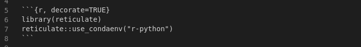
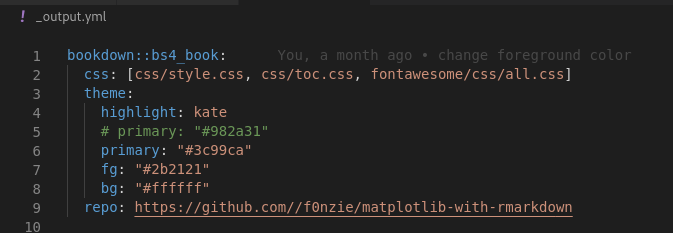

# BUILD

## Introduction

### What is so special about this book

1. Book written in Python with Rmarkdown

2. Combination of different engines: `r`, `python`, and `shell`

3. Addition of a decoration for chunks through file `deco_hook.R`. Implemented for Python, R and Shell.

4. Each chapter is built using reticulate and a conda environment

    

5. Uses a before chapter script with `R/before-each-chapter.R`

6. New bookdown format `bs4_book` added to the output

    

7. 

## Building the book

*   `make bs4_book`
*   `make git_book`: 


## Makefile

*   `make git_push`:
*   `make tidy`
*   `make info`: information about the environment


## Repository

### ssh

    ```
    git@github-oilgains:f0nzie/matplotlib-with-rmarkdown.git
    ```

