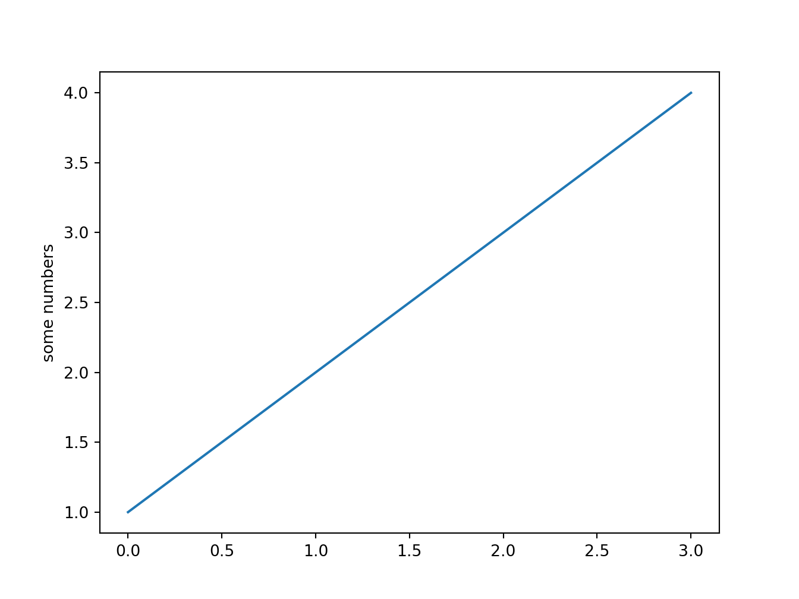

# Preface {.unnumbered}

*Last update: Sun Nov 15 15:27:51 2020 -0600 (bbd8f7c)*

The goal of this minimal book is thoroughly testing that Python `matplotlib` notebooks in **Rmarkdown** work seamlessly from within `RStudio`. Making `matplotlib` run from within RStudio using the R package `reticulate` and **Python Anaconda** has improved a lot. The package `reticulate` and RStudio have gone through a complete transformation in the past few months. Enough to say that it's an accepted fact today that Python and R are ready to work along for the benefit of data science, machine learning and artificial intelligence.

## Motivation {.unnumbered}

What has provoked this transition is the realization within the R community that porting the machine learning libraries, such **TensorFlow** and **PyTorch**, from Python to R is turning in a tedious, repetitive and redundant task.

I had this feeling personally as I was developing **rTorch**, which is writing wrappers in R to the already existing PyTorch functions. The hard work is writing a new function in R routing to its corresponding function in PyTorch. This requires class and type validation, stick to the original length of arguments, converting R objects to Python, or PyTorch, objects, test that the conversion was correct, and finally return the R object. With so many functions in these machine libraries, and the dynamic change of versions, it is hard to keep up. Why not rather write the machine learning algorithm directly in Python within Rmarkdown blocks?

I have been testing different ways of making this task reproducible and repeatable with several Python libraries, such as numpy, pandas, scipy, and others. One of the hardest to get satisfactory results is **matplotlib**, due to the inline plotting within the document. In the past matplotlib was causing crashes in RStudio, or simply, didn't show any plot because incompatibilities in th visualization layers. So annoying and frustrating to giving you incentive enough to write your own R wrappers to Python machine learning packages. Today, the situation has changed drastically. RStudio has taken the decision of making R and Python ecosystems to live harmoniously together. The new upcoming *RStudio 1.4* -which preview version I have been testing-, really delivers R and Python super-powers. And best of all, in great reproducible Rmarkdown!

## Method {.unnumbered}

### R engine {.unnumbered}

Since I combine code from different sources (`R`, `Python`, and `Bash`), I have added some custom colorization to the code chunks when I use a particular code engine. Here is an example of using the R engine. {-=""}

<div class=decocode><div style="background-color:#4C78DB"><span style="font-size:90%;color:#ffffff"><i class="fab fa-r-project"></i><b>R</b></span>

```r
library(reticulate)
reticulate::use_condaenv("r-python")
```

</div><br></div>

What we are doing is calling the R package **reticulate**, which makes possible the communication between Python and R.

The way you will enter this block of code is pretty straightforward; you just indicate the engine you want, in this, case `r`, like this:

```` {.markdown}
```{r}
library(reticulate)
reticulate::use_condaenv("r-python")
```
````

There is even a shortcut in RStudio to add the R block automatically for you: <kbd>Ctrl</kbd> <kbd>Alt</kbd> <kbd>I</kbd>.

To add color and icon to this R block, add the parameter `decorate=TRUE`. This function hook resides in the file `R/deco_hook.R`. Of course, you can modify the colors or icons for the engines, or add your own. This is how hook looks like:

<div class=decocode><div style="background-color:#4C78DB"><span style="font-size:90%;color:#ffffff"><i class="fab fa-r-project"></i><b>R</b></span>

```r
library(knitr)

knit_hooks$set(decorate = function(before, options) {
  if (before) {
     if (options$engine == "python") {
       label <- "<b>Python</b>"
       bc <- "#417FB1"
       sz <- "90%"
       tc <- "#FFD94C"
       icon <- "<i class=\"fab fa-python\"></i>  "
     } else if (options$engine == "R") {
       label <- "<b>R</b>"
       bc <- "#4C78DB"
       sz <- "90%"
       tc <- "#ffffff"
       icon <- "<i class=\"fab fa-r-project\"></i>  "
     } else if (options$engine == "bash") {
       label <- "<b>Shell</b>"
       bc <- "#000000"
       sz <- "90%"
       tc <- "#ffffff"
       icon <- "<i class=\"fas fa-terminal\"></i>  "
     }
    paste0("<div class=decocode>",
           "<div style=\"background-color:", bc, "\">",
           "<span style=\"font-size:", sz, ";color:", tc, "\">",
           icon, label, "</span>", "\n")
  } else {
    "</div><br></div>"
  }
}) 
```

</div><br></div>

You see that we are using the knitr engine name as the condition for the formatting block.

### Bash engine {.unnumbered}

This chunk of code with the engine set to `bash` will list all the `conda` environments installed and available to the user (in my machine):

<div class=decocode><div style="background-color:#000000"><span style="font-size:90%;color:#ffffff"><i class="fas fa-terminal"></i>  <b>Shell</b></span>

```bash
echo "list all conda environments available"
source ~/miniconda3/etc/profile.d/conda.sh
conda activate r-python
conda env list
echo "working from the terminal"
```

```
#:> list all conda environments available
#:> # conda environments:
#:> #
#:> base                     /home/msfz751/miniconda3
#:> man_ccia                 /home/msfz751/miniconda3/envs/man_ccia
#:> pybook                   /home/msfz751/miniconda3/envs/pybook
#:> r-python              *  /home/msfz751/miniconda3/envs/r-python
#:> r-tensorflow             /home/msfz751/miniconda3/envs/r-tensorflow
#:> 
#:> working from the terminal
```

</div><br></div>

To set the block as bash, we enter it like this:

```` {.markdown}
 ```{bash}
echo "list all conda environments available"
source ~/anaconda3/etc/profile.d/conda.sh
conda activate r-python
conda env list
echo "working from the terminal"
```
````

And the block will execute your commands as you were in the terminal.

### Python engine {.unnumbered}

This other colorized chunk of code shows a simple example of the use of `matplotlib` from with R. It is a very simple example but now you now the color convention for different sets of code I will be using in this minimal book.

<div class=decocode><div style="background-color:#417FB1"><span style="font-size:90%;color:#FFD94C"><i class="fab fa-python"></i>  <b>Python</b></span>

```python
import matplotlib.pyplot as plt

plt.plot([1, 2, 3, 4])
plt.ylabel('some numbers')
plt.show()
```

</div><br></div>

As you may be expecting it follows the same pattern when we want to use a Python engine. You just have to indicate it after three backticks, curly brace opened, `python`, and a curly brace closed: \`\`\``{python}`. You end the Python block with other three backticks. That's it.

```` {.markdown}
 ```{python}
import matplotlib.pyplot as plt

plt.plot([1, 2, 3, 4])
plt.ylabel('some numbers')
plt.show()
```
````
