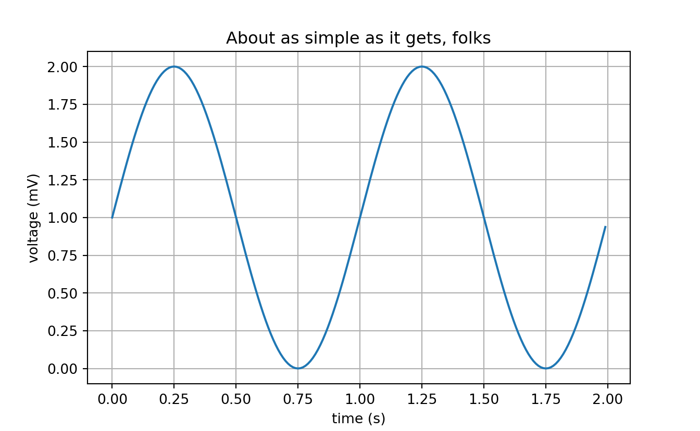

# Python environment


```r
# library(reticulate)
# reticulate::use_python("..\\..\\python-3.6.7.amd64\\python.exe")
# reticulate::py_config()
# reticulate::py_available()
```


```r
library(reticulate)
```


```r
# get the current folder of the notebook to set the relative path
getwd()
```

```
## [1] "/media/msfz751/2560x/remotes/github-oilgains/matplotlib-with-rmarkdown"
```


```r
library(reticulate)
use_condaenv("r-python", required = TRUE)
py_config()
```

```
## python:         /home/msfz751/anaconda3/envs/r-python/bin/python
## libpython:      /home/msfz751/anaconda3/envs/r-python/lib/libpython3.7m.so
## pythonhome:     /home/msfz751/anaconda3/envs/r-python:/home/msfz751/anaconda3/envs/r-python
## version:        3.7.9 (default, Aug 31 2020, 12:42:55)  [GCC 7.3.0]
## numpy:          /home/msfz751/anaconda3/envs/r-python/lib/python3.7/site-packages/numpy
## numpy_version:  1.19.1
## 
## NOTE: Python version was forced by use_python function
```


```r
reticulate::use_python("..\\..\\python-3.6.7.amd64\\python.exe")
reticulate::py_config()
reticulate::py_available()
```


```python
# this chunk with matplotlib will only run if the PyQt plugin path has been specified
import matplotlib
import matplotlib.pyplot as plt
import numpy as np
```


```python
t = np.arange(0.0, 2.0, 0.01)
s = 1 + np.sin(2 * np.pi * t)

fig, ax = plt.subplots()
ax.plot(t, s)

ax.set(xlabel='time (s)', ylabel='voltage (mV)',
       title='About as simple as it gets, folks')
```

```
## [Text(0.5, 0, 'time (s)'), Text(0, 0.5, 'voltage (mV)'), Text(0.5, 1.0, 'About as simple as it gets, folks')]
```

```python
ax.grid()

plt.show()
```




