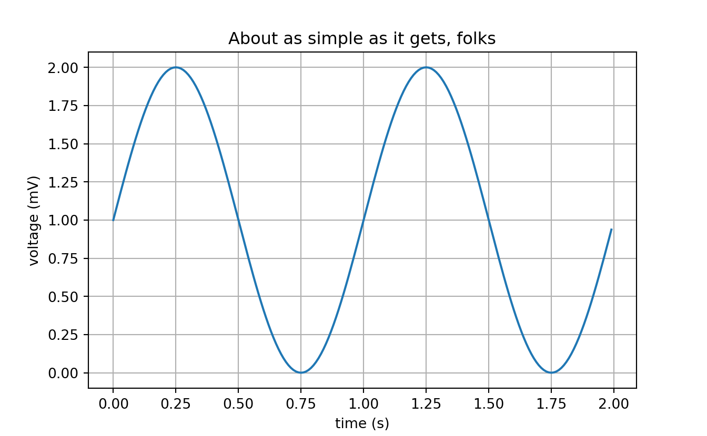

# Python environment


<div class=decocode><div style="background-color:#4C78DB"><span style="font-size:90%;color:#ffffff"><i class="fab fa-r-project"></i>  <b>R</b></span>

```r
library(reticulate)
```

</div></div>

<div class=decocode><div style="background-color:#4C78DB"><span style="font-size:90%;color:#ffffff"><i class="fab fa-r-project"></i>  <b>R</b></span>

```r
# get the current folder of the notebook to set the relative path
getwd()
```

</div></div>

<div class=decocode><div style="background-color:#4C78DB"><span style="font-size:90%;color:#ffffff"><i class="fab fa-r-project"></i>  <b>R</b></span>

```r
library(reticulate)
use_condaenv("r-python", required = TRUE)
py_config()
```

</div></div>


<div class=decocode><div style="background-color:#366994"><span style="font-size:90%;color:#ffffff"><i class="fab fa-python"></i>  <b>Python</b></span>

```python
# this chunk with matplotlib will only run if the PyQt plugin path has been specified
import matplotlib
import matplotlib.pyplot as plt
import numpy as np
```

</div></div>

<div class=decocode><div style="background-color:#366994"><span style="font-size:90%;color:#ffffff"><i class="fab fa-python"></i>  <b>Python</b></span>

```python
t = np.arange(0.0, 2.0, 0.01)
s = 1 + np.sin(2 * np.pi * t)

fig, ax = plt.subplots()
ax.plot(t, s)

ax.set(xlabel='time (s)', ylabel='voltage (mV)',
       title='About as simple as it gets, folks')
ax.grid()

plt.show()
```

</div></div>


```r
# load the package that makes R and Python talk
library(reticulate)

# set the preferred Python to execute
user_profile <- Sys.getenv("USERPROFILE")                    # user folder
python_portable <- normalizePath(file.path(user_profile,     # Python location
                                "WPy-3710zero/python-3.7.1.amd64/python.exe"))
reticulate::use_python(python_portable, required = TRUE)
reticulate::py_config()
```


```r
# library(reticulate)
# reticulate::use_python("..\\..\\python-3.6.7.amd64\\python.exe")
# reticulate::py_config()
# reticulate::py_available()
```
