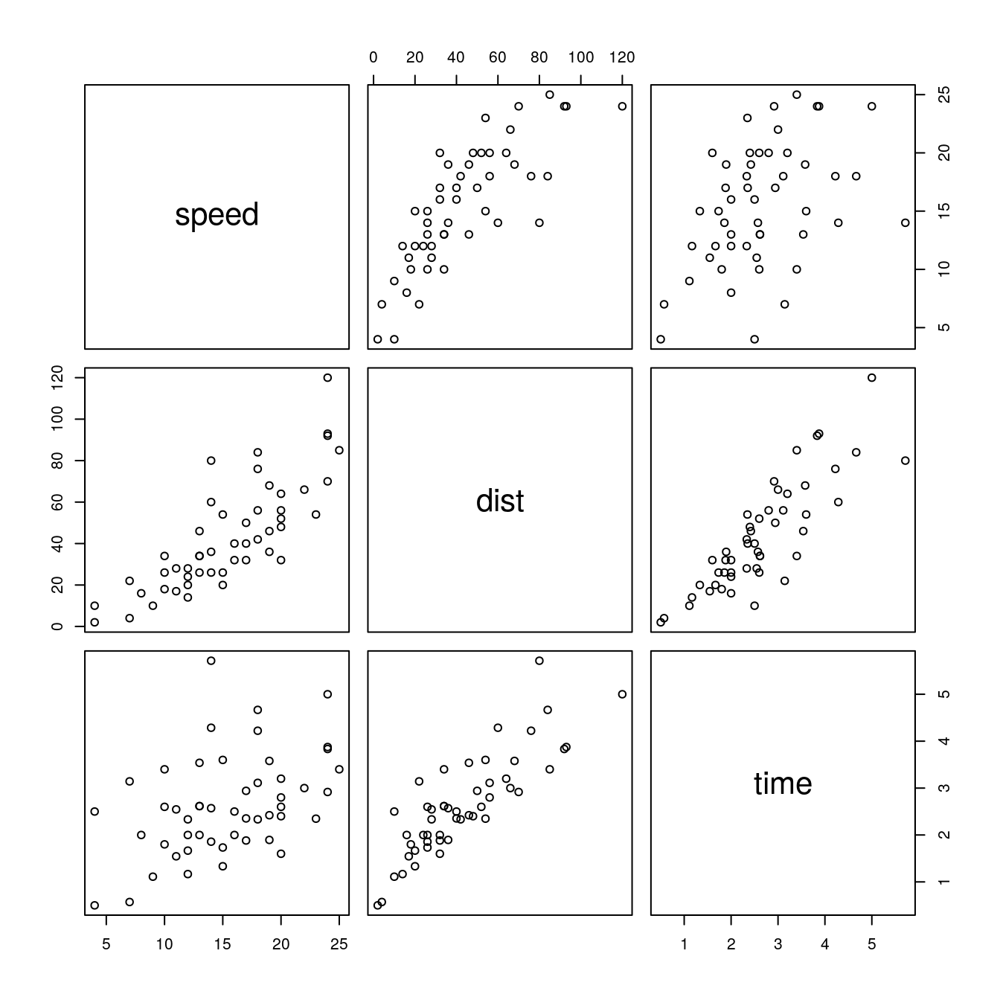

# Sharing data objects

_Last update: Thu Nov 5 14:04:38 2020 -0600 (afafa56)_

## From R to Python, back to R

-   Always load the Python environment with the packages you need.

<div class=decocode><div style="background-color:#4C78DB"><span style="font-size:90%;color:#ffffff"><i class="fab fa-r-project"></i>  <b>R</b></span>

```r
library(reticulate)
use_condaenv("r-python")
```

</div><br></div>

1.  Load the dataset in R and assign it to an R object. Let's call it `autos`:

<div class=decocode><div style="background-color:#4C78DB"><span style="font-size:90%;color:#ffffff"><i class="fab fa-r-project"></i>  <b>R</b></span>

```r
# R chunk
autos = cars       # assign cars to autos
```

</div><br></div>

2.  Read the R object from Python by adding the prefix `r.` before the name of the R object `autos`. Then, assign it to a Python object that we will name `autos_py`.

<div class=decocode><div style="background-color:#417FB1"><span style="font-size:90%;color:#FFD94C"><i class="fab fa-python"></i>  <b>Python</b></span>

```python
# Python chunk
import numpy
import pandas 

autos_py = r.autos    # assign to a Python object
```

</div><br></div>

3.  Make a calculation between two columns in the dataset (distance and speed), and assign it to a new column in the dataset with `autos_py['time']`.

<div class=decocode><div style="background-color:#417FB1"><span style="font-size:90%;color:#FFD94C"><i class="fab fa-python"></i>  <b>Python</b></span>

```python
# Python chunk
autos_py['time'] = autos_py['dist'] / autos_py['speed']   # calculate on variables
```

</div><br></div>

4.  From R, read the Python object `py$autos_py` and plot the dataset with the new column `time`, that you obtained in Python. Observe that we added the prefix `py$` in front of the Python object `autos_py`:

<div class=decocode><div style="background-color:#4C78DB"><span style="font-size:90%;color:#ffffff"><i class="fab fa-r-project"></i>  <b>R</b></span>

```r
# R chunk
plot(py$autos_py)          # plot a Python data object
```

</div><br></div>

## From Python to R, back to Python
