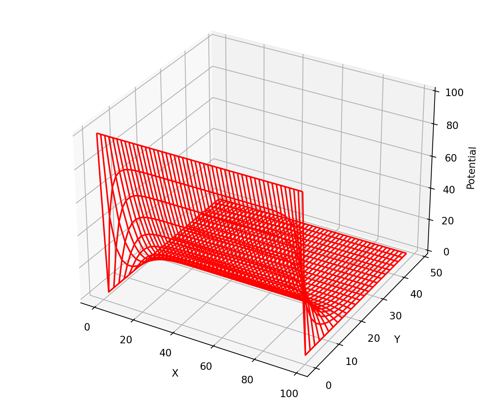
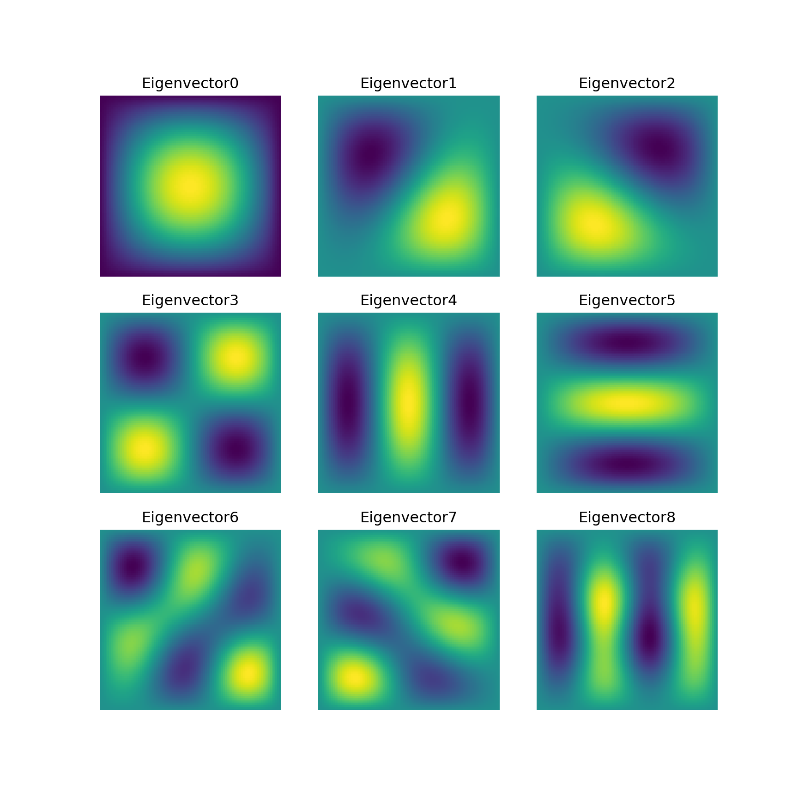
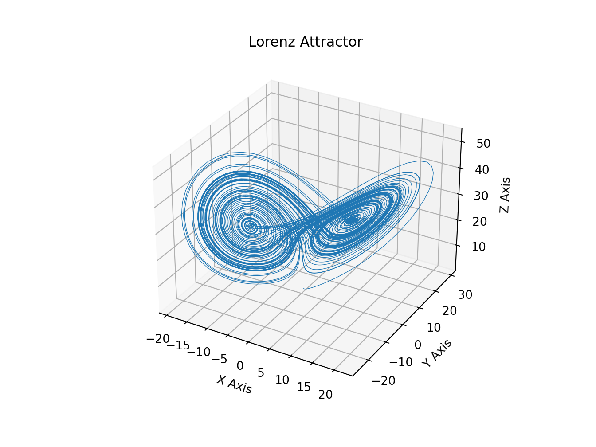
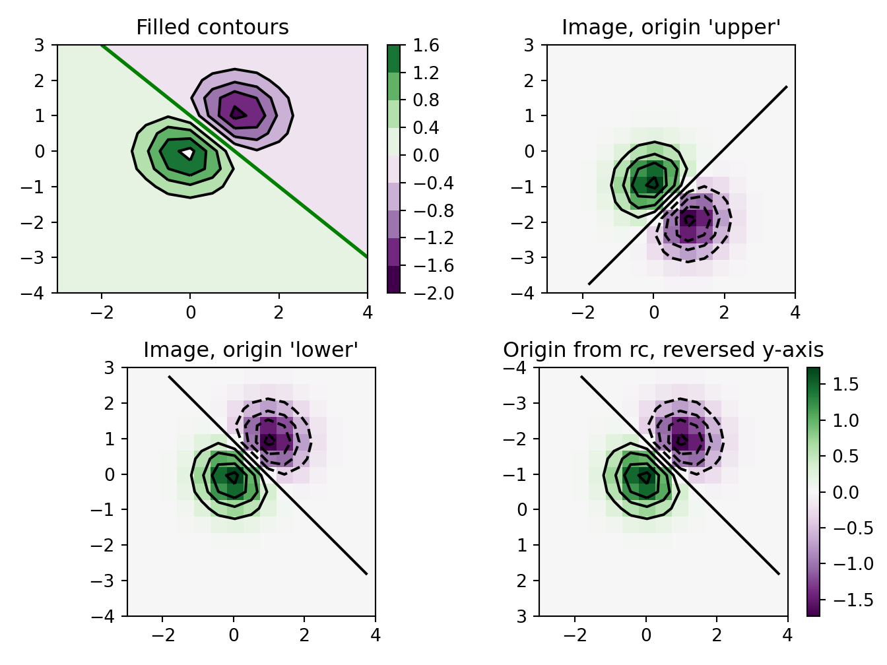
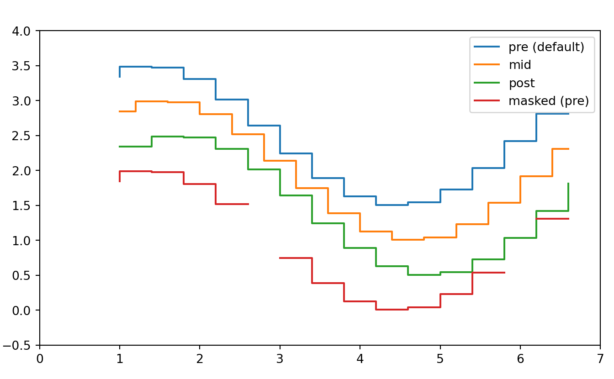
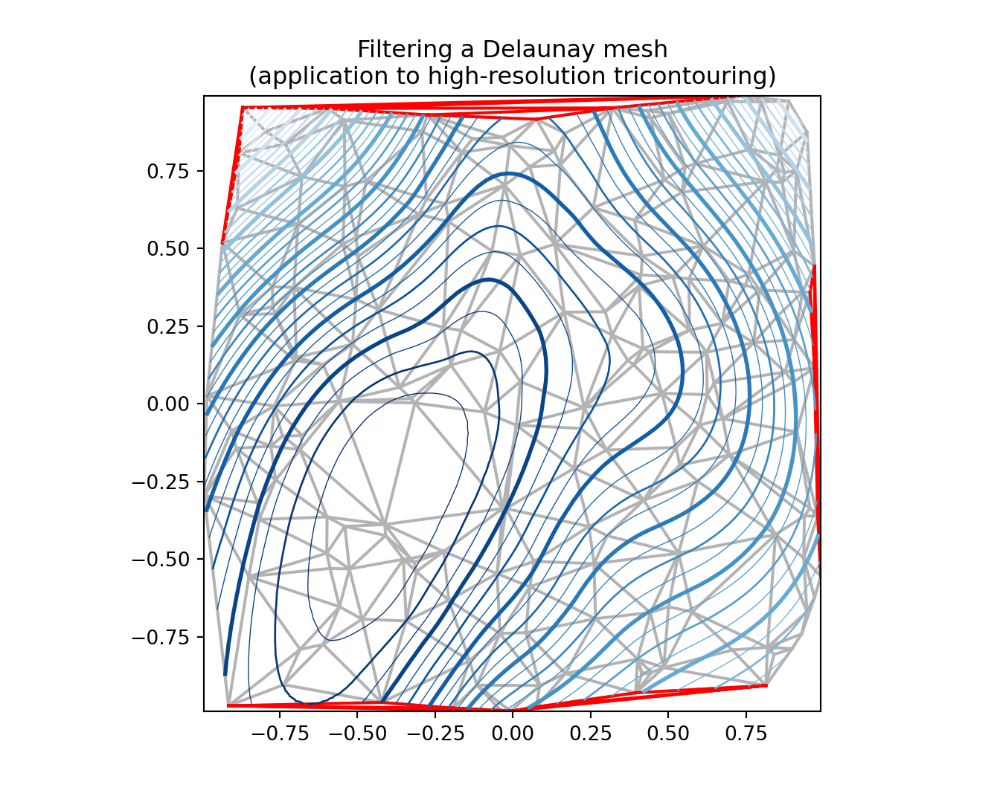
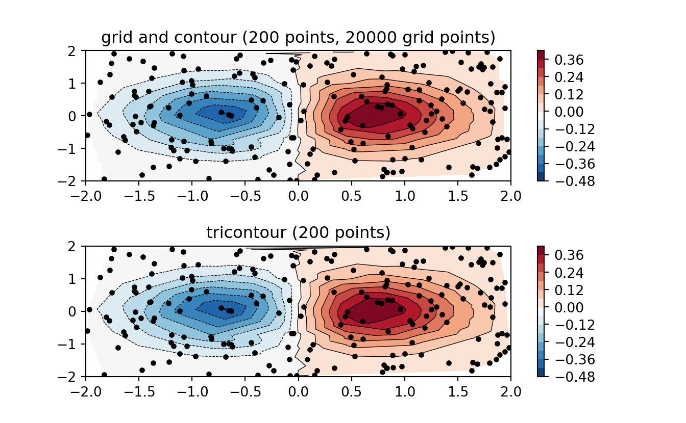
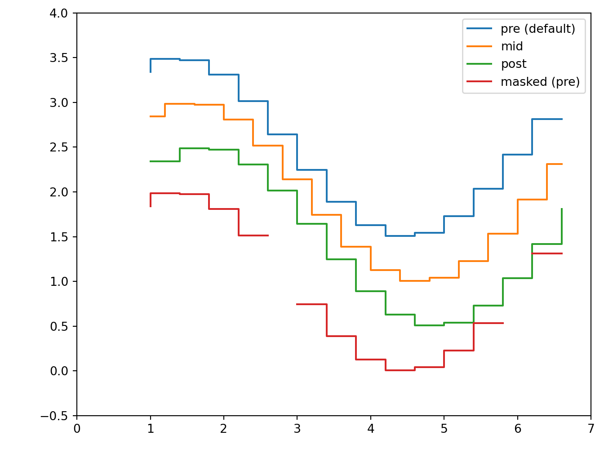
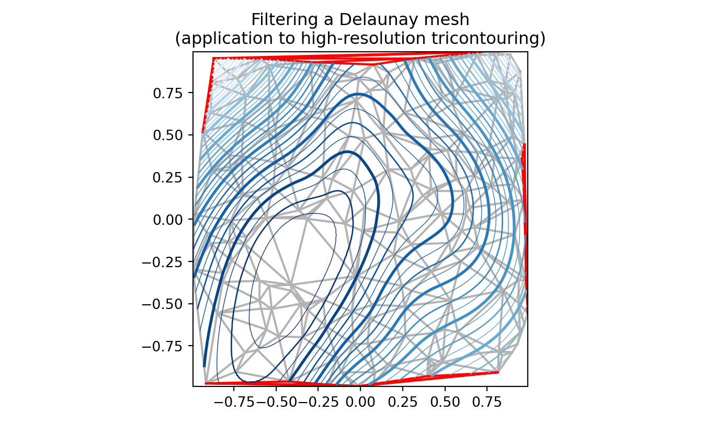
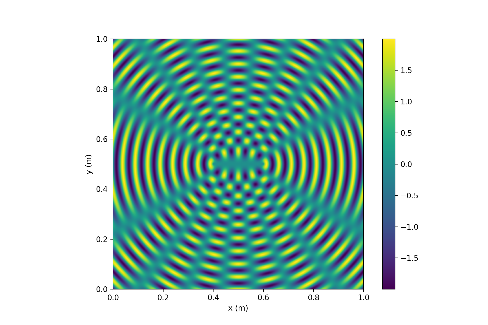

# Scientific

_Last update: Thu Nov 5 19:22:01 2020 -0600 (5124cef)_

<div class=decocode><div style="background-color:#4C78DB"><span style="font-size:90%;color:#ffffff"><i class="fab fa-r-project"></i><b>R</b></span>

```r
library(reticulate)
reticulate::use_condaenv("r-python")
```

</div><br></div>


## Solve Computational Physics Problems

<div class=decocode><div style="background-color:#417FB1"><span style="font-size:90%;color:#FFD94C"><i class="fab fa-python"></i><b>Python</b></span>

```python
# https://www.codeproject.com/Articles/1087025/Using-Python-to-Solve-Computational-Physics-Proble
import numpy as np
import matplotlib.pyplot as plt

# Set maximum iteration
maxIter = 500

# Set Dimension and delta
lenX = lenY = 20 #we set it rectangular
delta = 1

# Boundary condition
Ttop = 100
Tbottom = 0
Tleft = 0
Tright = 30

# Initial guess of interior grid
Tguess = 30

# Set colour interpolation and colour map.
# You can try set it to 10, or 100 to see the difference
# You can also try: colourMap = plt.cm.coolwarm
colorinterpolation = 50
colourMap = plt.cm.jet

# Set meshgrid
X, Y = np.meshgrid(np.arange(0, lenX), np.arange(0, lenY))

# Set array size and set the interior value with Tguess
T = np.empty((lenX, lenY))
T.fill(Tguess)

# Set Boundary condition
T[(lenY-1):, :] = Ttop
T[:1, :] = Tbottom
T[:, (lenX-1):] = Tright
T[:, :1] = Tleft

# Iteration (We assume that the iteration is convergence in maxIter = 500)
print("Please wait for a moment")
for iteration in range(0, maxIter):
    for i in range(1, lenX-1, delta):
        for j in range(1, lenY-1, delta):
            T[i, j] = 0.25 * (T[i+1][j] + T[i-1][j] + T[i][j+1] + T[i][j-1])

print("Iteration finished")

# Configure the contour
plt.title("Contour of Temperature")
plt.contourf(X, Y, T, colorinterpolation, cmap=colourMap)

# Set Colorbar
plt.colorbar()

# Show the result in the plot window
plt.show()
```

</div><br></div>

## Find electric potential in a square wire

<div class=decocode><div style="background-color:#417FB1"><span style="font-size:90%;color:#FFD94C"><i class="fab fa-python"></i><b>Python</b></span>

```python
# https://www.eidos.ic.i.u-tokyo.ac.jp/~tau/lecture/computational_physics/docs/computational_physics.pdf
# Page 404. Figure 17.1
# Solve Laplace equation
from numpy import * 
import matplotlib.pylab as lab
import matplotlib.pyplot as plt
from mpl_toolkits.mplot3d import Axes3D

print("Initializing")
Nmax = 100; Niter = 70; V = zeros((Nmax, Nmax), float) # float maybe Float

print("Working hard, wait for the figure while I count to 60")
for k in range(0, Nmax-1):  V[k,0] = 100.0      # line at 100V

for iter in range(Niter):                       # iterations over algorithm
    if iter % 10 == 0: print(iter)
    for i in range(1, Nmax-2):
        for j in range(1,Nmax-2): V[i,j] = 0.25 * (V[i+1,j] + V[i-1,j] + V[i,j+1] + V[i,j-1])
x = range(0, Nmax-1, 2); y = range(0, 50, 2)     # plot every other point
X, Y = lab.meshgrid(x, y)

def functz(V):                                    # Function returns V(x, y)
    z = V[X,Y]
    return z

Z = functz(V)
fig = lab.figure()                          # Create figures
ax = Axes3D(fig)                            # plot axes
ax.plot_wireframe(X, Y, Z, color = 'r')     # red wireframe
ax.set_xlabel('X')                          # label axes
ax.set_ylabel('Y')
ax.set_zlabel('Potential')
lab.show()                                  # display fig, close shell to quit
```

</div><br></div>


## Eigenvalue problems
    
* `lobpcg` (Locally Optimal Block Preconditioned Conjugate Gradient Method) * works very well in combination with `PyAMG` (example by Nathan Bell)

<div class=decocode><div style="background-color:#417FB1"><span style="font-size:90%;color:#FFD94C"><i class="fab fa-python"></i><b>Python</b></span>

```python
# http://scipy-lectures.org/_downloads/ScipyLectures-simple.pdf
# Page 348
# Compute eigenvectors and eigenvalues using a preconditioned eigensolver
# ========================================================================
# In this example Smoothed Aggregation (SA) is used to precondition
# the LOBPCG eigensolver on a two-dimensional Poisson problem with
# Dirichlet boundary conditions.
import scipy
from scipy.sparse.linalg import lobpcg
import matplotlib.pyplot as plt
from pyamg import smoothed_aggregation_solver
from pyamg.gallery import poisson

N = 100
K = 9
A = poisson((N,N), format='csr')
# create the AMG hierarchy
ml = smoothed_aggregation_solver(A)
# initial approximation to the K eigenvectors
X = scipy.rand(A.shape[0], K)
# preconditioner based on ml
M = ml.aspreconditioner()
# compute eigenvalues and eigenvectors with LOBPCG
W,V = lobpcg(A, X, M=M, tol=1e-8, largest=False)

plt.figure(figsize=(9,9))
# iterate through the subplots adding data points
for i in range(K):
    plt.subplot(3, 3, i+1)
    plt.title('Eigenvector%d'% i)
    plt.pcolor(V[:,i].reshape(N,N))
    plt.axis('equal')
    plt.axis('off')
plt.show()
```

</div><br></div>

## Computational Physics

<div class=decocode><div style="background-color:#417FB1"><span style="font-size:90%;color:#FFD94C"><i class="fab fa-python"></i><b>Python</b></span>

```python
# Plot of the Lorenz Attractor based on Edward Lorenz's 1963 "Deterministic
# Nonperiodic Flow" publication.
# http://journals.ametsoc.org/doi/abs/10.1175/1520-0469%281963%29020%3C0130%3ADNF%3E2.0.CO%3B2
import numpy as np
import matplotlib.pyplot as plt
from mpl_toolkits.mplot3d import Axes3D


def lorenz(x, y, z, s=10, r=28, b=2.667):
    x_dot = s*(y - x)
    y_dot = r*x - y - x*z
    z_dot = x*y - b*z
    return x_dot, y_dot, z_dot
# parameters
dt = 0.01
stepCnt = 10000
# Need one more for the initial values
xs = np.empty((stepCnt + 1,))
ys = np.empty((stepCnt + 1,))
zs = np.empty((stepCnt + 1,))
# Setting initial values
xs[0], ys[0], zs[0] = (0., 1., 1.05)
# Stepping through "time".
for i in range(stepCnt):
    # Derivatives of the X, Y, Z state
    x_dot, y_dot, z_dot = lorenz(xs[i], ys[i], zs[i])
    xs[i + 1] = xs[i] + (x_dot * dt)
    ys[i + 1] = ys[i] + (y_dot * dt)
    zs[i + 1] = zs[i] + (z_dot * dt)

fig = plt.figure()
ax = fig.gca(projection='3d')

ax.plot(xs, ys, zs, lw=0.5)
ax.set_xlabel("X Axis")
ax.set_ylabel("Y Axis")
ax.set_zlabel("Z Axis")
ax.set_title("Lorenz Attractor")

plt.show()
```

</div><br></div>


<div class=decocode><div style="background-color:#417FB1"><span style="font-size:90%;color:#FFD94C"><i class="fab fa-python"></i><b>Python</b></span>

```python
# https://matplotlib.org/gallery/images_contours_and_fields/contour_image.html#sphx-glr-gallery-images-contours-and-fields-contour-image-py
import matplotlib.pyplot as plt
import numpy as np
from matplotlib import cm
# Default delta is large because that makes it fast, and it illustrates
# the correct registration between image and contours.
delta = 0.5

extent = (-3, 4, -4, 3)

x = np.arange(-3.0, 4.001, delta)
y = np.arange(-4.0, 3.001, delta)
X, Y = np.meshgrid(x, y)
Z1 = np.exp(-X**2 - Y**2)
Z2 = np.exp(-(X - 1)**2 - (Y - 1)**2)
Z = (Z1 - Z2) * 2

# Boost the upper limit to avoid truncation errors.
levels = np.arange(-2.0, 1.601, 0.4)

norm = cm.colors.Normalize(vmax=abs(Z).max(), vmin=-abs(Z).max())
cmap = cm.PRGn

fig, _axs = plt.subplots(nrows=2, ncols=2)
fig.subplots_adjust(hspace=0.3)
axs = _axs.flatten()

cset1 = axs[0].contourf(X, Y, Z, levels, norm=norm,
                     cmap=cm.get_cmap(cmap, len(levels) - 1))
# It is not necessary, but for the colormap, we need only the
# number of levels minus 1.  To avoid discretization error, use
# either this number or a large number such as the default (256).

# If we want lines as well as filled regions, we need to call
# contour separately; don't try to change the edgecolor or edgewidth
# of the polygons in the collections returned by contourf.
# Use levels output from previous call to guarantee they are the same.
cset2 = axs[0].contour(X, Y, Z, cset1.levels, colors='k')

# We don't really need dashed contour lines to indicate negative
# regions, so let's turn them off.
for c in cset2.collections:
    c.set_linestyle('solid')

# It is easier here to make a separate call to contour than
# to set up an array of colors and linewidths.
# We are making a thick green line as a zero contour.
# Specify the zero level as a tuple with only 0 in it.
cset3 = axs[0].contour(X, Y, Z, (0,), colors='g', linewidths=2)
axs[0].set_title('Filled contours')
fig.colorbar(cset1, ax=axs[0])
axs[1].imshow(Z, extent=extent, cmap=cmap, norm=norm)
axs[1].contour(Z, levels, colors='k', origin='upper', extent=extent)
axs[1].set_title("Image, origin 'upper'")

axs[2].imshow(Z, origin='lower', extent=extent, cmap=cmap, norm=norm)
axs[2].contour(Z, levels, colors='k', origin='lower', extent=extent)
axs[2].set_title("Image, origin 'lower'")

# We will use the interpolation "nearest" here to show the actual
# image pixels.
# Note that the contour lines don't extend to the edge of the box.
# This is intentional. The Z values are defined at the center of each
# image pixel (each color block on the following subplot), so the
# domain that is contoured does not extend beyond these pixel centers.
im = axs[3].imshow(Z, interpolation='nearest', extent=extent,
                cmap=cmap, norm=norm)
axs[3].contour(Z, levels, colors='k', origin='image', extent=extent)
ylim = axs[3].get_ylim()
axs[3].set_ylim(ylim[::-1])
axs[3].set_title("Origin from rc, reversed y-axis")
fig.colorbar(im, ax=axs[3])
fig.tight_layout()
plt.show()
```

</div><br></div>


<div class=decocode><div style="background-color:#417FB1"><span style="font-size:90%;color:#FFD94C"><i class="fab fa-python"></i><b>Python</b></span>

```python
# https://matplotlib.org/gallery/images_contours_and_fields/irregulardatagrid.html#sphx-glr-gallery-images-contours-and-fields-irregulardatagrid-py
import matplotlib.pyplot as plt
import matplotlib.tri as tri
import numpy as np

np.random.seed(19680801)
npts = 200
ngridx = 100
ngridy = 200
x = np.random.uniform(-2, 2, npts)
y = np.random.uniform(-2, 2, npts)
z = x * np.exp(-x**2 - y**2)

fig, (ax1, ax2) = plt.subplots(nrows=2)

# -----------------------
# Interpolation on a grid
# -----------------------
# A contour plot of irregularly spaced data coordinates
# via interpolation on a grid.

# Create grid values first.
xi = np.linspace(-2.1, 2.1, ngridx)
yi = np.linspace(-2.1, 2.1, ngridy)

# Perform linear interpolation of the data (x,y)
# on a grid defined by (xi,yi)
triang = tri.Triangulation(x, y)
interpolator = tri.LinearTriInterpolator(triang, z)
Xi, Yi = np.meshgrid(xi, yi)
zi = interpolator(Xi, Yi)

# Note that scipy.interpolate provides means to interpolate data on a grid
# as well. The following would be an alternative to the four lines above:
#from scipy.interpolate import griddata
#zi = griddata((x, y), z, (xi[None,:], yi[:,None]), method='linear')
ax1.contour(xi, yi, zi, 14, linewidths=0.5, colors='k')
cntr1 = ax1.contourf(xi, yi, zi, 14, cmap="RdBu_r")

fig.colorbar(cntr1, ax=ax1)
ax1.plot(x, y, 'ko', ms=3)
ax1.axis((-2, 2, -2, 2))
ax1.set_title('grid and contour (%d points, %d grid points)' %
              (npts, ngridx * ngridy))
# ----------
# Tricontour
# ----------
# Directly supply the unordered, irregularly spaced coordinates
# to tricontour.
ax2.tricontour(x, y, z, 14, linewidths=0.5, colors='k')
cntr2 = ax2.tricontourf(x, y, z, 14, cmap="RdBu_r")

fig.colorbar(cntr2, ax=ax2)
ax2.plot(x, y, 'ko', ms=3)
ax2.axis((-2, 2, -2, 2))
ax2.set_title('tricontour (%d points)' % npts)

plt.subplots_adjust(hspace=0.5)
plt.show()
```

</div><br></div>


## Triangulation and Delauney maps

<div class=decocode><div style="background-color:#417FB1"><span style="font-size:90%;color:#FFD94C"><i class="fab fa-python"></i><b>Python</b></span>

```python
from matplotlib.tri import Triangulation, TriAnalyzer, UniformTriRefiner
import matplotlib.pyplot as plt
import matplotlib.cm as cm
import numpy as np
#-----------------------------------------------------------------------------
# Analytical test function
#-----------------------------------------------------------------------------
def experiment_res(x, y):
    """ An analytic function representing experiment results """
    x = 2. * x
    r1 = np.sqrt((0.5 - x)**2 + (0.5 - y)**2)
    theta1 = np.arctan2(0.5 - x, 0.5 - y)
    r2 = np.sqrt((-x - 0.2)**2 + (-y - 0.2)**2)
    theta2 = np.arctan2(-x - 0.2, -y - 0.2)
    z = (4 * (np.exp((r1 / 10)**2) - 1) * 30. * np.cos(3 * theta1) +
         (np.exp((r2 / 10)**2) - 1) * 30. * np.cos(5 * theta2) +
         2 * (x**2 + y**2))
    return (np.max(z) - z) / (np.max(z) - np.min(z))

#-----------------------------------------------------------------------------
# Generating the initial data test points and triangulation for the demo
#-----------------------------------------------------------------------------
# User parameters for data test points
n_test = 200  # Number of test data points, tested from 3 to 5000 for subdiv=3

subdiv = 3  # Number of recursive subdivisions of the initial mesh for smooth
            # plots. Values >3 might result in a very high number of triangles
            # for the refine mesh: new triangles numbering = (4**subdiv)*ntri

init_mask_frac = 0.0    # Float > 0. adjusting the proportion of
                        # (invalid) initial triangles which will be masked
                        # out. Enter 0 for no mask.

min_circle_ratio = .01  # Minimum circle ratio - border triangles with circle
                        # ratio below this will be masked if they touch a
                        # border. Suggested value 0.01; use -1 to keep
                        # all triangles.

# Random points
random_gen = np.random.RandomState(seed=19680801)
x_test = random_gen.uniform(-1., 1., size=n_test)
y_test = random_gen.uniform(-1., 1., size=n_test)
z_test = experiment_res(x_test, y_test)
# meshing with Delaunay triangulation
tri = Triangulation(x_test, y_test)
ntri = tri.triangles.shape[0]
# Some invalid data are masked out
mask_init = np.zeros(ntri, dtype=bool)
masked_tri = random_gen.randint(0, ntri, int(ntri * init_mask_frac))
mask_init[masked_tri] = True
tri.set_mask(mask_init)
#-----------------------------------------------------------------------------
# Improving the triangulation before high-res plots: removing flat triangles
#-----------------------------------------------------------------------------
# masking badly shaped triangles at the border of the triangular mesh.
mask = TriAnalyzer(tri).get_flat_tri_mask(min_circle_ratio)
tri.set_mask(mask)
# refining the data
refiner = UniformTriRefiner(tri)
tri_refi, z_test_refi = refiner.refine_field(z_test, subdiv=subdiv)
# analytical 'results' for comparison
z_expected = experiment_res(tri_refi.x, tri_refi.y)
# for the demo: loading the 'flat' triangles for plot
flat_tri = Triangulation(x_test, y_test)
flat_tri.set_mask(~mask)
#-----------------------------------------------------------------------------
# Now the plots
#-----------------------------------------------------------------------------
# User options for plots
plot_tri = True          # plot of base triangulation
plot_masked_tri = True   # plot of excessively flat excluded triangles
plot_refi_tri = False    # plot of refined triangulation
plot_expected = False    # plot of analytical function values for comparison

# Graphical options for tricontouring
levels = np.arange(0., 1., 0.025)
cmap = cm.get_cmap(name='Blues', lut=None)

fig, ax = plt.subplots()
ax.set_aspect('equal')
ax.set_title("Filtering a Delaunay mesh\n" +
          "(application to high-resolution tricontouring)")

# 1) plot of the refined (computed) data contours:
ax.tricontour(tri_refi, z_test_refi, levels=levels, cmap=cmap,
               linewidths=[2.0, 0.5, 1.0, 0.5])
# 2) plot of the expected (analytical) data contours (dashed):
if plot_expected:
    ax.tricontour(tri_refi, z_expected, levels=levels, cmap=cmap,
                   linestyles='--')
# 3) plot of the fine mesh on which interpolation was done:
if plot_refi_tri:
    ax.triplot(tri_refi, color='0.97')
# 4) plot of the initial 'coarse' mesh:
if plot_tri:
    ax.triplot(tri, color='0.7')
# 4) plot of the unvalidated triangles from naive Delaunay Triangulation:
if plot_masked_tri:
    ax.triplot(flat_tri, color='red')
plt.show()
```

</div><br></div>

<div class=decocode><div style="background-color:#417FB1"><span style="font-size:90%;color:#FFD94C"><i class="fab fa-python"></i><b>Python</b></span>

```python
# https://matplotlib.org/gallery/images_contours_and_fields/triinterp_demo.html#sphx-glr-gallery-images-contours-and-fields-triinterp-demo-py
import matplotlib.pyplot as plt
import matplotlib.tri as mtri
import numpy as np

# Create triangulation.
x = np.asarray([0, 1, 2, 3, 0.5, 1.5, 2.5, 1, 2, 1.5])
y = np.asarray([0, 0, 0, 0, 1.0, 1.0, 1.0, 2, 2, 3.0])
triangles = [[0, 1, 4], [1, 2, 5], [2, 3, 6], [1, 5, 4], [2, 6, 5], [4, 5, 7],
             [5, 6, 8], [5, 8, 7], [7, 8, 9]]
triang = mtri.Triangulation(x, y, triangles)

# Interpolate to regularly-spaced quad grid.
z = np.cos(1.5 * x) * np.cos(1.5 * y)
xi, yi = np.meshgrid(np.linspace(0, 3, 20), np.linspace(0, 3, 20))

interp_lin = mtri.LinearTriInterpolator(triang, z)
zi_lin = interp_lin(xi, yi)

interp_cubic_geom = mtri.CubicTriInterpolator(triang, z, kind='geom')
zi_cubic_geom = interp_cubic_geom(xi, yi)

interp_cubic_min_E = mtri.CubicTriInterpolator(triang, z, kind='min_E')
zi_cubic_min_E = interp_cubic_min_E(xi, yi)

# Set up the figure
fig, axs = plt.subplots(nrows=2, ncols=2)
axs = axs.flatten()

# Plot the triangulation.
axs[0].tricontourf(triang, z)
axs[0].triplot(triang, 'ko-')
axs[0].set_title('Triangular grid')

# Plot linear interpolation to quad grid.
axs[1].contourf(xi, yi, zi_lin)
axs[1].plot(xi, yi, 'k-', lw=0.5, alpha=0.5)
axs[1].plot(xi.T, yi.T, 'k-', lw=0.5, alpha=0.5)
axs[1].set_title("Linear interpolation")

# Plot cubic interpolation to quad grid, kind=geom
axs[2].contourf(xi, yi, zi_cubic_geom)
axs[2].plot(xi, yi, 'k-', lw=0.5, alpha=0.5)
axs[2].plot(xi.T, yi.T, 'k-', lw=0.5, alpha=0.5)
axs[2].set_title("Cubic interpolation,\nkind='geom'")

# Plot cubic interpolation to quad grid, kind=min_E
axs[3].contourf(xi, yi, zi_cubic_min_E)
axs[3].plot(xi, yi, 'k-', lw=0.5, alpha=0.5)
axs[3].plot(xi.T, yi.T, 'k-', lw=0.5, alpha=0.5)
axs[3].set_title("Cubic interpolation,\nkind='min_E'")

fig.tight_layout()
plt.show()
```

</div><br></div>


## Contour maps

<div class=decocode><div style="background-color:#417FB1"><span style="font-size:90%;color:#FFD94C"><i class="fab fa-python"></i><b>Python</b></span>

```python
# http://www.scipy-lectures.org/intro/matplotlib/auto_examples/plot_contour_ex.html
import matplotlib.pyplot as plt
import numpy as np


def f(x, y):
    return (1 - x / 2 + x ** 5 + y ** 3) * np.exp(-x ** 2 -y ** 2)

n = 256
x = np.linspace(-3, 3, n)
y = np.linspace(-3, 3, n)
X,Y = np.meshgrid(x, y)

plt.axes([0.025, 0.025, 0.95, 0.95])

plt.contourf(X, Y, f(X, Y), 8, alpha=.75, cmap=plt.cm.hot)
C = plt.contour(X, Y, f(X, Y), 8, colors='black', linewidth=.5)
plt.clabel(C, inline=1, fontsize=10)
plt.xticks(())
plt.yticks(())
plt.show()
```

</div><br></div>


## Real time


<div class=decocode><div style="background-color:#417FB1"><span style="font-size:90%;color:#FFD94C"><i class="fab fa-python"></i><b>Python</b></span>

```python
# https://matplotlib.org/gallery/lines_bars_and_markers/cohere.html#sphx-glr-gallery-lines-bars-and-markers-cohere-py
import numpy as np
import matplotlib.pyplot as plt
# Fixing random state for reproducibility
np.random.seed(19680801)

dt = 0.01
t = np.arange(0, 30, dt)
nse1 = np.random.randn(len(t))                 # white noise 1
nse2 = np.random.randn(len(t))                 # white noise 2

# Two signals with a coherent part at 10Hz and a random part
s1 = np.sin(2 * np.pi * 10 * t) + nse1
s2 = np.sin(2 * np.pi * 10 * t) + nse2

fig, axs = plt.subplots(2, 1)
axs[0].plot(t, s1, t, s2)
axs[0].set_xlim(0, 2)
axs[0].set_xlabel('time')
axs[0].set_ylabel('s1 and s2')
axs[0].grid(True)

cxy, f = axs[1].cohere(s1, s2, 256, 1. / dt)
axs[1].set_ylabel('coherence')

fig.tight_layout()
plt.show()
```

</div><br></div>


<div class=decocode><div style="background-color:#417FB1"><span style="font-size:90%;color:#FFD94C"><i class="fab fa-python"></i><b>Python</b></span>

```python
# https://matplotlib.org/gallery/scales/symlog_demo.html#sphx-glr-gallery-scales-symlog-demo-py
import matplotlib.pyplot as plt
import numpy as np

dt = 0.01
x = np.arange(-50.0, 50.0, dt)
y = np.arange(0, 100.0, dt)

plt.subplot(311)
plt.plot(x, y)
plt.xscale('symlog')
plt.ylabel('symlogx')
plt.grid(True)
plt.gca().xaxis.grid(True, which='minor')  # minor grid on too

plt.subplot(312)
plt.plot(y, x)
plt.yscale('symlog')
plt.ylabel('symlogy')

plt.subplot(313)
plt.plot(x, np.sin(x / 3.0))
plt.xscale('symlog')
plt.yscale('symlog', linthreshy=0.015)
plt.grid(True)
plt.ylabel('symlog both')

plt.tight_layout()
plt.show()
```

</div><br></div>


<div class=decocode><div style="background-color:#417FB1"><span style="font-size:90%;color:#FFD94C"><i class="fab fa-python"></i><b>Python</b></span>

```python
# https://matplotlib.org/gallery/lines_bars_and_markers/step_demo.html#sphx-glr-gallery-lines-bars-and-markers-step-demo-py
import numpy as np
from numpy import ma
import matplotlib.pyplot as plt

x = np.arange(1, 7, 0.4)
y0 = np.sin(x)
y = y0.copy() + 2.5

plt.step(x, y, label='pre (default)')

y -= 0.5
plt.step(x, y, where='mid', label='mid')

y -= 0.5
plt.step(x, y, where='post', label='post')

y = ma.masked_where((y0 > -0.15) & (y0 < 0.15), y - 0.5)
plt.step(x, y, label='masked (pre)')

plt.legend()

plt.xlim(0, 7)
plt.ylim(-0.5, 4)
plt.show()
```

</div><br></div>

## Density plots

<div class=decocode><div style="background-color:#417FB1"><span style="font-size:90%;color:#FFD94C"><i class="fab fa-python"></i><b>Python</b></span>

```python
# https://blogs.umass.edu/candela/computational-physics-in-python/
# Visualize the interference from two point sources, vectorized version.
import numpy as np
import matplotlib.pyplot as plt
from numpy import pi,sqrt,sin

wavelength = 5e-2     # wavelength (m) (this is 5cm as in Newman)
k = 2*pi/wavelength   # wavenumber (m^-1)
aa0 = 1.0             # amplitude of the waves (arb. units)
separation = 20e-2    # separation of centers (m)
side = 100e-2         # side of the square (m)
points = 500          # number of grid points along each side

# Calculate the positions of the centers of the circles
x1 = side/2 + separation/2
y1 = side/2
x2 = side/2 - separation/2
y2 = side/2

# Calculate an array aas with the sum of the two waves at a grid of points
xs = np.linspace(0,side,points)                 # row vector of x's
ys = np.linspace(0,side,points)[:,np.newaxis]   # column vector of y's
r1s = sqrt((xs-x1)**2+(ys-y1)**2)
r2s = sqrt((xs-x2)**2+(ys-y2)**2)
aas = aa0*sin(k*r1s) + aa0*sin(k*r2s)

# Make the plot
plt.figure(figsize=(9,6)) 
plt.imshow(aas,origin='lower',extent=[0,side,0,side])
plt.xlabel('x (m)')
plt.ylabel('y (m)')
# plt.gray()
plt.colorbar()
plt.show()
```

</div><br></div>
