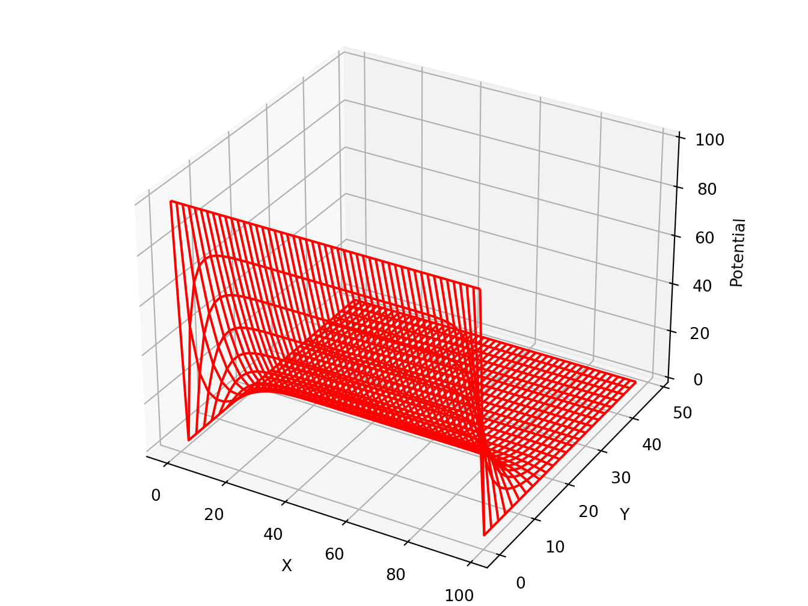
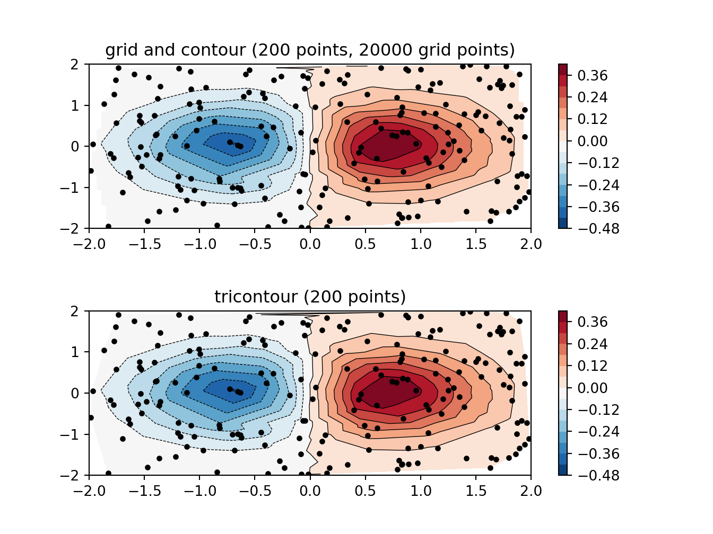
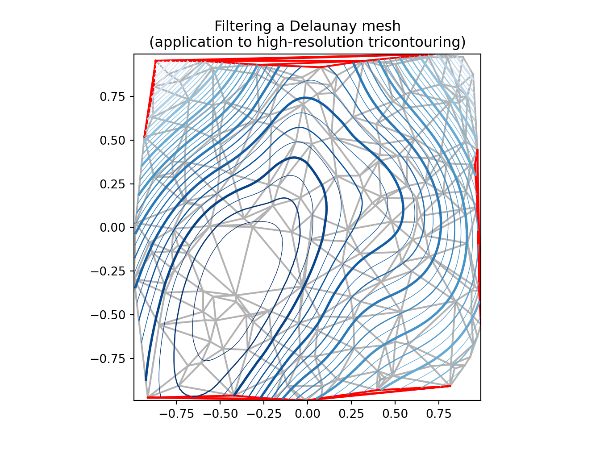

# Scientific


```r
library(reticulate)
reticulate::use_condaenv("r-torch")
reticulate::py_config()
```

```
## python:         /home/msfz751/anaconda3/envs/r-torch/bin/python
## libpython:      /home/msfz751/anaconda3/envs/r-torch/lib/libpython3.7m.so
## pythonhome:     /home/msfz751/anaconda3/envs/r-torch:/home/msfz751/anaconda3/envs/r-torch
## version:        3.7.9 (default, Aug 31 2020, 12:42:55)  [GCC 7.3.0]
## numpy:          /home/msfz751/anaconda3/envs/r-torch/lib/python3.7/site-packages/numpy
## numpy_version:  1.19.1
## 
## python versions found: 
##  /home/msfz751/anaconda3/envs/r-torch/bin/python
##  /home/msfz751/anaconda3/envs/r-torch/bin/python3
##  /usr/bin/python3
##  /usr/bin/python
##  /home/msfz751/anaconda3/bin/python
##  /home/msfz751/anaconda3/envs/man_ccia/bin/python
##  /home/msfz751/anaconda3/envs/porepy/bin/python
##  /home/msfz751/anaconda3/envs/python_book/bin/python
##  /home/msfz751/anaconda3/envs/r-python/bin/python
##  /home/msfz751/anaconda3/envs/r-tensorflow/bin/python
##  /home/msfz751/anaconda3/envs/r-toarchboard/bin/python
```


```python
# Plot of the Lorenz Attractor based on Edward Lorenz's 1963 "Deterministic
# Nonperiodic Flow" publication.
# http://journals.ametsoc.org/doi/abs/10.1175/1520-0469%281963%29020%3C0130%3ADNF%3E2.0.CO%3B2


import numpy as np
import matplotlib.pyplot as plt
from mpl_toolkits.mplot3d import Axes3D


def lorenz(x, y, z, s=10, r=28, b=2.667):
    x_dot = s*(y - x)
    y_dot = r*x - y - x*z
    z_dot = x*y - b*z
    return x_dot, y_dot, z_dot

dt = 0.01
stepCnt = 10000

# Need one more for the initial values
xs = np.empty((stepCnt + 1,))
ys = np.empty((stepCnt + 1,))
zs = np.empty((stepCnt + 1,))

# Setting initial values
xs[0], ys[0], zs[0] = (0., 1., 1.05)

# Stepping through "time".
for i in range(stepCnt):
    # Derivatives of the X, Y, Z state
    x_dot, y_dot, z_dot = lorenz(xs[i], ys[i], zs[i])
    xs[i + 1] = xs[i] + (x_dot * dt)
    ys[i + 1] = ys[i] + (y_dot * dt)
    zs[i + 1] = zs[i] + (z_dot * dt)

fig = plt.figure()
ax = fig.gca(projection='3d')

ax.plot(xs, ys, zs, lw=0.5)
ax.set_xlabel("X Axis")
ax.set_ylabel("Y Axis")
ax.set_zlabel("Z Axis")
ax.set_title("Lorenz Attractor")

plt.show()
```


```python
# ===================================
# 3D wireframe plots in one direction
# ===================================

# Demonstrates that setting rstride or cstride to 0 causes wires to not be
# generated in the corresponding direction.


from mpl_toolkits.mplot3d import axes3d
import matplotlib.pyplot as plt


fig, [ax1, ax2] = plt.subplots(2, 1, figsize=(8, 12), subplot_kw={'projection': '3d'})

# Get the test data
X, Y, Z = axes3d.get_test_data(0.05)

# Give the first plot only wireframes of the type y = c
ax1.plot_wireframe(X, Y, Z, rstride=10, cstride=0)
ax1.set_title("Column (x) stride set to 0")

# Give the second plot only wireframes of the type x = c
ax2.plot_wireframe(X, Y, Z, rstride=0, cstride=10)
ax2.set_title("Row (y) stride set to 0")

plt.tight_layout()
plt.show()
```




```python
# https://matplotlib.org/gallery/images_contours_and_fields/contour_image.html#sphx-glr-gallery-images-contours-and-fields-contour-image-py

import matplotlib.pyplot as plt
import numpy as np
from matplotlib import cm

# Default delta is large because that makes it fast, and it illustrates
# the correct registration between image and contours.
delta = 0.5

extent = (-3, 4, -4, 3)

x = np.arange(-3.0, 4.001, delta)
y = np.arange(-4.0, 3.001, delta)
X, Y = np.meshgrid(x, y)
Z1 = np.exp(-X**2 - Y**2)
Z2 = np.exp(-(X - 1)**2 - (Y - 1)**2)
Z = (Z1 - Z2) * 2

# Boost the upper limit to avoid truncation errors.
levels = np.arange(-2.0, 1.601, 0.4)

norm = cm.colors.Normalize(vmax=abs(Z).max(), vmin=-abs(Z).max())
cmap = cm.PRGn

fig, _axs = plt.subplots(nrows=2, ncols=2)
fig.subplots_adjust(hspace=0.3)
axs = _axs.flatten()

cset1 = axs[0].contourf(X, Y, Z, levels, norm=norm,
                     cmap=cm.get_cmap(cmap, len(levels) - 1))
# It is not necessary, but for the colormap, we need only the
# number of levels minus 1.  To avoid discretization error, use
# either this number or a large number such as the default (256).

# If we want lines as well as filled regions, we need to call
# contour separately; don't try to change the edgecolor or edgewidth
# of the polygons in the collections returned by contourf.
# Use levels output from previous call to guarantee they are the same.

cset2 = axs[0].contour(X, Y, Z, cset1.levels, colors='k')

# We don't really need dashed contour lines to indicate negative
# regions, so let's turn them off.

for c in cset2.collections:
    c.set_linestyle('solid')

# It is easier here to make a separate call to contour than
# to set up an array of colors and linewidths.
# We are making a thick green line as a zero contour.
# Specify the zero level as a tuple with only 0 in it.

cset3 = axs[0].contour(X, Y, Z, (0,), colors='g', linewidths=2)
axs[0].set_title('Filled contours')
fig.colorbar(cset1, ax=axs[0])

```

```
## <matplotlib.colorbar.Colorbar object at 0x7f27fdf58710>
```

```python
axs[1].imshow(Z, extent=extent, cmap=cmap, norm=norm)
axs[1].contour(Z, levels, colors='k', origin='upper', extent=extent)
```

```
## <matplotlib.contour.QuadContourSet object at 0x7f27fdf252d0>
```

```python
axs[1].set_title("Image, origin 'upper'")

axs[2].imshow(Z, origin='lower', extent=extent, cmap=cmap, norm=norm)
axs[2].contour(Z, levels, colors='k', origin='lower', extent=extent)
```

```
## <matplotlib.contour.QuadContourSet object at 0x7f27fdec2d10>
```

```python
axs[2].set_title("Image, origin 'lower'")

# We will use the interpolation "nearest" here to show the actual
# image pixels.
# Note that the contour lines don't extend to the edge of the box.
# This is intentional. The Z values are defined at the center of each
# image pixel (each color block on the following subplot), so the
# domain that is contoured does not extend beyond these pixel centers.
im = axs[3].imshow(Z, interpolation='nearest', extent=extent,
                cmap=cmap, norm=norm)
axs[3].contour(Z, levels, colors='k', origin='image', extent=extent)
```

```
## <matplotlib.contour.QuadContourSet object at 0x7f27fdeec4d0>
```

```python
ylim = axs[3].get_ylim()
axs[3].set_ylim(ylim[::-1])
```

```
## (3.0, -4.0)
```

```python
axs[3].set_title("Origin from rc, reversed y-axis")
fig.colorbar(im, ax=axs[3])
```

```
## <matplotlib.colorbar.Colorbar object at 0x7f27fdf25a90>
```

```python
fig.tight_layout()
plt.show()
```


## weird

```python
# step demo
# https://matplotlib.org/gallery/lines_bars_and_markers/step_demo.html#sphx-glr-gallery-lines-bars-and-markers-step-demo-py

import numpy as np
from numpy import ma
import matplotlib.pyplot as plt

x = np.arange(1, 7, 0.4)
y0 = np.sin(x)
y = y0.copy() + 2.5

plt.step(x, y, label='pre (default)')

y -= 0.5
plt.step(x, y, where='mid', label='mid')

y -= 0.5
plt.step(x, y, where='post', label='post')

y = ma.masked_where((y0 > -0.15) & (y0 < 0.15), y - 0.5)
plt.step(x, y, label='masked (pre)')

plt.legend()

plt.xlim(0, 7)
```

```
## (0.0, 7.0)
```

```python
plt.ylim(-0.5, 4)
```

```
## (-0.5, 4.0)
```

```python
plt.show()
```


## Middle


```python
from mpl_toolkits.mplot3d import axes3d
import matplotlib.pyplot as plt
from matplotlib import cm

fig = plt.figure()
ax = fig.gca(projection='3d')
X, Y, Z = axes3d.get_test_data(0.05)
ax.plot_surface(X, Y, Z, rstride=8, cstride=8, alpha=0.3)
cset = ax.contourf(X, Y, Z, zdir='z', offset=-100, cmap=cm.coolwarm)
cset = ax.contourf(X, Y, Z, zdir='x', offset=-40, cmap=cm.coolwarm)
cset = ax.contourf(X, Y, Z, zdir='y', offset=40, cmap=cm.coolwarm)

ax.set_xlabel('X')
ax.set_xlim(-40, 40)
```

```
## (-40.0, 40.0)
```

```python
ax.set_ylabel('Y')
ax.set_ylim(-40, 40)
```

```
## (-40.0, 40.0)
```

```python
ax.set_zlabel('Z')
ax.set_zlim(-100, 100)
```

```
## (-100.0, 100.0)
```

```python
plt.show()
```


```python
# Plot of the Lorenz Attractor based on Edward Lorenz's 1963 "Deterministic
# Nonperiodic Flow" publication.
# http://journals.ametsoc.org/doi/abs/10.1175/1520-0469%281963%29020%3C0130%3ADNF%3E2.0.CO%3B2


import numpy as np
import matplotlib.pyplot as plt
from mpl_toolkits.mplot3d import Axes3D


def lorenz(x, y, z, s=10, r=28, b=2.667):
    x_dot = s*(y - x)
    y_dot = r*x - y - x*z
    z_dot = x*y - b*z
    return x_dot, y_dot, z_dot

dt = 0.01
stepCnt = 10000

# Need one more for the initial values
xs = np.empty((stepCnt + 1,))
ys = np.empty((stepCnt + 1,))
zs = np.empty((stepCnt + 1,))

# Setting initial values
xs[0], ys[0], zs[0] = (0., 1., 1.05)

# Stepping through "time".
for i in range(stepCnt):
    # Derivatives of the X, Y, Z state
    x_dot, y_dot, z_dot = lorenz(xs[i], ys[i], zs[i])
    xs[i + 1] = xs[i] + (x_dot * dt)
    ys[i + 1] = ys[i] + (y_dot * dt)
    zs[i + 1] = zs[i] + (z_dot * dt)

fig = plt.figure()
ax = fig.gca(projection='3d')

ax.plot(xs, ys, zs, lw=0.5)
ax.set_xlabel("X Axis")
ax.set_ylabel("Y Axis")
ax.set_zlabel("Z Axis")
ax.set_title("Lorenz Attractor")

plt.show()
```




```python
# ===================================
# 3D wireframe plots in one direction
# ===================================

# Demonstrates that setting rstride or cstride to 0 causes wires to not be
# generated in the corresponding direction.


from mpl_toolkits.mplot3d import axes3d
import matplotlib.pyplot as plt


fig, [ax1, ax2] = plt.subplots(2, 1, figsize=(8, 12), subplot_kw={'projection': '3d'})

# Get the test data
X, Y, Z = axes3d.get_test_data(0.05)

# Give the first plot only wireframes of the type y = c
ax1.plot_wireframe(X, Y, Z, rstride=10, cstride=0)
ax1.set_title("Column (x) stride set to 0")

# Give the second plot only wireframes of the type x = c
ax2.plot_wireframe(X, Y, Z, rstride=0, cstride=10)
ax2.set_title("Row (y) stride set to 0")

plt.tight_layout()
plt.show()
```




```python
# https://matplotlib.org/gallery/images_contours_and_fields/contour_image.html#sphx-glr-gallery-images-contours-and-fields-contour-image-py

import matplotlib.pyplot as plt
import numpy as np
from matplotlib import cm

# Default delta is large because that makes it fast, and it illustrates
# the correct registration between image and contours.
delta = 0.5

extent = (-3, 4, -4, 3)

x = np.arange(-3.0, 4.001, delta)
y = np.arange(-4.0, 3.001, delta)
X, Y = np.meshgrid(x, y)
Z1 = np.exp(-X**2 - Y**2)
Z2 = np.exp(-(X - 1)**2 - (Y - 1)**2)
Z = (Z1 - Z2) * 2

# Boost the upper limit to avoid truncation errors.
levels = np.arange(-2.0, 1.601, 0.4)

norm = cm.colors.Normalize(vmax=abs(Z).max(), vmin=-abs(Z).max())
cmap = cm.PRGn

fig, _axs = plt.subplots(nrows=2, ncols=2)
fig.subplots_adjust(hspace=0.3)
axs = _axs.flatten()

cset1 = axs[0].contourf(X, Y, Z, levels, norm=norm,
                     cmap=cm.get_cmap(cmap, len(levels) - 1))
# It is not necessary, but for the colormap, we need only the
# number of levels minus 1.  To avoid discretization error, use
# either this number or a large number such as the default (256).

# If we want lines as well as filled regions, we need to call
# contour separately; don't try to change the edgecolor or edgewidth
# of the polygons in the collections returned by contourf.
# Use levels output from previous call to guarantee they are the same.

cset2 = axs[0].contour(X, Y, Z, cset1.levels, colors='k')

# We don't really need dashed contour lines to indicate negative
# regions, so let's turn them off.

for c in cset2.collections:
    c.set_linestyle('solid')

# It is easier here to make a separate call to contour than
# to set up an array of colors and linewidths.
# We are making a thick green line as a zero contour.
# Specify the zero level as a tuple with only 0 in it.

cset3 = axs[0].contour(X, Y, Z, (0,), colors='g', linewidths=2)
axs[0].set_title('Filled contours')
fig.colorbar(cset1, ax=axs[0])

```

```
## <matplotlib.colorbar.Colorbar object at 0x7f27fda84cd0>
```

```python
axs[1].imshow(Z, extent=extent, cmap=cmap, norm=norm)
axs[1].contour(Z, levels, colors='k', origin='upper', extent=extent)
```

```
## <matplotlib.contour.QuadContourSet object at 0x7f27fd953790>
```

```python
axs[1].set_title("Image, origin 'upper'")

axs[2].imshow(Z, origin='lower', extent=extent, cmap=cmap, norm=norm)
axs[2].contour(Z, levels, colors='k', origin='lower', extent=extent)
```

```
## <matplotlib.contour.QuadContourSet object at 0x7f27fdbb6910>
```

```python
axs[2].set_title("Image, origin 'lower'")

# We will use the interpolation "nearest" here to show the actual
# image pixels.
# Note that the contour lines don't extend to the edge of the box.
# This is intentional. The Z values are defined at the center of each
# image pixel (each color block on the following subplot), so the
# domain that is contoured does not extend beyond these pixel centers.
im = axs[3].imshow(Z, interpolation='nearest', extent=extent,
                cmap=cmap, norm=norm)
axs[3].contour(Z, levels, colors='k', origin='image', extent=extent)
```

```
## <matplotlib.contour.QuadContourSet object at 0x7f27fd90e390>
```

```python
ylim = axs[3].get_ylim()
axs[3].set_ylim(ylim[::-1])
```

```
## (3.0, -4.0)
```

```python
axs[3].set_title("Origin from rc, reversed y-axis")
fig.colorbar(im, ax=axs[3])
```

```
## <matplotlib.colorbar.Colorbar object at 0x7f27fdfd3990>
```

```python
fig.tight_layout()
plt.show()
```


```python
# https://matplotlib.org/gallery/lines_bars_and_markers/step_demo.html#sphx-glr-gallery-lines-bars-and-markers-step-demo-py
import numpy as np
from numpy import ma
import matplotlib.pyplot as plt

x = np.arange(1, 7, 0.4)
y0 = np.sin(x)
y = y0.copy() + 2.5

plt.step(x, y, label='pre (default)')

y -= 0.5
plt.step(x, y, where='mid', label='mid')

y -= 0.5
plt.step(x, y, where='post', label='post')

y = ma.masked_where((y0 > -0.15) & (y0 < 0.15), y - 0.5)
plt.step(x, y, label='masked (pre)')

plt.legend()

plt.xlim(0, 7)
```

```
## (0.0, 7.0)
```

```python
plt.ylim(-0.5, 4)
```

```
## (-0.5, 4.0)
```

```python
plt.show()
```


```python
# https://matplotlib.org/gallery/lines_bars_and_markers/cohere.html#sphx-glr-gallery-lines-bars-and-markers-cohere-py
import numpy as np
import matplotlib.pyplot as plt

# Fixing random state for reproducibility
np.random.seed(19680801)

dt = 0.01
t = np.arange(0, 30, dt)
nse1 = np.random.randn(len(t))                 # white noise 1
nse2 = np.random.randn(len(t))                 # white noise 2

# Two signals with a coherent part at 10Hz and a random part
s1 = np.sin(2 * np.pi * 10 * t) + nse1
s2 = np.sin(2 * np.pi * 10 * t) + nse2

fig, axs = plt.subplots(2, 1)
axs[0].plot(t, s1, t, s2)
```

```
## [<matplotlib.lines.Line2D object at 0x7f27fddd06d0>, <matplotlib.lines.Line2D object at 0x7f27fd7fec10>]
```

```python
axs[0].set_xlim(0, 2)
```

```
## (0.0, 2.0)
```

```python
axs[0].set_xlabel('time')
axs[0].set_ylabel('s1 and s2')
axs[0].grid(True)

cxy, f = axs[1].cohere(s1, s2, 256, 1. / dt)
axs[1].set_ylabel('coherence')

fig.tight_layout()
plt.show()
```


```python
# https://matplotlib.org/gallery/images_contours_and_fields/irregulardatagrid.html#sphx-glr-gallery-images-contours-and-fields-irregulardatagrid-py
import matplotlib.pyplot as plt
import matplotlib.tri as tri
import numpy as np

np.random.seed(19680801)
npts = 200
ngridx = 100
ngridy = 200
x = np.random.uniform(-2, 2, npts)
y = np.random.uniform(-2, 2, npts)
z = x * np.exp(-x**2 - y**2)

fig, (ax1, ax2) = plt.subplots(nrows=2)

# -----------------------
# Interpolation on a grid
# -----------------------
# A contour plot of irregularly spaced data coordinates
# via interpolation on a grid.

# Create grid values first.
xi = np.linspace(-2.1, 2.1, ngridx)
yi = np.linspace(-2.1, 2.1, ngridy)

# Perform linear interpolation of the data (x,y)
# on a grid defined by (xi,yi)
triang = tri.Triangulation(x, y)
interpolator = tri.LinearTriInterpolator(triang, z)
Xi, Yi = np.meshgrid(xi, yi)
zi = interpolator(Xi, Yi)

# Note that scipy.interpolate provides means to interpolate data on a grid
# as well. The following would be an alternative to the four lines above:
#from scipy.interpolate import griddata
#zi = griddata((x, y), z, (xi[None,:], yi[:,None]), method='linear')


ax1.contour(xi, yi, zi, 14, linewidths=0.5, colors='k')
```

```
## <matplotlib.contour.QuadContourSet object at 0x7f27fdf7ef10>
```

```python
cntr1 = ax1.contourf(xi, yi, zi, 14, cmap="RdBu_r")

fig.colorbar(cntr1, ax=ax1)
```

```
## <matplotlib.colorbar.Colorbar object at 0x7f27fdfee2d0>
```

```python
ax1.plot(x, y, 'ko', ms=3)
ax1.axis((-2, 2, -2, 2))
```

```
## (-2.0, 2.0, -2.0, 2.0)
```

```python
ax1.set_title('grid and contour (%d points, %d grid points)' %
              (npts, ngridx * ngridy))


# ----------
# Tricontour
# ----------
# Directly supply the unordered, irregularly spaced coordinates
# to tricontour.

ax2.tricontour(x, y, z, 14, linewidths=0.5, colors='k')
```

```
## <matplotlib.tri.tricontour.TriContourSet object at 0x7f2806b11150>
```

```python
cntr2 = ax2.tricontourf(x, y, z, 14, cmap="RdBu_r")

fig.colorbar(cntr2, ax=ax2)
```

```
## <matplotlib.colorbar.Colorbar object at 0x7f27fdf9d190>
```

```python
ax2.plot(x, y, 'ko', ms=3)
ax2.axis((-2, 2, -2, 2))
```

```
## (-2.0, 2.0, -2.0, 2.0)
```

```python
ax2.set_title('tricontour (%d points)' % npts)

plt.subplots_adjust(hspace=0.5)
plt.show()
```


```python
from matplotlib.tri import Triangulation, TriAnalyzer, UniformTriRefiner
import matplotlib.pyplot as plt
import matplotlib.cm as cm
import numpy as np


#-----------------------------------------------------------------------------
# Analytical test function
#-----------------------------------------------------------------------------
def experiment_res(x, y):
    """ An analytic function representing experiment results """
    x = 2. * x
    r1 = np.sqrt((0.5 - x)**2 + (0.5 - y)**2)
    theta1 = np.arctan2(0.5 - x, 0.5 - y)
    r2 = np.sqrt((-x - 0.2)**2 + (-y - 0.2)**2)
    theta2 = np.arctan2(-x - 0.2, -y - 0.2)
    z = (4 * (np.exp((r1 / 10)**2) - 1) * 30. * np.cos(3 * theta1) +
         (np.exp((r2 / 10)**2) - 1) * 30. * np.cos(5 * theta2) +
         2 * (x**2 + y**2))
    return (np.max(z) - z) / (np.max(z) - np.min(z))

#-----------------------------------------------------------------------------
# Generating the initial data test points and triangulation for the demo
#-----------------------------------------------------------------------------
# User parameters for data test points
n_test = 200  # Number of test data points, tested from 3 to 5000 for subdiv=3

subdiv = 3  # Number of recursive subdivisions of the initial mesh for smooth
            # plots. Values >3 might result in a very high number of triangles
            # for the refine mesh: new triangles numbering = (4**subdiv)*ntri

init_mask_frac = 0.0    # Float > 0. adjusting the proportion of
                        # (invalid) initial triangles which will be masked
                        # out. Enter 0 for no mask.

min_circle_ratio = .01  # Minimum circle ratio - border triangles with circle
                        # ratio below this will be masked if they touch a
                        # border. Suggested value 0.01; use -1 to keep
                        # all triangles.

# Random points
random_gen = np.random.RandomState(seed=19680801)
x_test = random_gen.uniform(-1., 1., size=n_test)
y_test = random_gen.uniform(-1., 1., size=n_test)
z_test = experiment_res(x_test, y_test)

# meshing with Delaunay triangulation
tri = Triangulation(x_test, y_test)
ntri = tri.triangles.shape[0]

# Some invalid data are masked out
mask_init = np.zeros(ntri, dtype=bool)
masked_tri = random_gen.randint(0, ntri, int(ntri * init_mask_frac))
mask_init[masked_tri] = True
tri.set_mask(mask_init)


#-----------------------------------------------------------------------------
# Improving the triangulation before high-res plots: removing flat triangles
#-----------------------------------------------------------------------------
# masking badly shaped triangles at the border of the triangular mesh.
mask = TriAnalyzer(tri).get_flat_tri_mask(min_circle_ratio)
tri.set_mask(mask)

# refining the data
refiner = UniformTriRefiner(tri)
tri_refi, z_test_refi = refiner.refine_field(z_test, subdiv=subdiv)

# analytical 'results' for comparison
z_expected = experiment_res(tri_refi.x, tri_refi.y)

# for the demo: loading the 'flat' triangles for plot
flat_tri = Triangulation(x_test, y_test)
flat_tri.set_mask(~mask)


#-----------------------------------------------------------------------------
# Now the plots
#-----------------------------------------------------------------------------
# User options for plots
plot_tri = True          # plot of base triangulation
plot_masked_tri = True   # plot of excessively flat excluded triangles
plot_refi_tri = False    # plot of refined triangulation
plot_expected = False    # plot of analytical function values for comparison


# Graphical options for tricontouring
levels = np.arange(0., 1., 0.025)
cmap = cm.get_cmap(name='Blues', lut=None)

fig, ax = plt.subplots()
ax.set_aspect('equal')
ax.set_title("Filtering a Delaunay mesh\n" +
          "(application to high-resolution tricontouring)")

# 1) plot of the refined (computed) data contours:
ax.tricontour(tri_refi, z_test_refi, levels=levels, cmap=cmap,
               linewidths=[2.0, 0.5, 1.0, 0.5])
# 2) plot of the expected (analytical) data contours (dashed):
```

```
## <matplotlib.tri.tricontour.TriContourSet object at 0x7f27fdfc4ed0>
```

```python
if plot_expected:
    ax.tricontour(tri_refi, z_expected, levels=levels, cmap=cmap,
                   linestyles='--')
# 3) plot of the fine mesh on which interpolation was done:
if plot_refi_tri:
    ax.triplot(tri_refi, color='0.97')
# 4) plot of the initial 'coarse' mesh:
if plot_tri:
    ax.triplot(tri, color='0.7')
# 4) plot of the unvalidated triangles from naive Delaunay Triangulation:
```

```
## [<matplotlib.lines.Line2D object at 0x7f27fd7feb10>, <matplotlib.lines.Line2D object at 0x7f28040860d0>]
```

```python
if plot_masked_tri:
    ax.triplot(flat_tri, color='red')
```

```
## [<matplotlib.lines.Line2D object at 0x7f2804086b50>, <matplotlib.lines.Line2D object at 0x7f2804223390>]
```

```python
plt.show()
```


```python
# https://matplotlib.org/gallery/images_contours_and_fields/triinterp_demo.html#sphx-glr-gallery-images-contours-and-fields-triinterp-demo-py

import matplotlib.pyplot as plt
import matplotlib.tri as mtri
import numpy as np

# Create triangulation.
x = np.asarray([0, 1, 2, 3, 0.5, 1.5, 2.5, 1, 2, 1.5])
y = np.asarray([0, 0, 0, 0, 1.0, 1.0, 1.0, 2, 2, 3.0])
triangles = [[0, 1, 4], [1, 2, 5], [2, 3, 6], [1, 5, 4], [2, 6, 5], [4, 5, 7],
             [5, 6, 8], [5, 8, 7], [7, 8, 9]]
triang = mtri.Triangulation(x, y, triangles)

# Interpolate to regularly-spaced quad grid.
z = np.cos(1.5 * x) * np.cos(1.5 * y)
xi, yi = np.meshgrid(np.linspace(0, 3, 20), np.linspace(0, 3, 20))

interp_lin = mtri.LinearTriInterpolator(triang, z)
zi_lin = interp_lin(xi, yi)

interp_cubic_geom = mtri.CubicTriInterpolator(triang, z, kind='geom')
zi_cubic_geom = interp_cubic_geom(xi, yi)

interp_cubic_min_E = mtri.CubicTriInterpolator(triang, z, kind='min_E')
zi_cubic_min_E = interp_cubic_min_E(xi, yi)

# Set up the figure
fig, axs = plt.subplots(nrows=2, ncols=2)
axs = axs.flatten()

# Plot the triangulation.
axs[0].tricontourf(triang, z)
```

```
## <matplotlib.tri.tricontour.TriContourSet object at 0x7f28040939d0>
```

```python
axs[0].triplot(triang, 'ko-')
```

```
## [<matplotlib.lines.Line2D object at 0x7f27fd8e4150>, <matplotlib.lines.Line2D object at 0x7f27fd76e410>]
```

```python
axs[0].set_title('Triangular grid')

# Plot linear interpolation to quad grid.
axs[1].contourf(xi, yi, zi_lin)
```

```
## <matplotlib.contour.QuadContourSet object at 0x7f27fd76ea50>
```

```python
axs[1].plot(xi, yi, 'k-', lw=0.5, alpha=0.5)
```

```
## [<matplotlib.lines.Line2D object at 0x7f27fdef0650>, <matplotlib.lines.Line2D object at 0x7f27fd76e790>, <matplotlib.lines.Line2D object at 0x7f28041a0b50>, <matplotlib.lines.Line2D object at 0x7f28041a0c10>, <matplotlib.lines.Line2D object at 0x7f28041a0cd0>, <matplotlib.lines.Line2D object at 0x7f28041a0d10>, <matplotlib.lines.Line2D object at 0x7f28041a0e90>, <matplotlib.lines.Line2D object at 0x7f28041a0f50>, <matplotlib.lines.Line2D object at 0x7f28041a0f90>, <matplotlib.lines.Line2D object at 0x7f28041a0d90>, <matplotlib.lines.Line2D object at 0x7f280418a190>, <matplotlib.lines.Line2D object at 0x7f280418a250>, <matplotlib.lines.Line2D object at 0x7f280418a310>, <matplotlib.lines.Line2D object at 0x7f280418a3d0>, <matplotlib.lines.Line2D object at 0x7f280418a490>, <matplotlib.lines.Line2D object at 0x7f280418a550>, <matplotlib.lines.Line2D object at 0x7f280418a610>, <matplotlib.lines.Line2D object at 0x7f280418a6d0>, <matplotlib.lines.Line2D object at 0x7f280418a790>, <matplotlib.lines.Line2D object at 0x7f280418a850>]
```

```python
axs[1].plot(xi.T, yi.T, 'k-', lw=0.5, alpha=0.5)
```

```
## [<matplotlib.lines.Line2D object at 0x7f280413c990>, <matplotlib.lines.Line2D object at 0x7f280418a950>, <matplotlib.lines.Line2D object at 0x7f280413cd50>, <matplotlib.lines.Line2D object at 0x7f280413ce10>, <matplotlib.lines.Line2D object at 0x7f280413ced0>, <matplotlib.lines.Line2D object at 0x7f280413cf10>, <matplotlib.lines.Line2D object at 0x7f280413cfd0>, <matplotlib.lines.Line2D object at 0x7f2804148190>, <matplotlib.lines.Line2D object at 0x7f2804148250>, <matplotlib.lines.Line2D object at 0x7f280413cf90>, <matplotlib.lines.Line2D object at 0x7f2804148390>, <matplotlib.lines.Line2D object at 0x7f2804148450>, <matplotlib.lines.Line2D object at 0x7f2804148510>, <matplotlib.lines.Line2D object at 0x7f28041485d0>, <matplotlib.lines.Line2D object at 0x7f2804148690>, <matplotlib.lines.Line2D object at 0x7f2804148750>, <matplotlib.lines.Line2D object at 0x7f2804148810>, <matplotlib.lines.Line2D object at 0x7f28041488d0>, <matplotlib.lines.Line2D object at 0x7f2804148990>, <matplotlib.lines.Line2D object at 0x7f2804148a50>]
```

```python
axs[1].set_title("Linear interpolation")

# Plot cubic interpolation to quad grid, kind=geom
axs[2].contourf(xi, yi, zi_cubic_geom)
```

```
## <matplotlib.contour.QuadContourSet object at 0x7f27fd6bbdd0>
```

```python
axs[2].plot(xi, yi, 'k-', lw=0.5, alpha=0.5)
```

```
## [<matplotlib.lines.Line2D object at 0x7f27fd76e490>, <matplotlib.lines.Line2D object at 0x7f27fd6d3e50>, <matplotlib.lines.Line2D object at 0x7f27fd6d3f50>, <matplotlib.lines.Line2D object at 0x7f27fd6d3f90>, <matplotlib.lines.Line2D object at 0x7f27fd6df110>, <matplotlib.lines.Line2D object at 0x7f27fd6df150>, <matplotlib.lines.Line2D object at 0x7f27fd6df2d0>, <matplotlib.lines.Line2D object at 0x7f27fd6df390>, <matplotlib.lines.Line2D object at 0x7f27fd6df450>, <matplotlib.lines.Line2D object at 0x7f27fd6df1d0>, <matplotlib.lines.Line2D object at 0x7f27fd6df590>, <matplotlib.lines.Line2D object at 0x7f27fd6df650>, <matplotlib.lines.Line2D object at 0x7f27fd6df710>, <matplotlib.lines.Line2D object at 0x7f27fd6df7d0>, <matplotlib.lines.Line2D object at 0x7f27fd6df890>, <matplotlib.lines.Line2D object at 0x7f27fd6df950>, <matplotlib.lines.Line2D object at 0x7f27fd6dfa10>, <matplotlib.lines.Line2D object at 0x7f27fd6dfad0>, <matplotlib.lines.Line2D object at 0x7f27fd6dfb90>, <matplotlib.lines.Line2D object at 0x7f27fd6dfc50>]
```

```python
axs[2].plot(xi.T, yi.T, 'k-', lw=0.5, alpha=0.5)
```

```
## [<matplotlib.lines.Line2D object at 0x7f27fd68ad90>, <matplotlib.lines.Line2D object at 0x7f27fd6dfd50>, <matplotlib.lines.Line2D object at 0x7f27fd695190>, <matplotlib.lines.Line2D object at 0x7f27fd695250>, <matplotlib.lines.Line2D object at 0x7f27fd695310>, <matplotlib.lines.Line2D object at 0x7f27fd695350>, <matplotlib.lines.Line2D object at 0x7f27fd6954d0>, <matplotlib.lines.Line2D object at 0x7f27fd695590>, <matplotlib.lines.Line2D object at 0x7f27fd695650>, <matplotlib.lines.Line2D object at 0x7f27fd6953d0>, <matplotlib.lines.Line2D object at 0x7f27fd695790>, <matplotlib.lines.Line2D object at 0x7f27fd695850>, <matplotlib.lines.Line2D object at 0x7f27fd695910>, <matplotlib.lines.Line2D object at 0x7f27fd6959d0>, <matplotlib.lines.Line2D object at 0x7f27fd695a90>, <matplotlib.lines.Line2D object at 0x7f27fd695b50>, <matplotlib.lines.Line2D object at 0x7f27fd695c10>, <matplotlib.lines.Line2D object at 0x7f27fd695cd0>, <matplotlib.lines.Line2D object at 0x7f27fd695d90>, <matplotlib.lines.Line2D object at 0x7f27fd695e50>]
```

```python
axs[2].set_title("Cubic interpolation,\nkind='geom'")

# Plot cubic interpolation to quad grid, kind=min_E
axs[3].contourf(xi, yi, zi_cubic_min_E)
```

```
## <matplotlib.contour.QuadContourSet object at 0x7f27fdb1aad0>
```

```python
axs[3].plot(xi, yi, 'k-', lw=0.5, alpha=0.5)
```

```
## [<matplotlib.lines.Line2D object at 0x7f27fdf7f890>, <matplotlib.lines.Line2D object at 0x7f27fd64cb90>, <matplotlib.lines.Line2D object at 0x7f27fd64cc90>, <matplotlib.lines.Line2D object at 0x7f27fd64cd50>, <matplotlib.lines.Line2D object at 0x7f27fd64ce10>, <matplotlib.lines.Line2D object at 0x7f27fd64ce50>, <matplotlib.lines.Line2D object at 0x7f27fd64cfd0>, <matplotlib.lines.Line2D object at 0x7f27fd6630d0>, <matplotlib.lines.Line2D object at 0x7f27fd663190>, <matplotlib.lines.Line2D object at 0x7f27fd64ced0>, <matplotlib.lines.Line2D object at 0x7f27fd6632d0>, <matplotlib.lines.Line2D object at 0x7f27fd663390>, <matplotlib.lines.Line2D object at 0x7f27fd663450>, <matplotlib.lines.Line2D object at 0x7f27fd663510>, <matplotlib.lines.Line2D object at 0x7f27fd6635d0>, <matplotlib.lines.Line2D object at 0x7f27fd663690>, <matplotlib.lines.Line2D object at 0x7f27fd663750>, <matplotlib.lines.Line2D object at 0x7f27fd663810>, <matplotlib.lines.Line2D object at 0x7f27fd6638d0>, <matplotlib.lines.Line2D object at 0x7f27fd663990>]
```

```python
axs[3].plot(xi.T, yi.T, 'k-', lw=0.5, alpha=0.5)
```

```
## [<matplotlib.lines.Line2D object at 0x7f27fd60fad0>, <matplotlib.lines.Line2D object at 0x7f27fd663a90>, <matplotlib.lines.Line2D object at 0x7f27fd60fe90>, <matplotlib.lines.Line2D object at 0x7f27fd60ff50>, <matplotlib.lines.Line2D object at 0x7f27fd60ff90>, <matplotlib.lines.Line2D object at 0x7f27fd618090>, <matplotlib.lines.Line2D object at 0x7f27fd618210>, <matplotlib.lines.Line2D object at 0x7f27fd6182d0>, <matplotlib.lines.Line2D object at 0x7f27fd618390>, <matplotlib.lines.Line2D object at 0x7f27fd618110>, <matplotlib.lines.Line2D object at 0x7f27fd6184d0>, <matplotlib.lines.Line2D object at 0x7f27fd618590>, <matplotlib.lines.Line2D object at 0x7f27fd618650>, <matplotlib.lines.Line2D object at 0x7f27fd618710>, <matplotlib.lines.Line2D object at 0x7f27fd6187d0>, <matplotlib.lines.Line2D object at 0x7f27fd618890>, <matplotlib.lines.Line2D object at 0x7f27fd618950>, <matplotlib.lines.Line2D object at 0x7f27fd618a10>, <matplotlib.lines.Line2D object at 0x7f27fd618ad0>, <matplotlib.lines.Line2D object at 0x7f27fd618b90>]
```

```python
axs[3].set_title("Cubic interpolation,\nkind='min_E'")

fig.tight_layout()
plt.show()
```


```python
# https://matplotlib.org/gallery/subplots_axes_and_figures/axhspan_demo.html#sphx-glr-gallery-subplots-axes-and-figures-axhspan-demo-py

import numpy as np
import matplotlib.pyplot as plt

t = np.arange(-1, 2, .01)
s = np.sin(2 * np.pi * t)

plt.plot(t, s)
# Draw a thick red hline at y=0 that spans the xrange
plt.axhline(linewidth=8, color='#d62728')

# Draw a default hline at y=1 that spans the xrange
plt.axhline(y=1)

# Draw a default vline at x=1 that spans the yrange
plt.axvline(x=1)

# Draw a thick blue vline at x=0 that spans the upper quadrant of the yrange
plt.axvline(x=0, ymin=0.75, linewidth=8, color='#1f77b4')

# Draw a default hline at y=.5 that spans the middle half of the axes
plt.axhline(y=.5, xmin=0.25, xmax=0.75)

plt.axhspan(0.25, 0.75, facecolor='0.5', alpha=0.5)

plt.axvspan(1.25, 1.55, facecolor='#2ca02c', alpha=0.5)

plt.axis([-1, 2, -1, 2])
```

```
## (-1.0, 2.0, -1.0, 2.0)
```

```python
plt.show()
```


```python
# https://matplotlib.org/gallery/subplots_axes_and_figures/subplots_adjust.html#sphx-glr-gallery-subplots-axes-and-figures-subplots-adjust-py

import matplotlib.pyplot as plt
import numpy as np

# Fixing random state for reproducibility
np.random.seed(19680801)


plt.subplot(211)
plt.imshow(np.random.random((100, 100)), cmap=plt.cm.BuPu_r)
plt.subplot(212)
plt.imshow(np.random.random((100, 100)), cmap=plt.cm.BuPu_r)

plt.subplots_adjust(bottom=0.1, right=0.8, top=0.9)
cax = plt.axes([0.85, 0.1, 0.075, 0.8])
plt.colorbar(cax=cax)
```

```
## <matplotlib.colorbar.Colorbar object at 0x7f28040868d0>
```

```python
plt.show()
```


```python
# https://matplotlib.org/gallery/scales/symlog_demo.html#sphx-glr-gallery-scales-symlog-demo-py

import matplotlib.pyplot as plt
import numpy as np

dt = 0.01
x = np.arange(-50.0, 50.0, dt)
y = np.arange(0, 100.0, dt)

plt.subplot(311)
plt.plot(x, y)
plt.xscale('symlog')
plt.ylabel('symlogx')
plt.grid(True)
plt.gca().xaxis.grid(True, which='minor')  # minor grid on too

plt.subplot(312)
plt.plot(y, x)
plt.yscale('symlog')
plt.ylabel('symlogy')

plt.subplot(313)
plt.plot(x, np.sin(x / 3.0))
plt.xscale('symlog')
plt.yscale('symlog', linthreshy=0.015)
```

```
## /home/msfz751/anaconda3/envs/r-torch/bin/python:1: MatplotlibDeprecationWarning: The 'linthreshy' parameter of __init__() has been renamed 'linthresh' since Matplotlib 3.3; support for the old name will be dropped two minor releases later.
```

```python
plt.grid(True)
plt.ylabel('symlog both')

plt.tight_layout()
plt.show()
```


```python
import matplotlib.pyplot as plt
import numpy as np
# http://www.scipy-lectures.org/intro/matplotlib/auto_examples/plot_contour_ex.html

def f(x, y):
    return (1 - x / 2 + x ** 5 + y ** 3) * np.exp(-x ** 2 -y ** 2)

n = 256
x = np.linspace(-3, 3, n)
y = np.linspace(-3, 3, n)
X,Y = np.meshgrid(x, y)

plt.axes([0.025, 0.025, 0.95, 0.95])

plt.contourf(X, Y, f(X, Y), 8, alpha=.75, cmap=plt.cm.hot)
```

```
## <matplotlib.contour.QuadContourSet object at 0x7f27fdc29c90>
```

```python
C = plt.contour(X, Y, f(X, Y), 8, colors='black', linewidth=.5)
```

```
## /home/msfz751/anaconda3/envs/r-torch/bin/python:1: UserWarning: The following kwargs were not used by contour: 'linewidth'
```

```python
plt.clabel(C, inline=1, fontsize=10)
```

```
## <a list of 9 text.Text objects>
```

```python
plt.xticks(())
```

```
## ([], [])
```

```python
plt.yticks(())
```

```
## ([], [])
```

```python
plt.show()
```


```python
from mpl_toolkits.mplot3d import Axes3D  # noqa: F401 unused import

import numpy as np
import matplotlib.pyplot as plt

fig = plt.figure()
ax = fig.gca(projection='3d')

# Plot a sin curve using the x and y axes.
x = np.linspace(0, 1, 100)
y = np.sin(x * 2 * np.pi) / 2 + 0.5
ax.plot(x, y, zs=0, zdir='z', label='curve in (x,y)')

# Plot scatterplot data (20 2D points per colour) on the x and z axes.
colors = ('r', 'g', 'b', 'k')

# Fixing random state for reproducibility
np.random.seed(19680801)

x = np.random.sample(20 * len(colors))
y = np.random.sample(20 * len(colors))
c_list = []
for c in colors:
    c_list.extend([c] * 20)
# By using zdir='y', the y value of these points is fixed to the zs value 0
# and the (x,y) points are plotted on the x and z axes.
ax.scatter(x, y, zs=0, zdir='y', c=c_list, label='points in (x,z)')

# Make legend, set axes limits and labels
ax.legend()
ax.set_xlim(0, 1)
```

```
## (0.0, 1.0)
```

```python
ax.set_ylim(0, 1)
```

```
## (0.0, 1.0)
```

```python
ax.set_zlim(0, 1)
```

```
## (0.0, 1.0)
```

```python
ax.set_xlabel('X')
ax.set_ylabel('Y')
ax.set_zlabel('Z')

# Customize the view angle so it's easier to see that the scatter points lie
# on the plane y=0
ax.view_init(elev=20., azim=-35)

plt.show()
```


```python
# step demo
# https://matplotlib.org/gallery/lines_bars_and_markers/step_demo.html#sphx-glr-gallery-lines-bars-and-markers-step-demo-py

import numpy as np
from numpy import ma
import matplotlib.pyplot as plt

x = np.arange(1, 7, 0.4)
y0 = np.sin(x)
y = y0.copy() + 2.5

plt.step(x, y, label='pre (default)')

y -= 0.5
plt.step(x, y, where='mid', label='mid')

y -= 0.5
plt.step(x, y, where='post', label='post')

y = ma.masked_where((y0 > -0.15) & (y0 < 0.15), y - 0.5)
plt.step(x, y, label='masked (pre)')

plt.legend()

plt.xlim(0, 7)
```

```
## (0.0, 7.0)
```

```python
plt.ylim(-0.5, 4)
```

```
## (-0.5, 4.0)
```

```python
plt.show()
```


