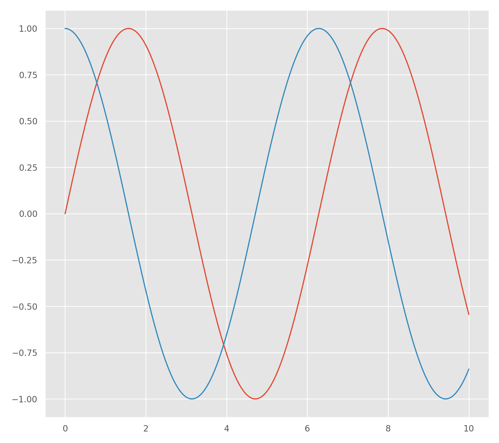
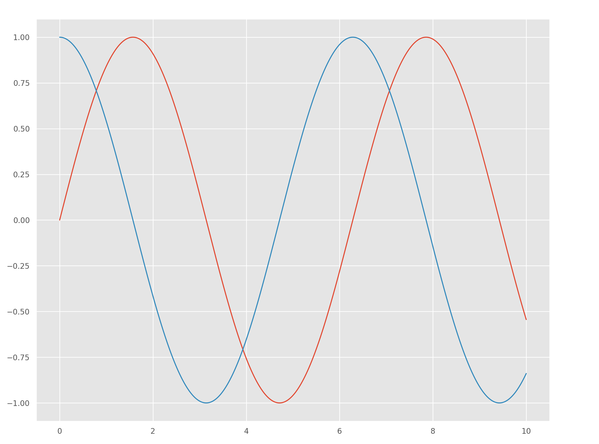

# Seaborn


```r
library(reticulate)
use_condaenv("r-python", required = TRUE)
py_config()
```

```
## python:         /home/msfz751/anaconda3/envs/r-python/bin/python
## libpython:      /home/msfz751/anaconda3/envs/r-python/lib/libpython3.7m.so
## pythonhome:     /home/msfz751/anaconda3/envs/r-python:/home/msfz751/anaconda3/envs/r-python
## version:        3.7.9 (default, Aug 31 2020, 12:42:55)  [GCC 7.3.0]
## numpy:          /home/msfz751/anaconda3/envs/r-python/lib/python3.7/site-packages/numpy
## numpy_version:  1.19.1
## 
## NOTE: Python version was forced by use_python function
```


```r
# load the package that makes R and Python talk
library(reticulate)

# set the preferred Python to execute
user_profile <- Sys.getenv("USERPROFILE")                    # user folder
python_portable <- normalizePath(file.path(user_profile,     # Python location
                                "WPy-3710zero/python-3.7.1.amd64/python.exe"))
reticulate::use_python(python_portable, required = TRUE)
reticulate::py_config()
```


```python
from __future__ import print_function, division

import matplotlib.pyplot as plt
import numpy as np
import pandas as pd
```


```python
x = np.linspace(0, 10, 1000)
```


```python
plt.style.use('ggplot')

plt.plot(x, np.sin(x), x, np.cos(x));
plt.show()
```




```python
import matplotlib.pyplot as plt
import seaborn as sns
import numpy as np

x = np.linspace(0, 10, 1000)
sns.set()
plt.plot(x, np.sin(x), x, np.cos(x));
plt.show()
```



