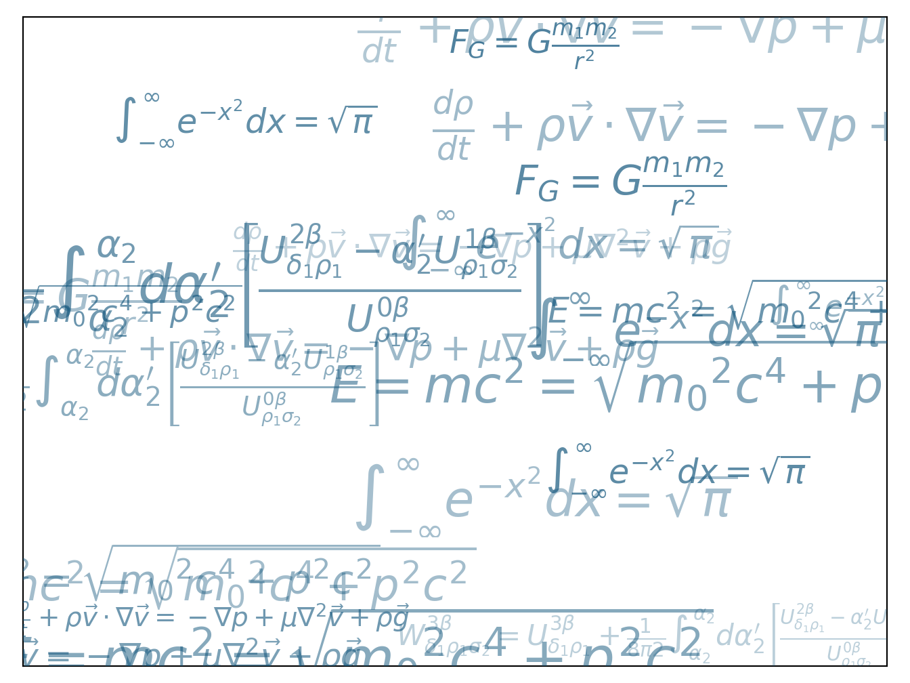
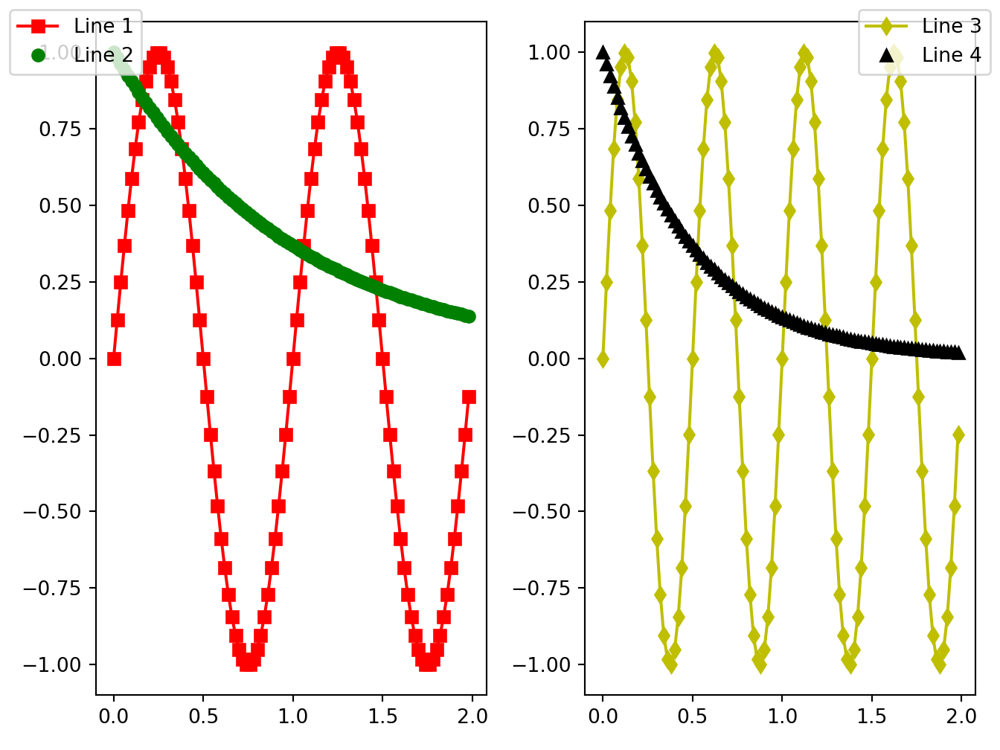

# Advanced

_Last update: Thu Nov 5 19:22:01 2020 -0600 (5124cef)_

<div class=decocode><div style="background-color:#4C78DB"><span style="font-size:90%;color:#ffffff"><i class="fab fa-r-project"></i>  <b>R</b></span>

```r
library(reticulate)
reticulate::use_condaenv("r-python")
```

</div><br></div>

## Adding labels
Math symbols printing with Latex.

$r's(t) = \mathcal{A}\/\sin(2 \omega t)'$

$\mathbb{blackboard}$


<div class=decocode><div style="background-color:#417FB1"><span style="font-size:90%;color:#FFD94C"><i class="fab fa-python"></i>  <b>Python</b></span>

```python
import matplotlib.pyplot as plt
import numpy as np

mu, sigma = 100, 15
x = mu + sigma * np.random.randn(10000)

# the histogram of the data
n, bins, patches = plt.hist(x, 50, density=1, facecolor='g', alpha=0.75)

plt.xlabel('Smarts')
plt.ylabel('Probability')
plt.title('Histogram of IQ')
plt.text(60, .025, r'$\mu=100,\ \sigma=15$')
plt.axis([40, 160, 0, 0.03])
plt.grid(True)
plt.show()
```

</div><br></div>


<div class=decocode><div style="background-color:#417FB1"><span style="font-size:90%;color:#FFD94C"><i class="fab fa-python"></i>  <b>Python</b></span>

```python
# http://scipy-lectures.org/_downloads/ScipyLectures-simple.pdf
import numpy as np
import matplotlib.pyplot as plt

eqs = []

eqs.append((r"$W^{3\beta}_{\delta_1 \rho_1 \sigma_2} = U^{3\beta}_{\delta_1 \rho_1} + \frac{1} {8 \pi 2} \int^{\alpha_2}_{\alpha_2} d \alpha^\prime_2 \left[\frac{ U^{2\beta}_{\delta_1 \rho_1} - \alpha^\prime_2U^{1\beta}_{\rho_1 \sigma_2}}{U^{0\beta}_{\rho_1 \sigma_2}} \right]$"))    # eq1
eqs.append((r"$\frac{d\rho}{d t} + \rho \vec{v}\cdot\nabla\vec{v} = -\nabla p + \mu\nabla^2 \vec{v} + \rho \vec{g}$"))   # eq2
eqs.append((r"$\int_{-\infty}^\infty e^{-x^2}dx=\sqrt{\pi}$"))   # eq3
eqs.append((r"$E = mc^2 = \sqrt{ {m_0}^2 c^4 + p^2 c^2}$"))      # eq4
eqs.append((r"$F_G = G\frac{m_1m_2}{r^2}$"))                     # eq5

plt.axes([0.025, 0.025, 0.95, 0.95])

for i in range(24):
    index = np.random.randint(0, len(eqs))
    eq = eqs[index]
    size = np.random.uniform(12, 32)
    x,y = np.random.uniform(0, 1, 2)
    alpha = np.random.uniform(0.25, .75)
    plt.text(x, y, eq, ha='center', va='center', color="#11557c", alpha=alpha,transform=plt.gca().transAxes, fontsize=size, clip_on=True)

plt.xticks([])
plt.yticks([])
plt.show()
```

</div><br></div>


## Subplots

<div class=decocode><div style="background-color:#417FB1"><span style="font-size:90%;color:#FFD94C"><i class="fab fa-python"></i>  <b>Python</b></span>

```python
# https://matplotlib.org/gallery/subplots_axes_and_figures/subplots_adjust.html#sphx-glr-gallery-subplots-axes-and-figures-subplots-adjust-py
import matplotlib.pyplot as plt
import numpy as np

# Fixing random state for reproducibility
np.random.seed(19680801)

plt.subplot(211)
plt.imshow(np.random.random((100, 100)), cmap=plt.cm.BuPu_r)
plt.subplot(212)
plt.imshow(np.random.random((100, 100)), cmap=plt.cm.BuPu_r)

plt.subplots_adjust(bottom=0.1, right=0.8, top=0.9)
cax = plt.axes([0.85, 0.1, 0.075, 0.8])
plt.colorbar(cax=cax)
plt.show()
```

</div><br></div>


<div class=decocode><div style="background-color:#417FB1"><span style="font-size:90%;color:#FFD94C"><i class="fab fa-python"></i>  <b>Python</b></span>

```python
# https://matplotlib.org/gallery/text_labels_and_annotations/figlegend_demo.html#sphx-glr-gallery-text-labels-and-annotations-figlegend-demo-py
import numpy as np
import matplotlib.pyplot as plt

fig, axs = plt.subplots(1, 2)

x = np.arange(0.0, 2.0, 0.02)
y1 = np.sin(2 * np.pi * x)
y2 = np.exp(-x)
l1, l2 = axs[0].plot(x, y1, 'rs-', x, y2, 'go')

y3 = np.sin(4 * np.pi * x)
y4 = np.exp(-2 * x)
l3, l4 = axs[1].plot(x, y3, 'yd-', x, y4, 'k^')

fig.legend((l1, l2), ('Line 1', 'Line 2'), 'upper left')
fig.legend((l3, l4), ('Line 3', 'Line 4'), 'upper right')

plt.tight_layout()
plt.show()
```

</div><br></div>


<div class=decocode><div style="background-color:#417FB1"><span style="font-size:90%;color:#FFD94C"><i class="fab fa-python"></i>  <b>Python</b></span>

```python
import matplotlib.pyplot as plt
import numpy as np

names = ['group_a', 'group_b', 'group_c']
values = [1, 10, 100]

plt.figure(figsize=(9, 3))

plt.subplot(131)
plt.bar(names, values)
plt.subplot(132)
plt.scatter(names, values)
plt.subplot(133)
plt.plot(names, values)
plt.suptitle('Categorical Plotting')
plt.show()
```

</div><br></div>


<div class=decocode><div style="background-color:#417FB1"><span style="font-size:90%;color:#FFD94C"><i class="fab fa-python"></i>  <b>Python</b></span>

```python
# https://www.python-course.eu/matplotlib_multiple_figures.php
import matplotlib.gridspec as gridspec
import matplotlib.pyplot as plt
import numpy as np

plt.figure(figsize=(6, 4))
G = gridspec.GridSpec(3, 3)
X = np.linspace(0, 2 * np.pi, 50, endpoint=True)
F1 = 2.8 * np.cos(X)
F2 = 5 * np.sin(X)
F3 = 0.3 * np.sin(X)
axes_1 = plt.subplot(G[0, :])
axes_1.plot(X, F1, 'r-', X, F2)
axes_2 = plt.subplot(G[1, :-1])
axes_2.plot(X, F3)
axes_3 = plt.subplot(G[1:, -1])
axes_3.plot([1,2,3,4], [1,10,100,1000], 'b-')
axes_4 = plt.subplot(G[-1, 0])
axes_4.plot([1,2,3,4], [47, 11, 42, 60], 'r-')
axes_5 = plt.subplot(G[-1, -2])
axes_5.plot([1,2,3,4], [7, 5, 4, 3.8])
plt.tight_layout()
plt.show()
```

</div><br></div>


<div class=decocode><div style="background-color:#417FB1"><span style="font-size:90%;color:#FFD94C"><i class="fab fa-python"></i>  <b>Python</b></span>

```python
# https://matplotlib.org/gallery/text_labels_and_annotations/figlegend_demo.html#sphx-glr-gallery-text-labels-and-annotations-figlegend-demo-py
import numpy as np
import matplotlib.pyplot as plt

fig, axs = plt.subplots(1, 2)

x = np.arange(0.0, 2.0, 0.02)
y1 = np.sin(2 * np.pi * x)
y2 = np.exp(-x)
l1, l2 = axs[0].plot(x, y1, 'rs-', x, y2, 'go')

y3 = np.sin(4 * np.pi * x)
y4 = np.exp(-2 * x)
l3, l4 = axs[1].plot(x, y3, 'yd-', x, y4, 'k^')

fig.legend((l1, l2), ('Line 1', 'Line 2'), 'upper left')
fig.legend((l3, l4), ('Line 3', 'Line 4'), 'upper right')

plt.tight_layout()
plt.show()
```

</div><br></div>


## Change of axes

<div class=decocode><div style="background-color:#417FB1"><span style="font-size:90%;color:#FFD94C"><i class="fab fa-python"></i>  <b>Python</b></span>

```python
import numpy as np
import matplotlib.pyplot as plt
# Fixing random state for reproducibility
np.random.seed(19680801)

# make up some data in the open interval (0, 1)
y = np.random.normal(loc=0.5, scale=0.4, size=1000)
y = y[(y > 0) & (y < 1)]
y.sort()
x = np.arange(len(y))

# plot with various axes scales
plt.figure()

# linear
plt.subplot(221)
plt.plot(x, y)
plt.yscale('linear')
plt.title('linear')
plt.grid(True)

# log
plt.subplot(222)
plt.plot(x, y)
plt.yscale('log')
plt.title('log')
plt.grid(True)

# symmetric log
plt.subplot(223)
plt.plot(x, y - y.mean())
plt.yscale('symlog', linthresh=0.01)
plt.title('symlog')
plt.grid(True)

# logit
plt.subplot(224)
plt.plot(x, y)
plt.yscale('logit')
plt.title('logit')
plt.grid(True)
# Adjust the subplot layout, because the logit one may take more space
# than usual, due to y-tick labels like "1 - 10^{-3}"
plt.subplots_adjust(top=0.92, bottom=0.08, left=0.10, right=0.95, hspace=0.25,
                    wspace=0.35)

plt.show()
```

</div><br></div>


